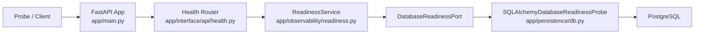
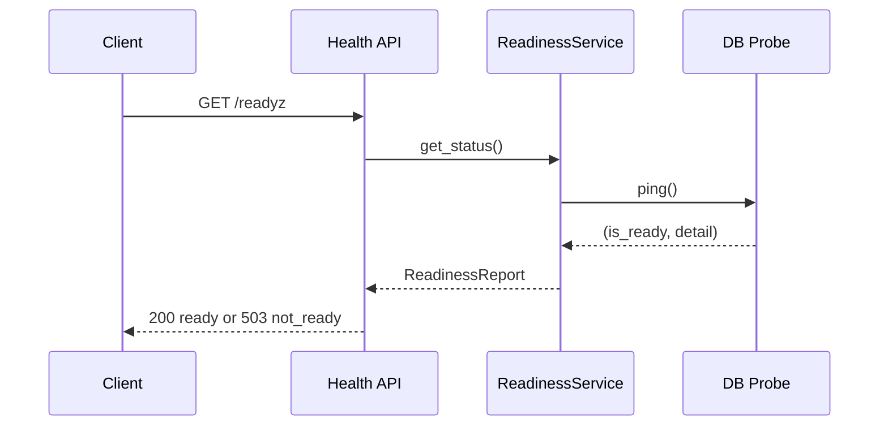

# Milestone 01 Changelog - Foundation Service Skeleton

This changelog documents implementation alignment for [.agents/plans/01-foundation-service-skeleton.md](../../.agents/plans/01-foundation-service-skeleton.md).

## Scope Delivered

- FastAPI composition root and startup lifecycle are wired in [app/main.py](../../app/main.py), including settings, logging, DB engine bootstrap, readiness service registration, and router installation.
- Health and readiness contracts are exposed from [app/interface/api/health.py](../../app/interface/api/health.py) using typed dependencies from [app/core/dependencies.py](../../app/core/dependencies.py) and readiness logic from [app/observability/readiness.py](../../app/observability/readiness.py).
- Environment-driven configuration and shared logging are centralized in [app/core/settings.py](../../app/core/settings.py) and [app/observability/logging.py](../../app/observability/logging.py).
- SQLAlchemy engine/session lifecycle and Alembic integration are established in [app/persistence/db.py](../../app/persistence/db.py), [alembic/env.py](../../alembic/env.py), and [alembic/versions/0001_baseline_audit_event.py](https://github.com/y0ncha/Aptitude/blob/ebe9db3c1ff7e8ce3f8ba300b70b8984c0547b5f/alembic/versions/0001_baseline_audit_event.py).
- Developer entrypoints for run, test, lint, typecheck, and migrations are provided in [Makefile](../../Makefile).
- Boundary guardrails are enforced by [tests/unit/test_layering_imports.py](../../tests/unit/test_layering_imports.py) and [tests/unit/test_registry_api_boundary.py](../../tests/unit/test_registry_api_boundary.py).

## Architecture Snapshot

Why this shape:
- Runtime wiring stays in one composition root so interface and core modules do not import persistence implementations directly. See [app/main.py](../../app/main.py) and [tests/unit/test_layering_imports.py](../../tests/unit/test_layering_imports.py).
- Readiness is computed through a core port, which keeps probe logic testable and independent from FastAPI request handlers. See [app/observability/readiness.py](../../app/observability/readiness.py) and [app/persistence/db.py](../../app/persistence/db.py).

## Runtime Flow

## Design Notes

- `app/main.py` owns process-scoped service construction and `app.state` registration; routers only consume typed dependencies. See [app/main.py](../../app/main.py) and [app/core/dependencies.py](../../app/core/dependencies.py).
- Health endpoints are intentionally narrow. `GET /healthz` reports process liveness and config identity, while `GET /readyz` adds database reachability through the readiness service. See [app/interface/api/health.py](../../app/interface/api/health.py) and [tests/integration/test_health_endpoints.py](../../tests/integration/test_health_endpoints.py).
- The milestone is registry-only. Client-owned routes such as `/resolve`, `/solve`, lock endpoints, bundle retrieval, and report retrieval are guarded against at the API boundary rather than being stubbed. See [tests/unit/test_registry_api_boundary.py](../../tests/unit/test_registry_api_boundary.py).
- Baseline persistence is intentionally small. The first migration creates only the audit table, leaving catalog tables to later milestones. See [alembic/versions/0001_baseline_audit_event.py](https://github.com/y0ncha/Aptitude/blob/ebe9db3c1ff7e8ce3f8ba300b70b8984c0547b5f/alembic/versions/0001_baseline_audit_event.py).

## Schema Reference

Source: [0001_baseline_audit_event.py](https://github.com/y0ncha/Aptitude/blob/ebe9db3c1ff7e8ce3f8ba300b70b8984c0547b5f/alembic/versions/0001_baseline_audit_event.py).

### `audit_events`

| Field | Type | Nullable | Default / Constraint | Role |
| --- | --- | --- | --- | --- |
| `id` | `INTEGER` | No | Primary key, autoincrement | Stable row identifier for each recorded lifecycle event. |
| `event_type` | `VARCHAR(100)` | No | Required | Stores a compact, queryable event name such as publish or read lifecycle actions. |
| `payload` | `JSON` | Yes | None | Holds structured event metadata without forcing an early rigid schema. |
| `created_at` | `TIMESTAMPTZ` | No | `CURRENT_TIMESTAMP` | Captures when the event was written so audit streams can be ordered and correlated. |

## Verification Notes

- Unit coverage validates settings, readiness logic, logging, layering, and API boundary guardrails in [tests/unit/test_settings.py](../../tests/unit/test_settings.py), [tests/unit/test_readiness_service.py](../../tests/unit/test_readiness_service.py), [tests/unit/test_logging.py](../../tests/unit/test_logging.py), [tests/unit/test_layering_imports.py](../../tests/unit/test_layering_imports.py), and [tests/unit/test_registry_api_boundary.py](../../tests/unit/test_registry_api_boundary.py).
- Integration coverage exercises health endpoints and migration upgrade/downgrade lifecycle in [tests/integration/test_health_endpoints.py](../../tests/integration/test_health_endpoints.py) and [tests/integration/test_migrations.py](../../tests/integration/test_migrations.py).
- Integration tests require a reachable PostgreSQL instance from [tests/conftest.py](../../tests/conftest.py); when unavailable they are skipped rather than failing the unit suite.
