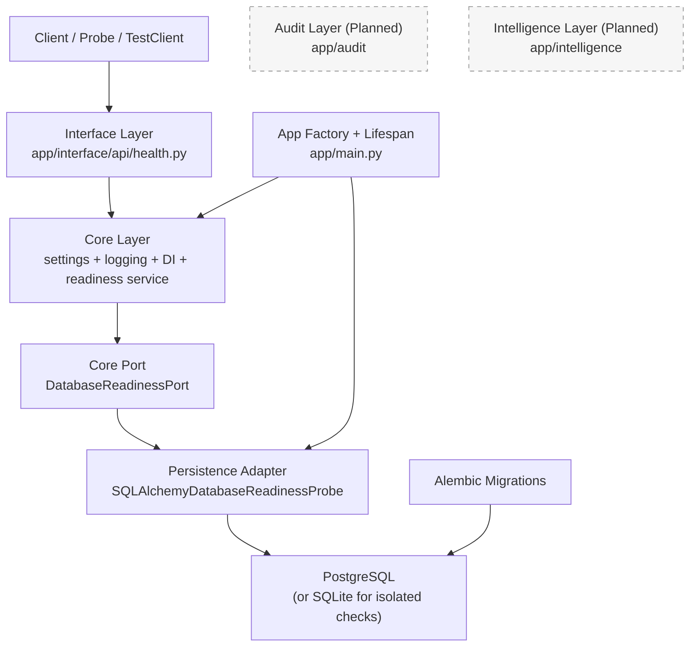
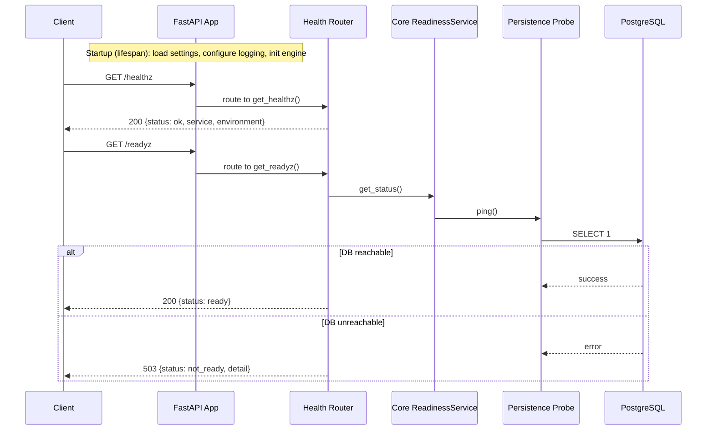
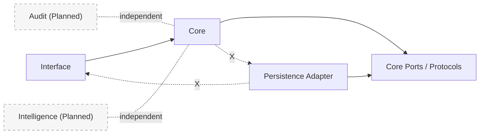

# Milestone 01 Changelog - Foundation Service Skeleton

This document reviews the implementation of [.agents/plans/01-foundation-service-skeleton.md](/Users/yonatan/Dev/Aptitude/.agents/plans/01-foundation-service-skeleton.md) with a system-design focus.

The emphasis is on **why** each architectural decision was made, how the parts fit together, and what to keep in mind for upcoming milestones.

## 1) Why this milestone exists

Milestone 01 establishes infrastructure, boundaries, and operational safety before domain behavior.  
The goal is to avoid early coupling that would make later milestones expensive to change.

Core drivers:
- A stable service skeleton that is runnable immediately.
- Explicit dependency direction between layers.
- Reproducible schema evolution from day one.
- Operational clarity through liveness/readiness semantics.
- A testing baseline that supports safe iteration.

## 2) Current system state (architecture)

Why this shape:
- Interface remains thin, so HTTP concerns do not absorb domain logic.
- Core owns process-level cross-cutting concerns (config, logging, DI), making startup and runtime behavior consistent.
- Persistence is centralized for connection lifecycle and infrastructure adapters.
- Composition root wiring in `app/main.py` keeps dependency direction strict while still allowing runtime assembly.
- Placeholders for `audit` and `intelligence` make future boundaries explicit now, reducing refactor cost later.

## 3) Request lifecycle and operational semantics

Why two endpoints:
- `/healthz` answers “is process alive?” and should be cheap/stable.
- `/readyz` answers “can this instance serve real traffic?” and includes dependency checks.
- This separation supports safer deployments, restarts, and traffic routing.

## 4) Why each major decision was taken

### 4.1 App factory + lifespan
- `create_app()` enables deterministic app construction in tests and runtime.
- Lifespan startup/shutdown centralizes resource management (engine init/dispose), reducing hidden side effects.

### 4.2 Typed settings (`pydantic-settings`)
- Required `DATABASE_URL` enforces fail-fast startup for critical infrastructure.
- Defaults (`APP_ENV`, `LOG_LEVEL`, `APP_NAME`) keep local setup simple but explicit.
- Typed config reduces “stringly typed” runtime errors and improves testability.

### 4.3 SQLAlchemy 2.0 + Alembic
- Chosen to align with roadmap and milestone contract.
- Engine/session lifecycle in one module prevents inconsistent DB handling across handlers.
- Versioned migrations make schema state reproducible and auditable.

### 4.4 Layered readiness refactor (strict boundaries)
- Introduced core port `DatabaseReadinessPort` and core `ReadinessService`.
- Replaced direct route-level persistence access with interface -> core dependency.
- Implemented persistence adapter `SQLAlchemyDatabaseReadinessProbe` and wired it only in `app/main.py`.
- Added architecture tests to fail on `interface -> persistence` and `core -> persistence` imports.

### 4.5 Baseline `audit_events` table
- Minimal schema to validate migration mechanics without introducing domain complexity.
- Gives a concrete target for upgrade/downgrade testing.

### 4.6 Test split (unit + integration)
- Unit tests cover strict configuration behavior quickly.
- Integration tests validate behavior at service and migration boundaries.
- DB-dependent tests skip cleanly when Postgres is unavailable, preserving local dev flow.

### 4.7 Tooling and quality gates
- `Makefile` provides one-command workflows and keeps execution habits consistent.
- `ruff` + `mypy` enforce readability and type contracts before future complexity arrives.
- `UV_CACHE_DIR=.uv-cache` avoids environment-specific cache permission issues.

## 5) Layer boundaries (future-safe rules)

Rules to preserve:
- `interface` depends only on core-facing modules.
- `core` depends on persistence only through core-defined ports/interfaces.
- `app/main.py` is the composition root allowed to wire core and persistence.
- `persistence` must never import API/router code.
- Keep future policy/resolution logic out of route handlers; place it in dedicated core modules.

## 6) Tradeoffs and known limitations

- No domain resolver/registry logic yet by design (scope control).
- Integration tests currently depend on an external running Postgres instance.
- Readiness probe currently checks connectivity only (`SELECT 1`) via a persistence adapter, not migration drift or deeper invariants.
- Logging uses stdlib baseline; structured correlation fields can be added in later operability milestone.

These are acceptable for Milestone 01 because the objective is a stable skeleton, not full behavior.

## 7) Notes for future milestones

1. Milestone 02 (immutable skill registry):
- Introduce core service modules for registry behavior, not in route files.
- Add persistence repositories instead of direct session-level access from handlers.

2. Milestone 03 (deterministic resolution):
- Add deterministic ordering rules in core layer with explicit tie-breakers.
- Record resolution reasoning in audit structures early.

3. API contract growth:
- Keep response DTOs in interface layer and avoid leaking ORM models.
- Add explicit error models as endpoints expand.

4. Readiness hardening:
- Extend `/readyz` to include migration-head check once release process exists.
- Consider separate degraded-state semantics if partial dependencies are introduced.

## 8) Learning takeaways (system design with Python/FastAPI)

- Start with architecture boundaries before feature logic to protect long-term velocity.
- Use typed configuration and explicit startup wiring to turn operational failures into early, understandable failures.
- Separate liveness from readiness to match real deployment behavior.
- Keep migration discipline from the first table; it prevents hidden state drift.
- Treat tests as architectural checks: unit tests protect contracts, integration tests protect boundaries.
