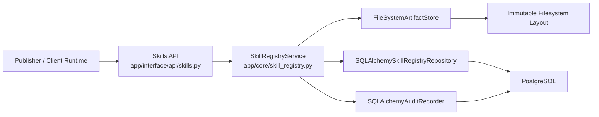
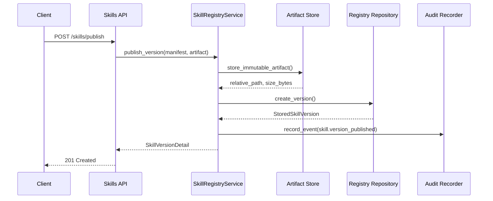

# Milestone 02 Changelog - Immutable Skill Registry

This changelog documents implementation alignment for [.agents/plans/02-immutable-skill-registry.md](/Users/yonatan/Dev/Aptitude/aptitude-server/.agents/plans/02-immutable-skill-registry.md).

## Scope Delivered

- Immutable registry routes are implemented in [app/interface/api/skills.py](/Users/yonatan/Dev/Aptitude/aptitude-server/app/interface/api/skills.py):
  - `POST /skills/publish`
  - `GET /skills/{id}/{version}`
  - `GET /skills/{id}`
- Publish, exact fetch, duplicate rejection, checksum generation, and read-time integrity verification are handled by [app/core/skill_registry.py](/Users/yonatan/Dev/Aptitude/aptitude-server/app/core/skill_registry.py).
- Immutable artifact bytes and manifest snapshots are written to filesystem storage by [app/persistence/artifact_store.py](/Users/yonatan/Dev/Aptitude/aptitude-server/app/persistence/artifact_store.py) using the `skills/<skill_id>/<version>/` layout.
- Version metadata, checksum rows, and deterministic version listings are persisted through [app/persistence/skill_registry_repository.py](/Users/yonatan/Dev/Aptitude/aptitude-server/app/persistence/skill_registry_repository.py) and [alembic/versions/0002_immutable_skill_registry.py](/Users/yonatan/Dev/Aptitude/aptitude-server/alembic/versions/0002_immutable_skill_registry.py).
- Audit recording for publish, read, list, and integrity-violation events is implemented by [app/audit/recorder.py](/Users/yonatan/Dev/Aptitude/aptitude-server/app/audit/recorder.py) and [app/persistence/models/audit_event.py](/Users/yonatan/Dev/Aptitude/aptitude-server/app/persistence/models/audit_event.py).

## Architecture Snapshot

Why this shape:
- The service owns the transaction boundary between contract validation, artifact storage, metadata persistence, and audit emission. See [app/core/skill_registry.py](/Users/yonatan/Dev/Aptitude/aptitude-server/app/core/skill_registry.py).
- The API remains registry-oriented. It returns immutable metadata and artifacts, but excludes client-owned solve, lock, and execution behavior. See [app/interface/api/skills.py](/Users/yonatan/Dev/Aptitude/aptitude-server/app/interface/api/skills.py) and [tests/unit/test_registry_api_boundary.py](/Users/yonatan/Dev/Aptitude/aptitude-server/tests/unit/test_registry_api_boundary.py).

## Runtime Flow

## Design Notes

- Duplicate protection is layered. The service pre-checks `(skill_id, version)`, the filesystem adapter guards immutable paths, and the database enforces a unique constraint on `(skill_fk, version)`. See [app/core/skill_registry.py](/Users/yonatan/Dev/Aptitude/aptitude-server/app/core/skill_registry.py), [app/persistence/artifact_store.py](/Users/yonatan/Dev/Aptitude/aptitude-server/app/persistence/artifact_store.py), and [alembic/versions/0002_immutable_skill_registry.py](/Users/yonatan/Dev/Aptitude/aptitude-server/alembic/versions/0002_immutable_skill_registry.py).
- Exact version fetches always recompute `sha256` over stored artifact bytes before returning a response, so corruption is detected on the read path rather than assumed away. See [app/core/skill_registry.py](/Users/yonatan/Dev/Aptitude/aptitude-server/app/core/skill_registry.py) and [tests/integration/test_skill_registry_endpoints.py](/Users/yonatan/Dev/Aptitude/aptitude-server/tests/integration/test_skill_registry_endpoints.py).
- Provenance basics are currently represented by immutable manifest snapshots plus audit events, not a dedicated provenance table. See [app/persistence/artifact_store.py](/Users/yonatan/Dev/Aptitude/aptitude-server/app/persistence/artifact_store.py) and [app/persistence/models/audit_event.py](/Users/yonatan/Dev/Aptitude/aptitude-server/app/persistence/models/audit_event.py).
- Version listing is deterministic by `published_at DESC, id DESC`, which keeps repeated reads stable for client-side lock and replay flows. See [app/persistence/skill_registry_repository.py](/Users/yonatan/Dev/Aptitude/aptitude-server/app/persistence/skill_registry_repository.py) and [tests/integration/test_skill_registry_endpoints.py](/Users/yonatan/Dev/Aptitude/aptitude-server/tests/integration/test_skill_registry_endpoints.py).

## Schema Reference

Source: [0002_immutable_skill_registry.py](/Users/yonatan/Dev/Aptitude/aptitude-server/alembic/versions/0002_immutable_skill_registry.py).

### `skills`

| Field | Type | Nullable | Default / Constraint | Role |
| --- | --- | --- | --- | --- |
| `id` | `BIGINT` | No | Primary key, autoincrement | Surrogate key used by related version rows and indexes. |
| `skill_id` | `TEXT` | No | Unique | Logical immutable skill name that clients address in API paths. |
| `created_at` | `TIMESTAMPTZ` | No | `CURRENT_TIMESTAMP` | Captures when the logical skill root was first introduced. |

### `skill_versions`

| Field | Type | Nullable | Default / Constraint | Role |
| --- | --- | --- | --- | --- |
| `id` | `BIGINT` | No | Primary key, autoincrement | Stable identifier for one immutable published version. |
| `skill_fk` | `BIGINT` | No | FK to `skills.id`, `ON DELETE CASCADE` | Connects version rows back to the logical skill root. |
| `version` | `TEXT` | No | Unique with `skill_fk`, semver check | Stores the immutable version coordinate requested by clients. |
| `manifest_json` | `JSONB` | No | Required | Persists the exact manifest contract served back to consumers. |
| `artifact_rel_path` | `TEXT` | No | Required | Stores the immutable artifact path inside the filesystem artifact root. |
| `artifact_size_bytes` | `BIGINT` | No | Required | Records the published artifact size for read responses and audits. |
| `published_at` | `TIMESTAMPTZ` | No | `CURRENT_TIMESTAMP` | Supports deterministic list ordering and publication history. |

### `skill_version_checksums`

| Field | Type | Nullable | Default / Constraint | Role |
| --- | --- | --- | --- | --- |
| `id` | `BIGINT` | No | Primary key, autoincrement | Row identity for checksum metadata. |
| `skill_version_fk` | `BIGINT` | No | FK to `skill_versions.id`, unique | Enforces exactly one checksum record per immutable version. |
| `algorithm` | `VARCHAR(20)` | No | `algorithm = 'sha256'` | Pins the integrity algorithm used by publish and fetch paths. |
| `digest` | `VARCHAR(64)` | No | `char_length = 64` | Stores the checksum returned to clients and used for read-time verification. |
| `created_at` | `TIMESTAMPTZ` | No | `CURRENT_TIMESTAMP` | Records when checksum metadata was materialized. |

## Verification Notes

- Unit coverage validates manifest parsing and core registry behavior in [tests/unit/test_skill_manifest.py](/Users/yonatan/Dev/Aptitude/aptitude-server/tests/unit/test_skill_manifest.py) and [tests/unit/test_skill_registry_service.py](/Users/yonatan/Dev/Aptitude/aptitude-server/tests/unit/test_skill_registry_service.py).
- Integration coverage validates publish, fetch, list, duplicate rejection, and checksum mismatch handling in [tests/integration/test_skill_registry_endpoints.py](/Users/yonatan/Dev/Aptitude/aptitude-server/tests/integration/test_skill_registry_endpoints.py).
- Migration lifecycle is covered in [tests/integration/test_migrations.py](/Users/yonatan/Dev/Aptitude/aptitude-server/tests/integration/test_migrations.py).
- Registry-only boundary enforcement remains covered by [tests/unit/test_registry_api_boundary.py](/Users/yonatan/Dev/Aptitude/aptitude-server/tests/unit/test_registry_api_boundary.py).
