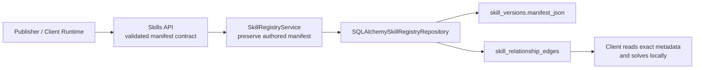
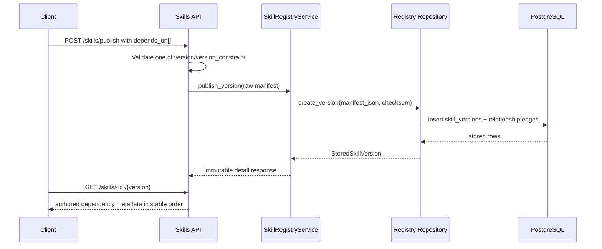

# Milestone 03 Changelog - Deterministic Dependency Metadata Contracts

This changelog documents implementation alignment for [.agents/plans/03-deterministic-dependency-resolution.md](../../.agents/plans/03-deterministic-dependency-resolution.md).

## Scope Delivered

- The manifest contract in [app/interface/api/skills.py](../../app/interface/api/skills.py) now treats `depends_on` as authored dependency metadata, not as a server-side solve instruction.
- `depends_on` accepts either an exact `version` or a validated `version_constraint`, plus optional `optional` and `markers` fields. See [app/interface/api/skills.py](../../app/interface/api/skills.py) and [tests/unit/test_skill_manifest.py](../../tests/unit/test_skill_manifest.py).
- Exact version reads preserve authored ordering and omit unset dependency fields by storing the raw manifest JSON and using response models with unset-field exclusion. See [app/core/skills/registry.py](../../app/core/skills/registry.py) and [app/interface/api/skills.py](../../app/interface/api/skills.py).
- Publish-time edge projection for `depends_on` and `extends` is implemented in [app/persistence/skill_registry_repository.py](../../app/persistence/skill_registry_repository.py) and materialized in [app/persistence/models/skill_relationship_edge.py](https://github.com/y0ncha/Aptitude/blob/515649b385befd1a96c126ab50ecc679dfce256e/app/persistence/models/skill_relationship_edge.py).
- Alembic migration `0003` creates the relationship-edge read model and backfills existing manifest data, while preserving authored selector text in `target_version_selector`. See [alembic/versions/0003_deterministic_dependency_resolution.py](https://github.com/y0ncha/Aptitude/blob/515649b385befd1a96c126ab50ecc679dfce256e/alembic/versions/0003_deterministic_dependency_resolution.py).
- Client-owned routes and persistence concepts remain absent and are guarded by [tests/unit/test_registry_api_boundary.py](../../tests/unit/test_registry_api_boundary.py).

## Architecture Snapshot

Why this shape:
- The server publishes immutable dependency metadata and a derived edge read model, but it never becomes the source of truth for solved dependency closure. See [app/persistence/skill_registry_repository.py](../../app/persistence/skill_registry_repository.py) and [tests/unit/test_registry_api_boundary.py](../../tests/unit/test_registry_api_boundary.py).
- Authored manifests are preserved verbatim enough to keep client-facing reads deterministic across repeated requests. See [app/core/skills/registry.py](../../app/core/skills/registry.py) and [tests/integration/test_skill_registry_endpoints.py](../../tests/integration/test_skill_registry_endpoints.py).

## Runtime Flow

## Design Notes

- `depends_on` validation is intentionally strict: each dependency declaration must provide exactly one selector source, either `version` or `version_constraint`. See [app/interface/api/skills.py](../../app/interface/api/skills.py) and [tests/unit/test_skill_manifest.py](../../tests/unit/test_skill_manifest.py).
- The core layer keeps a `raw_manifest_json` copy in [app/core/skills/registry.py](../../app/core/skills/registry.py) so the server can return authored dependency ordering without reconstructing or normalizing the payload.
- The read model stores selector text in `target_version_selector`, which allows exact pins and range-style constraints to be indexed uniformly without pretending they are solved outcomes. See [app/persistence/models/skill_relationship_edge.py](https://github.com/y0ncha/Aptitude/blob/515649b385befd1a96c126ab50ecc679dfce256e/app/persistence/models/skill_relationship_edge.py) and [alembic/versions/0003_deterministic_dependency_resolution.py](https://github.com/y0ncha/Aptitude/blob/515649b385befd1a96c126ab50ecc679dfce256e/alembic/versions/0003_deterministic_dependency_resolution.py).
- The edge projection is intentionally narrower than the manifest contract: only `depends_on` and `extends` are materialized into the read model today. `conflicts_with` and `overlaps_with` remain part of the manifest payload but are not expanded into separate edge tables yet. See [app/persistence/skill_registry_repository.py](../../app/persistence/skill_registry_repository.py).

## Schema Reference

Sources: [app/interface/api/skills.py](../../app/interface/api/skills.py) and [0003_deterministic_dependency_resolution.py](https://github.com/y0ncha/Aptitude/blob/515649b385befd1a96c126ab50ecc679dfce256e/alembic/versions/0003_deterministic_dependency_resolution.py).

### `manifest.depends_on[]`

| Field | Type | Nullable | Default / Constraint | Role |
| --- | --- | --- | --- | --- |
| `skill_id` | `string` | No | Pattern `SKILL_ID_PATTERN` | Names the direct dependency being declared by the publisher. |
| `version` | `string` | Yes | Semver; mutually exclusive with `version_constraint` | Represents an exact immutable dependency pin when the author wants no range semantics. |
| `version_constraint` | `string` | Yes | Comparator list such as `>=1.0.0,<2.0.0`; mutually exclusive with `version` | Preserves the authored direct constraint contract for client-side solving. |
| `optional` | `boolean` | Yes | Unset fields omitted from response | Flags that the dependency is optional metadata rather than an unconditional hard requirement. |
| `markers` | `string[]` | Yes | Token validation via `MARKER_PATTERN` | Carries authored environment or policy markers without turning them into server-side execution logic. |

### `skill_relationship_edges`

| Field | Type | Nullable | Default / Constraint | Role |
| --- | --- | --- | --- | --- |
| `id` | `BIGINT` | No | Primary key, autoincrement | Row identifier for each derived dependency or extension edge. |
| `source_skill_version_fk` | `BIGINT` | No | FK to `skill_versions.id`, `ON DELETE CASCADE` | Points back to the immutable published version that declared the relationship. |
| `edge_type` | `TEXT` | No | `IN ('depends_on', 'extends')` | Distinguishes dependency edges from inheritance-like extension edges. |
| `target_skill_id` | `TEXT` | No | Required | Stores the referenced skill identifier for lookup and indexing. |
| `target_version_selector` | `TEXT` | No | Required; unique with source and type | Preserves the authored exact version or constraint string used by the publisher. |
| `created_at` | `TIMESTAMPTZ` | No | `CURRENT_TIMESTAMP` | Records when the derived edge row was created or backfilled. |

## Verification Notes

- Unit validation for the dependency contract lives in [tests/unit/test_skill_manifest.py](../../tests/unit/test_skill_manifest.py).
- API-level integration coverage for stable dependency projection and invalid constraint rejection lives in [tests/integration/test_skill_registry_endpoints.py](../../tests/integration/test_skill_registry_endpoints.py).
- Migration backfill behavior is covered in [tests/integration/test_migrations.py](../../tests/integration/test_migrations.py).
- Boundary coverage proving solver-owned routes remain absent lives in [tests/unit/test_registry_api_boundary.py](../../tests/unit/test_registry_api_boundary.py).
- PostgreSQL-backed integration tests still depend on a reachable DB configured through [tests/conftest.py](../../tests/conftest.py).
