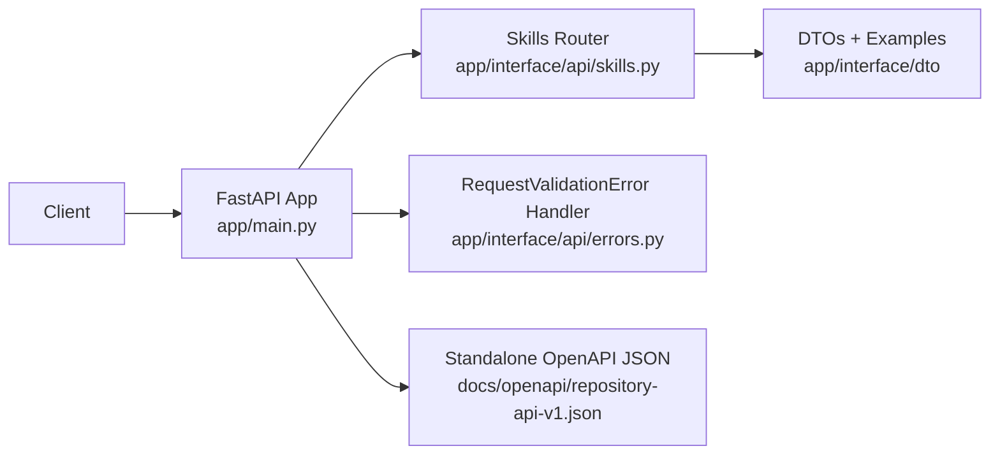
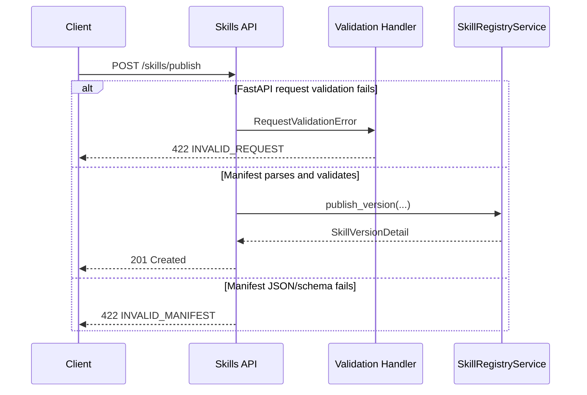

# Milestone 04 Changelog - Repository API Contract V1

This changelog documents implementation alignment for [.agents/plans/04-repository-api-contract-v1.md](/Users/yonatan/Dev/Aptitude/aptitude-server/.agents/plans/04-repository-api-contract-v1.md).

## Scope Delivered

- FastAPI now publishes explicit top-level API metadata for the stable v1 contract in [app/main.py](/Users/yonatan/Dev/Aptitude/aptitude-server/app/main.py), and the committed standalone schema is exported to [docs/openapi/repository-api-v1.json](/Users/yonatan/Dev/Aptitude/aptitude-server/docs/openapi/repository-api-v1.json) by [scripts/export_openapi.py](/Users/yonatan/Dev/Aptitude/aptitude-server/scripts/export_openapi.py).
- The public skill routes in [app/interface/api/skills.py](/Users/yonatan/Dev/Aptitude/aptitude-server/app/interface/api/skills.py) now carry stable `operation_id`s, shared OpenAPI response metadata, and example-backed request/response docs for `POST /skills/publish`, `GET /skills/{skill_id}/{version}`, and `GET /skills/{skill_id}`.
- Request validation failures are normalized through [app/interface/api/errors.py](/Users/yonatan/Dev/Aptitude/aptitude-server/app/interface/api/errors.py) and [app/interface/dto/errors.py](/Users/yonatan/Dev/Aptitude/aptitude-server/app/interface/dto/errors.py), so FastAPI-managed 422s and domain-level manifest failures share one error envelope while keeping distinct codes such as `INVALID_REQUEST` and `INVALID_MANIFEST`.
- Shared example payloads are centralized in [app/interface/dto/examples.py](/Users/yonatan/Dev/Aptitude/aptitude-server/app/interface/dto/examples.py) and validated by [tests/unit/test_api_contract_examples.py](/Users/yonatan/Dev/Aptitude/aptitude-server/tests/unit/test_api_contract_examples.py) to keep the docs, DTOs, and exported schema in sync.
- Search is explicitly documented as deferred rather than stubbed. See [README.md](/Users/yonatan/Dev/Aptitude/aptitude-server/README.md) and [app/interface/api/README.md](/Users/yonatan/Dev/Aptitude/aptitude-server/app/interface/api/README.md).

## Architecture Snapshot

Why this shape:
- OpenAPI stays FastAPI-native instead of being hand-maintained separately, so runtime behavior and the committed schema artifact are generated from the same application wiring. See [app/main.py](/Users/yonatan/Dev/Aptitude/aptitude-server/app/main.py), [scripts/export_openapi.py](/Users/yonatan/Dev/Aptitude/aptitude-server/scripts/export_openapi.py), and [tests/unit/test_openapi_contract.py](/Users/yonatan/Dev/Aptitude/aptitude-server/tests/unit/test_openapi_contract.py).
- Error serialization is centralized once and reused across routes, which prevents path/query/form validation from drifting into FastAPI’s default 422 payload shape. See [app/interface/api/errors.py](/Users/yonatan/Dev/Aptitude/aptitude-server/app/interface/api/errors.py) and [tests/integration/test_skill_registry_endpoints.py](/Users/yonatan/Dev/Aptitude/aptitude-server/tests/integration/test_skill_registry_endpoints.py).

## Runtime Flow

## Design Notes

- The stable public contract remains the unversioned `/skills/...` surface. This milestone versioned the schema via OpenAPI metadata and a pinned artifact, not by adding `/v1` path aliases. See [app/main.py](/Users/yonatan/Dev/Aptitude/aptitude-server/app/main.py), [app/interface/api/skills.py](/Users/yonatan/Dev/Aptitude/aptitude-server/app/interface/api/skills.py), and [tests/unit/test_registry_api_boundary.py](/Users/yonatan/Dev/Aptitude/aptitude-server/tests/unit/test_registry_api_boundary.py).
- Manifest validation and generic request validation are intentionally split. Multipart/path/query/form failures return `INVALID_REQUEST`, while manifest JSON/schema failures inside the publish flow return `INVALID_MANIFEST`. See [app/interface/api/errors.py](/Users/yonatan/Dev/Aptitude/aptitude-server/app/interface/api/errors.py), [app/interface/api/skills.py](/Users/yonatan/Dev/Aptitude/aptitude-server/app/interface/api/skills.py), and [tests/integration/test_skill_registry_endpoints.py](/Users/yonatan/Dev/Aptitude/aptitude-server/tests/integration/test_skill_registry_endpoints.py).
- This milestone changes public HTTP and OpenAPI schemas only. No database migration or persistence model change was required. The durable artifact is the exported schema file at [docs/openapi/repository-api-v1.json](/Users/yonatan/Dev/Aptitude/aptitude-server/docs/openapi/repository-api-v1.json).
- `GET /skills/search` remains out of the implementation and out of the exported schema, which keeps the contract aligned with the current server/client boundary while milestone 05 owns discovery behavior. See [README.md](/Users/yonatan/Dev/Aptitude/aptitude-server/README.md), [app/interface/api/README.md](/Users/yonatan/Dev/Aptitude/aptitude-server/app/interface/api/README.md), and [.agents/plans/05-metadata-search-ranking.md](/Users/yonatan/Dev/Aptitude/aptitude-server/.agents/plans/05-metadata-search-ranking.md).

## Schema Reference

Sources: [app/interface/dto/errors.py](/Users/yonatan/Dev/Aptitude/aptitude-server/app/interface/dto/errors.py), [app/interface/dto/skills.py](/Users/yonatan/Dev/Aptitude/aptitude-server/app/interface/dto/skills.py), and [docs/openapi/repository-api-v1.json](/Users/yonatan/Dev/Aptitude/aptitude-server/docs/openapi/repository-api-v1.json).

### `ErrorEnvelope`

| Field | Type | Nullable | Default / Constraint | Role |
| --- | --- | --- | --- | --- |
| `error` | `ErrorBody` | No | Required | Wraps every public API failure in one stable top-level object so clients never have to parse route-specific error shapes. |
| `error.code` | `string` | No | Required | Carries a machine-readable failure category such as `INVALID_REQUEST`, `INVALID_MANIFEST`, or `SKILL_VERSION_NOT_FOUND`. |
| `error.message` | `string` | No | Required | Provides a short human-readable summary suitable for logs and debugging output. |
| `error.details` | `object` | Yes | Omitted when not needed | Holds structured diagnostics such as field validation errors or missing skill coordinates without changing the envelope structure. |

### `Body_publishSkillVersion`

| Field | Type | Nullable | Default / Constraint | Role |
| --- | --- | --- | --- | --- |
| `manifest` | `string` | No | Required multipart form field | Preserves the authored manifest as a JSON string in multipart uploads so the publish route can validate it explicitly before crossing into the core layer. |
| `artifact` | `binary string` | No | Required multipart form field | Carries the immutable artifact payload associated with the published skill version. |

### `SkillVersionFetchResponse`

| Field | Type | Nullable | Default / Constraint | Role |
| --- | --- | --- | --- | --- |
| `skill_id` | `string` | No | Required | Echoes the immutable catalog identifier requested by the client. |
| `version` | `string` | No | Required semver | Pins the exact immutable version returned by the registry. |
| `manifest` | `SkillManifest` | No | Required | Returns the validated manifest contract as stored by the service. |
| `checksum` | `ChecksumResponse` | No | Required | Exposes the checksum metadata clients use to reason about artifact integrity. |
| `artifact_metadata` | `ArtifactMetadataResponse` | No | Required | Returns stable artifact location and size metadata without exposing storage internals beyond the contract. |
| `published_at` | `datetime` | No | Required UTC timestamp | Provides deterministic publication timing for read and list consumers. |
| `artifact_base64` | `string` | No | Required | Encodes the binary artifact into JSON-safe transport for exact fetch responses. |

## Verification Notes

- Runtime schema drift is covered by [tests/unit/test_openapi_contract.py](/Users/yonatan/Dev/Aptitude/aptitude-server/tests/unit/test_openapi_contract.py), which compares `create_app().openapi()` to [docs/openapi/repository-api-v1.json](/Users/yonatan/Dev/Aptitude/aptitude-server/docs/openapi/repository-api-v1.json).
- Example payload validity is covered by [tests/unit/test_api_contract_examples.py](/Users/yonatan/Dev/Aptitude/aptitude-server/tests/unit/test_api_contract_examples.py), which validates both success payloads and error examples against the DTO layer.
- Public surface and boundary metadata are covered by [tests/unit/test_registry_api_boundary.py](/Users/yonatan/Dev/Aptitude/aptitude-server/tests/unit/test_registry_api_boundary.py).
- Integration coverage for normalized invalid-request handling and manifest failures lives in [tests/integration/test_skill_registry_endpoints.py](/Users/yonatan/Dev/Aptitude/aptitude-server/tests/integration/test_skill_registry_endpoints.py). These tests still require a reachable PostgreSQL instance through [tests/conftest.py](/Users/yonatan/Dev/Aptitude/aptitude-server/tests/conftest.py).
