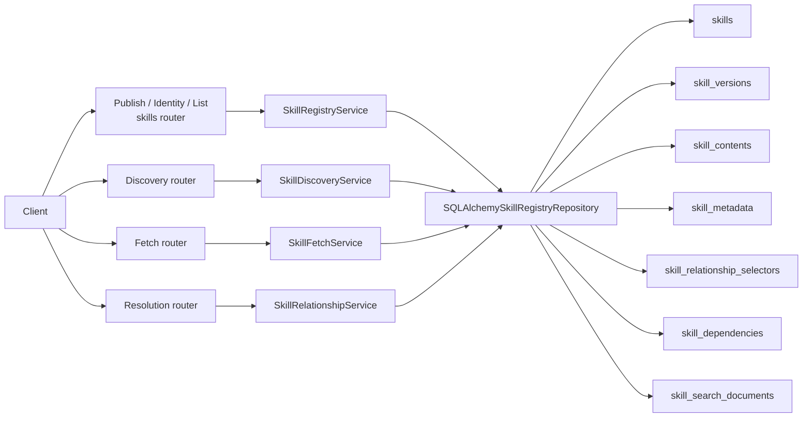
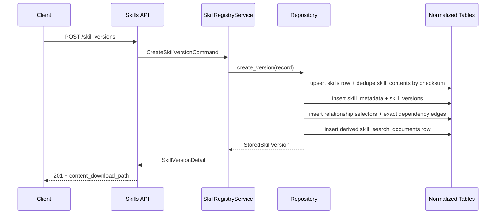

# Milestone 05 Changelog - Metadata Search, Ranking, and Normalized Storage

This changelog documents implementation of [.agents/plans/05-metadata-search-ranking.md](/Users/yonatan/Dev/Aptitude/aptitude-server/.agents/plans/05-metadata-search-ranking.md).

The branch delivered more than indexed search. It also completed the PostgreSQL normalization work described by the milestone, moved exact content fetch onto database-backed markdown storage, and split read surfaces so discovery stays body-free. Supporting design references live in [docs/schema.md](/Users/yonatan/Dev/Aptitude/aptitude-server/docs/schema.md) and [docs/storage-strategy-report.md](/Users/yonatan/Dev/Aptitude/aptitude-server/docs/storage-strategy-report.md).

## Scope Delivered

- The public HTTP contract now matches the normalized model instead of the legacy manifest-plus-artifact upload shape: [app/interface/api/skills.py](/Users/yonatan/Dev/Aptitude/aptitude-server/app/interface/api/skills.py) publishes `POST /skill-versions`, `GET /skills/{slug}`, and `GET /skills/{slug}/versions`, [app/interface/api/fetch.py](/Users/yonatan/Dev/Aptitude/aptitude-server/app/interface/api/fetch.py) serves exact metadata and raw markdown at `GET /skills/{slug}/versions/{version}` plus `.../content`, [app/interface/api/discovery.py](/Users/yonatan/Dev/Aptitude/aptitude-server/app/interface/api/discovery.py) exposes advisory search at `GET /discovery/skills/search`, and [app/interface/api/resolution.py](/Users/yonatan/Dev/Aptitude/aptitude-server/app/interface/api/resolution.py) exposes direct relationship reads at `POST /resolution/relationships:batch`.
- The schema rollout spans [alembic/versions/0004_metadata_search_ranking.py](/Users/yonatan/Dev/Aptitude/aptitude-server/alembic/versions/0004_metadata_search_ranking.py) and [alembic/versions/0005_normalized_skill_storage_api_cleanup.py](/Users/yonatan/Dev/Aptitude/aptitude-server/alembic/versions/0005_normalized_skill_storage_api_cleanup.py): `0004` introduced the search read model and ranking indexes, while `0005` adds `skills.slug`, `skills.current_version_id`, lifecycle timestamps/state, creates `skill_contents`, `skill_metadata`, `skill_relationship_selectors`, and `skill_dependencies`, backfills them from legacy rows, and rebuilds `skill_search_documents` from normalized sources.
- The immutable persistence path is now centered on [app/persistence/skill_registry_repository.py](/Users/yonatan/Dev/Aptitude/aptitude-server/app/persistence/skill_registry_repository.py) plus the normalized SQLAlchemy models in [app/persistence/models/skill.py](/Users/yonatan/Dev/Aptitude/aptitude-server/app/persistence/models/skill.py), [app/persistence/models/skill_version.py](/Users/yonatan/Dev/Aptitude/aptitude-server/app/persistence/models/skill_version.py), [app/persistence/models/skill_content.py](/Users/yonatan/Dev/Aptitude/aptitude-server/app/persistence/models/skill_content.py), [app/persistence/models/skill_metadata.py](/Users/yonatan/Dev/Aptitude/aptitude-server/app/persistence/models/skill_metadata.py), [app/persistence/models/skill_relationship_selector.py](/Users/yonatan/Dev/Aptitude/aptitude-server/app/persistence/models/skill_relationship_selector.py), and [app/persistence/models/skill_dependency.py](/Users/yonatan/Dev/Aptitude/aptitude-server/app/persistence/models/skill_dependency.py). Content rows are deduplicated by checksum, version rows remain immutable, authored selectors are preserved in publish order, and exact dependency edges are materialized only when the target `slug@version` is resolvable.
- Search now runs against a normalized derived read model instead of manifest-projected identity fields. [app/persistence/models/skill_search_document.py](/Users/yonatan/Dev/Aptitude/aptitude-server/app/persistence/models/skill_search_document.py), [app/core/skill_search.py](/Users/yonatan/Dev/Aptitude/aptitude-server/app/core/skill_search.py), and [app/intelligence/search_ranking.py](/Users/yonatan/Dev/Aptitude/aptitude-server/app/intelligence/search_ranking.py) implement slug/name/full-text/tag matching, freshness and content-size filters, deterministic tie-breaking, and stable explanation fields (`matched_fields`, `matched_tags`, `reasons`) over body-free search rows.
- The milestone also landed the service split needed to keep query paths explicit: [app/core/skill_registry.py](/Users/yonatan/Dev/Aptitude/aptitude-server/app/core/skill_registry.py) owns publish and identity/list reads, [app/core/skill_fetch.py](/Users/yonatan/Dev/Aptitude/aptitude-server/app/core/skill_fetch.py) owns exact metadata/body reads, [app/core/skill_relationships.py](/Users/yonatan/Dev/Aptitude/aptitude-server/app/core/skill_relationships.py) owns direct relationship inspection, and [app/core/dependencies.py](/Users/yonatan/Dev/Aptitude/aptitude-server/app/core/dependencies.py) plus [app/main.py](/Users/yonatan/Dev/Aptitude/aptitude-server/app/main.py) wire those services into the app and the exported contract at [docs/openapi/repository-api-v1.json](/Users/yonatan/Dev/Aptitude/aptitude-server/docs/openapi/repository-api-v1.json).

## Architecture Snapshot

Why this shape:
- PostgreSQL is now the only authoritative store for identity, metadata, relationships, and markdown bodies. The old filesystem-backed artifact path was removed from runtime use, [app/core/skill_fetch.py](/Users/yonatan/Dev/Aptitude/aptitude-server/app/core/skill_fetch.py) reads `skill_contents.raw_markdown` directly, and [app/interface/api/fetch.py](/Users/yonatan/Dev/Aptitude/aptitude-server/app/interface/api/fetch.py) exposes immutable cache headers from the stored checksum.
- Query-path separation is enforced in code instead of documentation only. Discovery and list/search flows stay off the raw markdown table through [app/persistence/models/skill_search_document.py](/Users/yonatan/Dev/Aptitude/aptitude-server/app/persistence/models/skill_search_document.py) and summary projections in [app/core/skill_registry.py](/Users/yonatan/Dev/Aptitude/aptitude-server/app/core/skill_registry.py), while exact content fetch is the only path that loads full markdown bytes through [app/core/skill_fetch.py](/Users/yonatan/Dev/Aptitude/aptitude-server/app/core/skill_fetch.py).

## Runtime Flow

## Design Notes

- The milestone chose PostgreSQL-only storage rather than keeping filesystem-backed artifacts. The migration reads legacy files during backfill and falls back to generated placeholder markdown when a historical artifact is missing, but the steady-state runtime now serves exact content from [app/persistence/models/skill_content.py](/Users/yonatan/Dev/Aptitude/aptitude-server/app/persistence/models/skill_content.py) and [alembic/versions/0005_normalized_skill_storage_api_cleanup.py](/Users/yonatan/Dev/Aptitude/aptitude-server/alembic/versions/0005_normalized_skill_storage_api_cleanup.py).
- `skill_relationship_selectors` and `skill_dependencies` intentionally coexist. [app/persistence/models/skill_relationship_selector.py](/Users/yonatan/Dev/Aptitude/aptitude-server/app/persistence/models/skill_relationship_selector.py) preserves authored selector text, edge family, order, optionality, and markers exactly as published, while [app/persistence/models/skill_dependency.py](/Users/yonatan/Dev/Aptitude/aptitude-server/app/persistence/models/skill_dependency.py) stores only exact version-to-version edges that can be resolved deterministically during publish or migration backfill.
- Legacy mirrors were retained where they reduce migration and downgrade risk. [app/persistence/models/skill.py](/Users/yonatan/Dev/Aptitude/aptitude-server/app/persistence/models/skill.py) still keeps `skill_id` as an internal compatibility column, and [app/persistence/models/skill_version.py](/Users/yonatan/Dev/Aptitude/aptitude-server/app/persistence/models/skill_version.py) still mirrors `manifest_json` and `artifact_rel_path`, but repository code now treats `slug`, `content_fk`, `metadata_fk`, and `checksum_digest` as the real source model.
- The original search-only framing is no longer sufficient for this milestone. The branch used dedicated discovery, resolution, and fetch services to make the plan’s body-free search and exact-content-read boundaries enforceable at the router and service levels, not just at the SQL level. See [app/main.py](/Users/yonatan/Dev/Aptitude/aptitude-server/app/main.py), [app/core/dependencies.py](/Users/yonatan/Dev/Aptitude/aptitude-server/app/core/dependencies.py), and [tests/unit/test_registry_api_boundary.py](/Users/yonatan/Dev/Aptitude/aptitude-server/tests/unit/test_registry_api_boundary.py).

## Schema Reference

Sources: [alembic/versions/0004_metadata_search_ranking.py](/Users/yonatan/Dev/Aptitude/aptitude-server/alembic/versions/0004_metadata_search_ranking.py), [alembic/versions/0005_normalized_skill_storage_api_cleanup.py](/Users/yonatan/Dev/Aptitude/aptitude-server/alembic/versions/0005_normalized_skill_storage_api_cleanup.py), [app/persistence/models/skill.py](/Users/yonatan/Dev/Aptitude/aptitude-server/app/persistence/models/skill.py), [app/persistence/models/skill_version.py](/Users/yonatan/Dev/Aptitude/aptitude-server/app/persistence/models/skill_version.py), [app/persistence/models/skill_content.py](/Users/yonatan/Dev/Aptitude/aptitude-server/app/persistence/models/skill_content.py), [app/persistence/models/skill_metadata.py](/Users/yonatan/Dev/Aptitude/aptitude-server/app/persistence/models/skill_metadata.py), [app/persistence/models/skill_relationship_selector.py](/Users/yonatan/Dev/Aptitude/aptitude-server/app/persistence/models/skill_relationship_selector.py), [app/persistence/models/skill_dependency.py](/Users/yonatan/Dev/Aptitude/aptitude-server/app/persistence/models/skill_dependency.py), and [app/persistence/models/skill_search_document.py](/Users/yonatan/Dev/Aptitude/aptitude-server/app/persistence/models/skill_search_document.py).

### `skills`

| Field | Type | Nullable | Default / Constraint | Role |
| --- | --- | --- | --- | --- |
| `skill_id` | `text` | No | Unique legacy mirror | Preserves the pre-normalization identifier long enough to backfill and downgrade safely without making it the public contract. |
| `slug` | `text` | No | Unique | Becomes the stable public identity used by every route and by exact dependency selectors. |
| `current_version_id` | `bigint` | Yes | FK to `skill_versions.id`, `ON DELETE SET NULL` | Tracks the mutable default pointer for identity reads while keeping version rows immutable. |
| `status` | `text` | No | Defaults to `published` | Holds lifecycle state on the identity row instead of burying it inside opaque JSON. |
| `updated_at` | `timestamptz` | No | Defaults to current timestamp | Records identity-level freshness separately from immutable version publication time. |

### `skill_versions`

| Field | Type | Nullable | Default / Constraint | Role |
| --- | --- | --- | --- | --- |
| `skill_fk` | `bigint` | No | FK to `skills.id` | Binds each immutable version to one logical skill identity. |
| `version` | `text` | No | Unique with `skill_fk` | Preserves semantic version identity per skill. |
| `content_fk` | `bigint` | No | FK to `skill_contents.id` | Separates exact markdown storage from discovery-facing version metadata. |
| `metadata_fk` | `bigint` | No | FK to `skill_metadata.id` | Separates queryable metadata from body storage so search/list APIs stay compact. |
| `checksum_digest` | `string(64)` | No | SHA-256 digest | Gives each immutable version an integrity and cache identity independent of legacy checksum tables. |
| `manifest_json` | `jsonb` | No | Legacy compatibility mirror | Lets the cutover preserve old data shape while the service reads normalized fields first. |
| `artifact_rel_path` | `text` | No | Legacy compatibility mirror | Now points at synthetic `db://...` paths so callers are not encouraged to depend on filesystem layout. |

### `skill_contents`

| Field | Type | Nullable | Default / Constraint | Role |
| --- | --- | --- | --- | --- |
| `raw_markdown` | `text` | No | Required | Stores the canonical markdown body in PostgreSQL with normal TOAST behavior. |
| `rendered_summary` | `text` | Yes | Optional | Keeps a short renderable summary close to the body for exact and list responses. |
| `storage_size_bytes` | `bigint` | No | Required | Exposes body size for fetch metadata, discovery filters, and deterministic ranking. |
| `checksum_digest` | `string(64)` | No | Unique | Deduplicates identical markdown bodies across versions and provides exact content cache identity. |

### `skill_metadata`

| Field | Type | Nullable | Default / Constraint | Role |
| --- | --- | --- | --- | --- |
| `name` | `text` | No | Required | Stores the human-readable display name used in exact fetch and discovery cards. |
| `description` | `text` | Yes | Optional | Carries searchable summary text without touching raw markdown. |
| `tags` | `text[]` | No | Defaults to empty array | Supports categorical filtering and tag-overlap ranking without a join to content. |
| `headers` | `jsonb` | Yes | Optional | Preserves flexible header-like metadata that is still useful to return and inspect exactly. |
| `inputs_schema` / `outputs_schema` | `jsonb` | Yes | Optional | Keeps structured contract fragments typed as flexible JSON instead of flattening them into strings. |
| `token_estimate` / `maturity_score` / `security_score` | `integer` / `float` | Yes | Optional | Reserve typed ranking and filtering inputs on the metadata row rather than in derived search JSON. |

### `skill_relationship_selectors`

| Field | Type | Nullable | Default / Constraint | Role |
| --- | --- | --- | --- | --- |
| `source_skill_version_fk` | `bigint` | No | FK to `skill_versions.id`, `ON DELETE CASCADE` | Attaches authored selectors to one immutable source version. |
| `edge_type` | `text` | No | Check-constrained to supported edge families | Distinguishes `depends_on`, `extends`, `conflicts_with`, and `overlaps_with` without inferring semantics from JSON keys. |
| `ordinal` | `integer` | No | Indexed with source + edge type | Preserves authored order so relationship responses remain deterministic. |
| `target_slug` | `text` | No | Required | Stores the public target identity even when an exact version is not resolvable yet. |
| `target_version` / `version_constraint` | `text` | Yes | Optional | Separates exact selectors from ranged selectors instead of collapsing both into one opaque string. |
| `optional` / `markers` | `boolean` / `text[]` | Yes / No | Optional flag, markers default empty | Keeps dependency execution hints intact for later resolver-side interpretation. |

### `skill_dependencies`

| Field | Type | Nullable | Default / Constraint | Role |
| --- | --- | --- | --- | --- |
| `from_version_fk` | `bigint` | No | FK to `skill_versions.id`, indexed | Identifies the source immutable version for an exact relationship edge. |
| `to_version_fk` | `bigint` | No | FK to `skill_versions.id`, indexed | Identifies the concrete target immutable version when one can be resolved. |
| `constraint_type` | `text` | No | Check-constrained, unique with source + target | Materializes deterministic exact edges for fast lookups and future graph operations. |
| `version_constraint` | `text` | Yes | Optional | Preserves the authored constraint text alongside the resolved exact edge when it exists. |

### `skill_search_documents`

| Field | Type | Nullable | Default / Constraint | Role |
| --- | --- | --- | --- | --- |
| `skill_version_fk` | `bigint` | No | PK, FK to `skill_versions.id`, `ON DELETE CASCADE` | Pins each derived search row to one immutable version so the read model is always rebuildable. |
| `slug` / `normalized_slug` | `text` | No | Indexed normalized slug | Replaces legacy `skill_id`-centric matching with the normalized public identity used by the API. |
| `name` / `normalized_name` | `text` | No | Indexed normalized name | Supports exact-name boosts and consistent text search normalization. |
| `normalized_tags` | `text[]` | No | GIN indexed | Enables efficient all-tags-match filters and overlap counts. |
| `search_vector` | `tsvector` | No | Trigger-maintained, GIN indexed | Keeps full-text ranking derived from slug, name, tags, and description without reading markdown bodies. |
| `published_at` / `content_size_bytes` / `usage_count` | `timestamptz` / `bigint` / `bigint` | No | Required, usage defaults to `0` | Supplies deterministic freshness, footprint, and future popularity signals for advisory ranking. |

## Verification Notes

- Migration lifecycle and schema shape are covered by [tests/integration/test_migrations.py](/Users/yonatan/Dev/Aptitude/aptitude-server/tests/integration/test_migrations.py), including explicit 0005 backfill checks for content rows, metadata rows, exact dependency rows, and rebuilt search documents.
- End-to-end API behavior is covered by [tests/integration/test_skill_registry_endpoints.py](/Users/yonatan/Dev/Aptitude/aptitude-server/tests/integration/test_skill_registry_endpoints.py) for normalized publish, identity/list reads, exact metadata fetch, markdown content fetch with immutable cache headers, all relationship edge families, slug-based discovery ranking, invalid dependency constraints, and publish-time search-document projection.
- Pure helper behavior is covered by [tests/unit/test_migration_0005.py](/Users/yonatan/Dev/Aptitude/aptitude-server/tests/unit/test_migration_0005.py), [tests/unit/test_search_ranking.py](/Users/yonatan/Dev/Aptitude/aptitude-server/tests/unit/test_search_ranking.py), [tests/unit/test_skill_registry_repository.py](/Users/yonatan/Dev/Aptitude/aptitude-server/tests/unit/test_skill_registry_repository.py), [tests/unit/test_skill_registry_service.py](/Users/yonatan/Dev/Aptitude/aptitude-server/tests/unit/test_skill_registry_service.py), and [tests/unit/test_skill_relationship_service.py](/Users/yonatan/Dev/Aptitude/aptitude-server/tests/unit/test_skill_relationship_service.py).
- Contract drift is covered by [tests/unit/test_registry_api_boundary.py](/Users/yonatan/Dev/Aptitude/aptitude-server/tests/unit/test_registry_api_boundary.py), [tests/unit/test_openapi_contract.py](/Users/yonatan/Dev/Aptitude/aptitude-server/tests/unit/test_openapi_contract.py), and [tests/unit/test_api_contract_examples.py](/Users/yonatan/Dev/Aptitude/aptitude-server/tests/unit/test_api_contract_examples.py), which keep the router surface, committed OpenAPI artifact, and example payloads aligned.
- Integration checks still require a reachable PostgreSQL database through [tests/conftest.py](/Users/yonatan/Dev/Aptitude/aptitude-server/tests/conftest.py). This changelog update did not add a database-free end-to-end harness.
