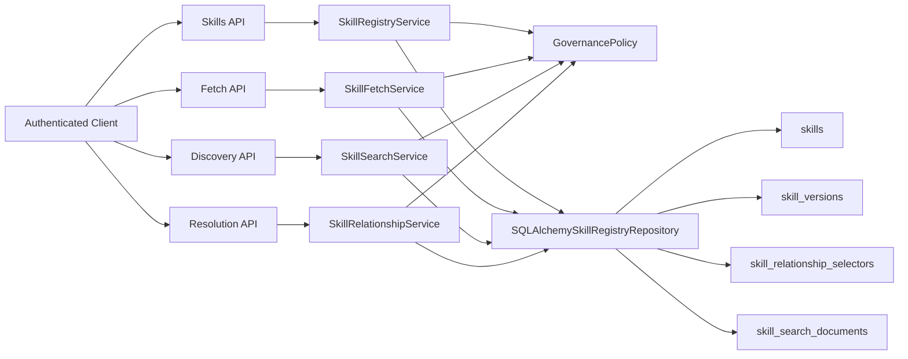
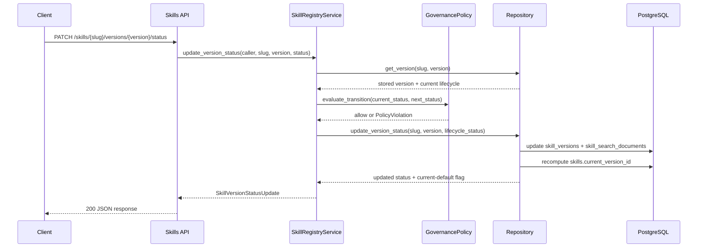

# Milestone 06 Changelog - Policy, Conflict, and Governance

This changelog documents implementation of [.agents/plans/06-policy-conflict-governance.md](../../.agents/plans/06-policy-conflict-governance.md).

The branch turned governance into a first-class server concern instead of a read-time convention. Publish now captures trust tier and optional provenance, read paths consistently enforce lifecycle visibility, discovery can filter by lifecycle and trust, and the PostgreSQL schema drops the compatibility artifacts that were left behind during the normalized storage cutover.

## Scope Delivered

- The branch introduced a centralized governance policy model in [app/core/governance.py](../../app/core/governance.py), settings-backed profile loading in [app/core/settings.py](../../app/core/settings.py), request authentication and scope mapping in [app/core/dependencies.py](../../app/core/dependencies.py), and uniform `403` policy error rendering in [app/interface/api/errors.py](../../app/interface/api/errors.py). Startup now wires one shared `GovernancePolicy` into registry, discovery, fetch, and relationship services in [app/main.py](../../app/main.py).
- Publish and exact-read contracts now expose governance explicitly. [app/interface/dto/skills.py](../../app/interface/dto/skills.py) adds `governance.trust_tier`, provenance fields, lifecycle/trust response fields, and new relationship families `conflicts_with` and `overlaps_with`; [app/interface/api/skills.py](../../app/interface/api/skills.py) adds `PATCH /skills/{slug}/versions/{version}/status`; and [app/interface/dto/examples.py](../../app/interface/dto/examples.py) plus [docs/api-contract.md](../project/api-contract.md) keep the public contract aligned.
- Version writes and read models now persist governance state in PostgreSQL. [alembic/versions/0006_policy_conflict_governance.py](https://github.com/y0ncha/Aptitude/blob/627675bca330d21a8703a56f102a30c7cb2df3f1/alembic/versions/0006_policy_conflict_governance.py) adds lifecycle, trust-tier, and provenance columns to `skill_versions`, projects lifecycle and trust into `skill_search_documents`, backfills defaults, recomputes `skills.current_version_id`, and drops legacy compatibility tables and mirror columns. The corresponding ORM and repository logic live in [app/persistence/models/skill.py](../../app/persistence/models/skill.py), [app/persistence/models/skill_version.py](../../app/persistence/models/skill_version.py), [app/persistence/models/skill_search_document.py](../../app/persistence/models/skill_search_document.py), [app/persistence/models/skill_relationship_selector.py](../../app/persistence/models/skill_relationship_selector.py), and [app/persistence/skill_registry_repository.py](../../app/persistence/skill_registry_repository.py).
- Read behavior now follows one governance boundary instead of ad hoc route checks. [app/core/skills/registry.py](../../app/core/skills/registry.py) enforces publish policy and lifecycle transitions, [app/core/skills/fetch.py](../../app/core/skills/fetch.py) blocks exact reads for hidden lifecycle states, [app/core/skills/search.py](../../app/core/skills/search.py) resolves allowed discovery statuses and trust tiers before querying, and [app/core/skill_relationships.py](https://github.com/y0ncha/Aptitude/blob/d121a27441a2f699bd0d3a85fe9127a14c8d820f/app/core/skill_relationships.py) redacts hidden relationship targets without introducing any winner selection or solver behavior.

## Architecture Snapshot

Why this shape:
- Policy decisions are evaluated once in the core layer and reused across publish, identity/list, exact fetch, discovery, and relationship reads rather than duplicated per router: [app/core/governance.py](../../app/core/governance.py), [app/core/skills/registry.py](../../app/core/skills/registry.py), [app/core/skills/fetch.py](../../app/core/skills/fetch.py), [app/core/skills/search.py](../../app/core/skills/search.py), [app/core/skill_relationships.py](https://github.com/y0ncha/Aptitude/blob/d121a27441a2f699bd0d3a85fe9127a14c8d820f/app/core/skill_relationships.py).
- Governance is stored on immutable versions and copied into the search projection so visibility checks do not depend on legacy mirrors or filesystem metadata: [alembic/versions/0006_policy_conflict_governance.py](https://github.com/y0ncha/Aptitude/blob/627675bca330d21a8703a56f102a30c7cb2df3f1/alembic/versions/0006_policy_conflict_governance.py), [app/persistence/models/skill_version.py](../../app/persistence/models/skill_version.py), [app/persistence/models/skill_search_document.py](../../app/persistence/models/skill_search_document.py).

## Runtime Flow

## Design Notes

- Policy is treated as data, not router logic. Settings can define additional named policy profiles via `POLICY_PROFILES_JSON`, and startup resolves one active profile before requests reach the service layer: [app/core/settings.py](../../app/core/settings.py), [app/main.py](../../app/main.py).
- Lifecycle visibility is intentionally consistent across list, fetch, relationship, and discovery surfaces. The branch uses the same `GovernancePolicy` checks when deciding whether a version is returned directly, contributes to `current_version_id`, or can appear as an enriched relationship target: [app/core/governance.py](../../app/core/governance.py), [app/persistence/skill_registry_repository.py](../../app/persistence/skill_registry_repository.py).
- Conflict metadata is preserved, not solved. `conflicts_with` and `overlaps_with` are accepted at publish time, stored in selector order, returned on exact reads and batch relationship reads, and may resolve to exact visible targets, but the server still does not pick winners or perform dependency/conflict resolution: [app/interface/dto/skills.py](../../app/interface/dto/skills.py), [app/core/ports.py](../../app/core/ports.py), [app/core/skill_relationships.py](https://github.com/y0ncha/Aptitude/blob/d121a27441a2f699bd0d3a85fe9127a14c8d820f/app/core/skill_relationships.py), [app/interface/api/resolution.py](../../app/interface/api/resolution.py).
- The migration finishes the cleanup promised by the normalized PostgreSQL cutover. Governance state now lives on canonical rows, while `skill_relationship_edges`, `skill_version_checksums`, `skills.skill_id`, `skills.status`, and version-level compatibility mirrors are removed from head instead of remaining as shadow runtime structures: [alembic/versions/0006_policy_conflict_governance.py](https://github.com/y0ncha/Aptitude/blob/627675bca330d21a8703a56f102a30c7cb2df3f1/alembic/versions/0006_policy_conflict_governance.py), [docs/schema.md](../../docs/schema.md).

## Schema Reference

Source: [alembic/versions/0006_policy_conflict_governance.py](https://github.com/y0ncha/Aptitude/blob/627675bca330d21a8703a56f102a30c7cb2df3f1/alembic/versions/0006_policy_conflict_governance.py), [docs/schema.md](../../docs/schema.md), [app/persistence/models/skill.py](../../app/persistence/models/skill.py), [app/persistence/models/skill_version.py](../../app/persistence/models/skill_version.py), [app/persistence/models/skill_relationship_selector.py](../../app/persistence/models/skill_relationship_selector.py), [app/persistence/models/skill_search_document.py](../../app/persistence/models/skill_search_document.py).

### `skills`

| Field | Type | Nullable | Default / Constraint | Role |
| --- | --- | --- | --- | --- |
| `slug` | `text` | No | Unique | Stable public identity used by every read and write route after removing legacy `skill_id`. |
| `current_version_id` | `bigint` | Yes | FK to `skill_versions.id` | Points to the highest-priority non-archived version so identity reads can expose one server-approved default. |
| `updated_at` | `timestamptz` | No | Auto-updated timestamp | Records when the identity-level default pointer changed after publish or lifecycle transitions. |

### `skill_versions`

| Field | Type | Nullable | Default / Constraint | Role |
| --- | --- | --- | --- | --- |
| `lifecycle_status` | `text` | No | Check-constrained to `published`, `deprecated`, `archived` | Governs exact-read visibility, discovery eligibility, and default-version selection. |
| `lifecycle_changed_at` | `timestamptz` | No | Defaults to current timestamp | Captures when the last lifecycle transition happened, separate from immutable publish time. |
| `trust_tier` | `text` | No | Check-constrained to `untrusted`, `internal`, `verified` | Carries the publish-time trust classification used by policy and discovery filters. |
| `provenance_repo_url` | `text` | Yes | Optional | Stores the source repository identifier required by stricter publish rules. |
| `provenance_commit_sha` | `text` | Yes | Optional | Stores the exact source revision bound to the immutable version. |
| `provenance_tree_path` | `text` | Yes | Optional | Preserves the repository subpath when the skill lives below repo root. |

### `skill_relationship_selectors`

| Field | Type | Nullable | Default / Constraint | Role |
| --- | --- | --- | --- | --- |
| `edge_type` | `text` | No | Check-constrained to `depends_on`, `extends`, `conflicts_with`, `overlaps_with` | Preserves authored relationship semantics without inferring them from JSON keys. |
| `ordinal` | `integer` | No | Indexed with source + edge type | Keeps relationship output deterministic and stable across exact fetch and batch reads. |
| `target_slug` | `text` | No | Required | Stores the public target identity even when no exact version can be enriched. |
| `target_version` | `text` | Yes | Optional | Records an exact immutable target for `extends`, `conflicts_with`, `overlaps_with`, and exact dependencies. |
| `version_constraint` | `text` | Yes | Optional | Preserves authored dependency ranges without forcing immediate resolution to one target version. |

### `skill_search_documents`

| Field | Type | Nullable | Default / Constraint | Role |
| --- | --- | --- | --- | --- |
| `lifecycle_status` | `text` | No | Check-constrained to `published`, `deprecated`, `archived` | Lets discovery enforce lifecycle visibility without joining back to mutable policy logic. |
| `trust_tier` | `text` | No | Check-constrained to `untrusted`, `internal`, `verified` | Enables explicit trust filtering on discovery queries. |
| `published_at` | `timestamptz` | No | Required | Preserves deterministic freshness ranking after lifecycle-aware filtering. |
| `content_size_bytes` | `bigint` | No | Required | Keeps discovery filters and tie-breaks body-free while still reflecting artifact size. |

Legacy state removed at head:
- `skill_relationship_edges` and `skill_version_checksums` are dropped entirely.
- `skills.skill_id` and `skills.status` are removed in favor of `skills.slug` plus `current_version_id`.
- `skill_versions.manifest_json`, `artifact_rel_path`, `artifact_size_bytes`, and `is_published` are removed because normalized tables and governance columns are now authoritative.

## Verification Notes

- Governance settings, publish requirements, and invalid lifecycle transitions are covered by [tests/unit/test_governance.py](../../tests/unit/test_governance.py).
- Core service behavior is covered by [tests/unit/test_skill_registry_service.py](../../tests/unit/test_skill_registry_service.py) and [tests/unit/test_skill_relationship_service.py](https://github.com/y0ncha/Aptitude/blob/86f334779619032d8c1eb6fd8d08221badcc6394/tests/unit/test_skill_relationship_service.py), including checksum production, audit emission, and exact relationship enrichment.
- End-to-end route coverage lives in [tests/integration/test_skill_registry_endpoints.py](../../tests/integration/test_skill_registry_endpoints.py) for trust-tier policy failures, status transitions, visibility/redaction rules, discovery trust/lifecycle filters, and governance-aware search-document projection.
- Migration shape and backfill behavior are covered by [tests/integration/test_migrations.py](../../tests/integration/test_migrations.py), including removal of legacy tables/columns and recomputation of governance defaults from a `0004` starting point.
- Contract drift is guarded by [tests/unit/test_registry_api_boundary.py](../../tests/unit/test_registry_api_boundary.py) and [tests/unit/test_api_contract_examples.py](../../tests/unit/test_api_contract_examples.py), which keep the published API surface and examples aligned with the DTOs.
