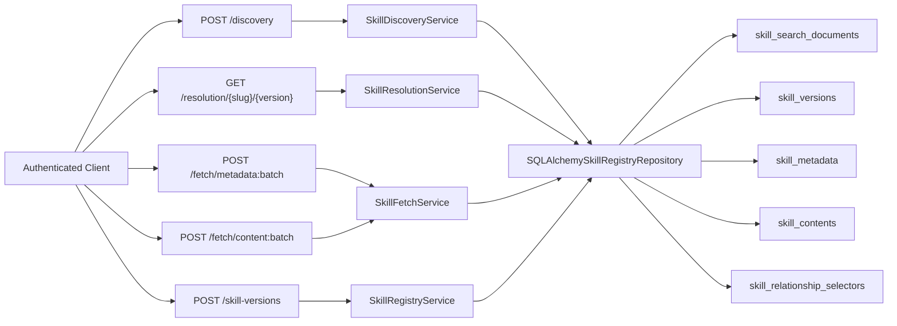
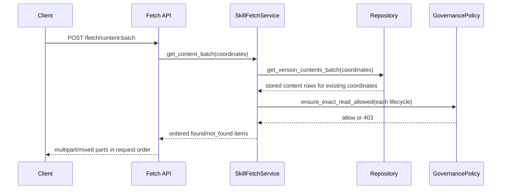

# Milestone 07 Changelog - MVP Read API Hard Cut

This changelog documents implementation of [.agents/plans/07-mvp-read-api-hard-cut.md](../../.agents/plans/07-mvp-read-api-hard-cut.md).

The milestone makes the intended break explicit: the public read contract is reduced to four endpoints, superseded read routes are removed instead of wrapped, and publish now reuses the same immutable metadata envelope returned by batch fetch. The cut is enforced in routers, services, and examples rather than carried as compatibility debt.

Historical note (March 15, 2026): the batch-fetch route inventory captured below was superseded before the contract freeze completed. The current public read contract is `POST /discovery`, public `GET /resolution/{slug}/{version}`, `GET /skills/{slug}/versions/{version}`, and `GET /skills/{slug}/versions/{version}/content`; use [docs/project/api-contract.md](../project/api-contract.md) and [Plan 09](../../.agents/plans/09-public-api-simplification-and-contract-freeze.md) as the current source of truth.

## Scope Delivered

- The public API surface now exposes only `POST /discovery`, `GET /resolution/{slug}/{version}`, `POST /fetch/metadata:batch`, `POST /fetch/content:batch`, `POST /skill-versions`, and `PATCH /skills/{slug}/versions/{version}/status`: [app/main.py](../../app/main.py), [app/interface/api/discovery.py](../../app/interface/api/discovery.py), [app/interface/api/resolution.py](../../app/interface/api/resolution.py), [app/interface/api/fetch.py](../../app/interface/api/fetch.py), [app/interface/api/skills.py](../../app/interface/api/skills.py), [tests/unit/test_registry_api_boundary.py](../../tests/unit/test_registry_api_boundary.py), [docs/api-contract.md](../project/api-contract.md).
- Discovery is now body-based and slug-only. The request trims `name`, normalizes optional `description`, deduplicates `tags`, and the core layer reuses the indexed ranking path while forcing a public limit of `20`: [app/interface/dto/skills.py](../../app/interface/dto/skills.py), [app/interface/api/discovery.py](../../app/interface/api/discovery.py), [app/core/skill_discovery.py](../../app/core/skill_discovery.py), [app/core/skill_search.py](../../app/core/skill_search.py).
- Resolution is now a single-coordinate exact read that returns only authored `depends_on` declarations. Non-dependency families stay stored but are not exposed on the public read contract, and missing coordinates map to `404`: [app/interface/api/resolution.py](../../app/interface/api/resolution.py), [app/interface/api/skill_api_support.py](../../app/interface/api/skill_api_support.py), [app/core/skill_resolution.py](../../app/core/skill_resolution.py), [tests/unit/test_skill_resolution_service.py](../../tests/unit/test_skill_resolution_service.py).
- Fetch is batch-only. Metadata fetch preserves request order and returns `found | not_found` items, while content fetch emits `multipart/mixed` parts with coordinate and status headers plus immutable cache headers for found markdown bodies: [app/interface/api/fetch.py](../../app/interface/api/fetch.py), [app/interface/dto/skills.py](../../app/interface/dto/skills.py), [app/core/skill_fetch.py](../../app/core/skill_fetch.py), [app/interface/validation.py](../../app/interface/validation.py), [tests/integration/test_skill_registry_endpoints.py](../../tests/integration/test_skill_registry_endpoints.py).
- The core and persistence boundary was narrowed to the new contract. Discovery now returns candidate slugs, resolution reads direct dependency selectors, fetch owns immutable batch reads, and the repository provides batch metadata/content/relationship lookups for those exact coordinates: [app/core/ports.py](../../app/core/ports.py), [app/core/skill_discovery.py](../../app/core/skill_discovery.py), [app/core/skill_resolution.py](../../app/core/skill_resolution.py), [app/core/skill_fetch.py](../../app/core/skill_fetch.py), [app/persistence/skill_registry_repository.py](../../app/persistence/skill_registry_repository.py).
- Publish now returns the same immutable metadata envelope used by batch metadata fetch and no longer advertises deleted read-only fields such as embedded relationships or `content_download_path`: [app/interface/api/skills.py](../../app/interface/api/skills.py), [app/interface/api/skill_api_support.py](../../app/interface/api/skill_api_support.py), [app/interface/dto/skills.py](../../app/interface/dto/skills.py), [app/interface/dto/examples.py](../../app/interface/dto/examples.py), [tests/unit/test_api_contract_examples.py](../../tests/unit/test_api_contract_examples.py).

## Architecture Snapshot

Why this shape:
- The hard cut separates candidate discovery, exact dependency reads, and immutable fetches into distinct services so the server boundary is obvious in code and in the documented API contract: [app/main.py](../../app/main.py), [app/core/ports.py](../../app/core/ports.py).
- Exact reads now converge on batch-capable repository methods and one shared governance gate before the API layer formats JSON or multipart responses: [app/core/skill_fetch.py](../../app/core/skill_fetch.py), [app/core/skill_resolution.py](../../app/core/skill_resolution.py), [app/persistence/skill_registry_repository.py](../../app/persistence/skill_registry_repository.py).

## Runtime Flow

## Design Notes

- This milestone chooses deletion over compatibility wrappers. The old public search, relationship batch, identity, version-list, and single-item fetch routes are absent from the router surface and from the documented API contract instead of being kept behind aliases: [tests/unit/test_registry_api_boundary.py](../../tests/unit/test_registry_api_boundary.py), [docs/api-contract.md](../project/api-contract.md).
- Discovery deliberately reuses the existing ranking pipeline while stripping the public response down to ordered slugs. The service still builds one normalized text query from `name` plus optional `description`, but explanation fields, versions, and solver-like output do not cross the public boundary: [app/core/skill_discovery.py](../../app/core/skill_discovery.py), [app/core/skill_search.py](../../app/core/skill_search.py), [app/intelligence/search_ranking.py](../../app/intelligence/search_ranking.py).
- Resolution returns dependency declarations exactly as authored rather than resolved winners. The service filters preserved selector rows down to `depends_on` and keeps `version` xor `version_constraint`, `optional`, and `markers` intact: [app/core/skill_resolution.py](../../app/core/skill_resolution.py), [app/persistence/models/skill_relationship_selector.py](../../app/persistence/models/skill_relationship_selector.py).
- Fetch owns immutable exact reads for both metadata and content. The service reconstructs request order after set-based repository queries, and the content route encodes found and missing coordinates into per-part headers without reintroducing single-item convenience routes: [app/core/skill_fetch.py](../../app/core/skill_fetch.py), [app/interface/api/fetch.py](../../app/interface/api/fetch.py).
- The batch exact-read policy is intentionally fail-fast for hidden lifecycle states. Existing archived coordinates return `403` for resolution and abort metadata or content batch fetches before any partial multipart body is emitted: [app/core/skill_fetch.py](../../app/core/skill_fetch.py), [app/core/skill_resolution.py](../../app/core/skill_resolution.py), [tests/integration/test_skill_registry_endpoints.py](../../tests/integration/test_skill_registry_endpoints.py).
- No new migration ships in this milestone. The implementation narrows the public contract and service boundary over the normalized schema already at head instead of introducing more compatibility tables or mirror columns: [app/persistence/models/skill_version.py](../../app/persistence/models/skill_version.py), [app/persistence/models/skill_content.py](../../app/persistence/models/skill_content.py), [app/persistence/models/skill_metadata.py](../../app/persistence/models/skill_metadata.py).

## Schema Reference

Source: [app/persistence/models/skill_version.py](../../app/persistence/models/skill_version.py), [app/persistence/models/skill_relationship_selector.py](../../app/persistence/models/skill_relationship_selector.py), [app/persistence/models/skill_content.py](../../app/persistence/models/skill_content.py), [app/persistence/models/skill_metadata.py](../../app/persistence/models/skill_metadata.py).

This milestone does not add a new schema migration. The tables below are the existing normalized rows that the hard-cut read contract now exposes more narrowly.

### `skill_versions`

| Field | Type | Nullable | Default / Constraint | Role |
| --- | --- | --- | --- | --- |
| `version` | `text` | No | Unique with `skill_fk` | Forms the immutable half of every exact `slug@version` coordinate used by resolution and batch fetch. |
| `content_fk` | `bigint` | No | FK to `skill_contents.id` | Binds each immutable version to the canonical markdown row returned by content batch fetch. |
| `metadata_fk` | `bigint` | No | FK to `skill_metadata.id` | Binds each immutable version to the structured metadata envelope returned by publish and metadata fetch. |
| `checksum_digest` | `string(64)` | No | Required | Gives the version-level checksum returned in the immutable metadata response. |
| `lifecycle_status` | `text` | No | Check-constrained to `published`, `deprecated`, `archived` | Drives exact-read visibility and discovery eligibility. |
| `trust_tier` | `text` | No | Check-constrained to `untrusted`, `internal`, `verified` | Preserves publish-time trust classification used by governance and discovery filtering. |
| `published_at` | `timestamptz` | No | Defaults to current timestamp | Carries immutable publication time for metadata responses and search freshness ranking. |

### `skill_relationship_selectors`

| Field | Type | Nullable | Default / Constraint | Role |
| --- | --- | --- | --- | --- |
| `source_skill_version_fk` | `bigint` | No | FK to `skill_versions.id`, `ON DELETE CASCADE` | Attaches authored selectors to one immutable source version. |
| `edge_type` | `text` | No | Check-constrained relationship family | Preserves `depends_on`, `extends`, `conflicts_with`, and `overlaps_with` even though resolution now only exposes dependencies. |
| `ordinal` | `integer` | No | Indexed with source + edge type | Keeps selector output deterministic in authored order. |
| `target_slug` | `text` | No | Required | Stores the public identity of the related skill for exact and ranged selectors. |
| `target_version` | `text` | Yes | Optional | Preserves an authored exact version selector when one exists. |
| `version_constraint` | `text` | Yes | Optional | Preserves authored dependency ranges without solving them. |
| `optional` / `markers` | `boolean` / `text[]` | Yes / No | Optional flag, markers default empty | Keeps dependency execution hints intact for the dependency-only resolution response. |

### `skill_contents`

| Field | Type | Nullable | Default / Constraint | Role |
| --- | --- | --- | --- | --- |
| `raw_markdown` | `text` | No | Required | Stores the canonical markdown body emitted in `multipart/mixed` content fetch parts. |
| `storage_size_bytes` | `bigint` | No | Required | Backs the content summary size field and the multipart `Content-Length` header. |
| `checksum_digest` | `string(64)` | No | Unique | Supplies the immutable content checksum used as the multipart `ETag`. |

### `skill_metadata`

| Field | Type | Nullable | Default / Constraint | Role |
| --- | --- | --- | --- | --- |
| `name` | `text` | No | Required | Stores the human-readable skill name used for discovery input matching and metadata responses. |
| `description` | `text` | Yes | Optional | Provides short searchable summary text without reading markdown bodies. |
| `tags` | `text[]` | No | Defaults to empty array | Supports discovery filters and slug-candidate ranking without a join to raw content. |
| `headers` | `jsonb` | Yes | Optional | Preserves flexible metadata that still belongs in the immutable metadata envelope. |
| `inputs_schema` / `outputs_schema` | `jsonb` | Yes | Optional | Keeps structured contract fragments with the immutable version metadata. |
| `token_estimate` / `maturity_score` / `security_score` | `integer` / `float` | Yes | Optional | Preserves structured numeric metadata in the batch metadata response without requiring a second lookup. |

## Verification Notes

- Contract surface and route deletion are enforced by [tests/unit/test_registry_api_boundary.py](../../tests/unit/test_registry_api_boundary.py) and the human-readable contract at [docs/api-contract.md](../project/api-contract.md).
- Example payloads for publish, discovery, resolution, metadata batch fetch, and lifecycle status are validated by [tests/unit/test_api_contract_examples.py](../../tests/unit/test_api_contract_examples.py) against the DTOs in [app/interface/dto/skills.py](../../app/interface/dto/skills.py).
- Dependency-only exact-read behavior is covered in [tests/unit/test_skill_resolution_service.py](../../tests/unit/test_skill_resolution_service.py), including the `404` path for unknown coordinates.
- End-to-end coverage lives in [tests/integration/test_skill_registry_endpoints.py](../../tests/integration/test_skill_registry_endpoints.py) for publish -> discovery -> resolution -> metadata batch fetch -> content batch fetch, ordered `found | not_found` semantics, multipart headers and body content, and `403` policy failures for forbidden exact reads.
- Integration execution still depends on a reachable PostgreSQL database through [tests/conftest.py](../../tests/conftest.py), so the contract has both database-backed integration coverage and database-free unit coverage.
