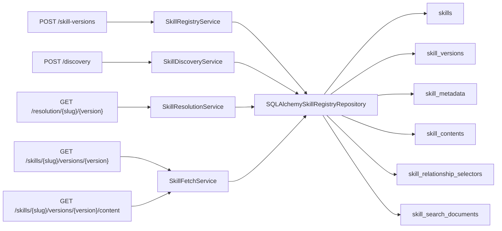

# Milestone 08 Changelog - Canonical PostgreSQL Storage Finalization

This changelog documents implementation of [.agents/plans/08-canonical-postgres-storage-finalization.md](../../.agents/plans/08-canonical-postgres-storage-finalization.md).

The milestone finishes the PostgreSQL-only runtime cutover behind the hard-cut read contract from Plan 07. Canonical storage now centers on immutable version rows, digest-deduplicated markdown rows, authored selector rows, and the search projection. Compatibility artifacts that only served deleted read routes were removed instead of being retained as internal debt.

## Scope Delivered

- The canonical Alembic baseline no longer creates `skills.current_version_id` or `skill_dependencies`; the runtime schema is now `skills`, `skill_versions`, `skill_contents`, `skill_metadata`, `skill_relationship_selectors`, `skill_search_documents`, and `audit_events`: [alembic/versions/0001_initial_schema.py](../../alembic/versions/0001_initial_schema.py), [tests/integration/test_migrations.py](../../tests/integration/test_migrations.py).
- ORM mappings now reflect that simplified model. `Skill` is an identity row only, `SkillVersion` binds immutable metadata/content/governance, and selector rows are the sole persisted dependency declarations: [app/persistence/models/skill.py](../../app/persistence/models/skill.py), [app/persistence/models/skill_version.py](../../app/persistence/models/skill_version.py), [app/persistence/models/skill_content.py](../../app/persistence/models/skill_content.py).
- Publish no longer materializes exact-edge projections, and lifecycle updates compute `is_current_default` from canonical version ordering rather than a stored pointer: [app/persistence/skill_registry_repository.py](../../app/persistence/skill_registry_repository.py), [app/core/skill_registry.py](../../app/core/skill_registry.py), [app/core/ports.py](../../app/core/ports.py).
- The identity/list-only core surface was removed. The remaining read stack now matches the public contract exactly: discovery uses the search projection, resolution uses authored selectors, and fetch serves exact immutable metadata and markdown reads over canonical coordinates: [app/core/skill_discovery.py](../../app/core/skill_discovery.py), [app/core/skill_resolution.py](../../app/core/skill_resolution.py), [app/core/skill_fetch.py](../../app/core/skill_fetch.py), [app/core/skill_version_projections.py](../../app/core/skill_version_projections.py).
- Storage and contract documentation now describe selector-backed dependency reads, digest-backed PostgreSQL content storage, and the absence of identity/list compatibility state: [docs/schema.md](../../docs/schema.md), [docs/storage-strategy.md](../../docs/storage-strategy.md), [docs/overview.md](../../docs/overview.md), [docs/scope.md](../project/scope.md), [docs/prd.md](../../docs/prd.md).

## Architecture Snapshot

## Design Notes

- Selector rows are now the only runtime dependency source of truth. Resolution already returned authored `depends_on` selectors exactly as stored, so removing `skill_dependencies` deleted unused write-time work without changing public behavior: [app/core/skill_resolution.py](../../app/core/skill_resolution.py), [app/persistence/skill_registry_repository.py](../../app/persistence/skill_registry_repository.py).
- `is_current_default` remains on the lifecycle update response, but it is derived from the same visible-version ordering rule used by policy rather than a persisted pointer on `skills`. This preserves the response contract while removing schema state that only supported deleted identity routes: [app/persistence/skill_registry_repository.py](../../app/persistence/skill_registry_repository.py), [tests/integration/test_skill_registry_endpoints.py](../../tests/integration/test_skill_registry_endpoints.py).
- Discovery is still metadata-only at runtime. The repository executes ranked SQL against `skill_search_documents`, and the new integration coverage asserts that discovery requests do not touch `skill_contents`: [app/persistence/skill_registry_repository_support.py](../../app/persistence/skill_registry_repository_support.py), [tests/integration/test_skill_registry_endpoints.py](../../tests/integration/test_skill_registry_endpoints.py).
- Digest deduplication is now documented and tested as the canonical content reuse mechanism for immutable markdown bodies published under multiple versions: [app/persistence/models/skill_content.py](../../app/persistence/models/skill_content.py), [tests/integration/test_skill_registry_endpoints.py](../../tests/integration/test_skill_registry_endpoints.py).

## Schema Reference

Source: [alembic/versions/0001_initial_schema.py](../../alembic/versions/0001_initial_schema.py), [app/persistence/models/skill.py](../../app/persistence/models/skill.py), [app/persistence/models/skill_version.py](../../app/persistence/models/skill_version.py), [app/persistence/models/skill_relationship_selector.py](../../app/persistence/models/skill_relationship_selector.py), [app/persistence/models/skill_content.py](../../app/persistence/models/skill_content.py).

### `skills`

| Field | Type | Nullable | Default / Constraint | Role |
| --- | --- | --- | --- | --- |
| `slug` | `text` | No | Unique | Stable public skill identity used by publish and exact reads. |
| `created_at` / `updated_at` | `timestamptz` | No | Server timestamps | Track identity-row lifecycle without storing a default-version pointer. |

### `skill_versions`

| Field | Type | Nullable | Default / Constraint | Role |
| --- | --- | --- | --- | --- |
| `skill_fk` + `version` | `bigint` + `text` | No | Unique pair | Forms each immutable `slug@version` coordinate. |
| `content_fk` | `bigint` | No | FK to `skill_contents.id` | Binds one immutable version to one digest-backed markdown row. |
| `metadata_fk` | `bigint` | No | FK to `skill_metadata.id` | Binds one immutable version to the structured metadata envelope. |
| `checksum_digest` | `string(64)` | No | Required | Carries the version-level checksum returned in metadata responses. |
| `lifecycle_status` / `trust_tier` | `text` | No | Check-constrained | Drive exact-read governance and discovery visibility. |
| `published_at` | `timestamptz` | No | Server timestamp | Preserves immutable ordering for fetch and derived default-status calculations. |

### `skill_relationship_selectors`

| Field | Type | Nullable | Default / Constraint | Role |
| --- | --- | --- | --- | --- |
| `source_skill_version_fk` | `bigint` | No | FK to `skill_versions.id` | Attaches selectors to one immutable source version. |
| `edge_type` + `ordinal` | `text` + `integer` | No | Indexed by source | Preserve authored edge family and deterministic output order. |
| `target_slug` | `text` | No | Required | Stores the related skill identity exactly as authored. |
| `target_version` / `version_constraint` | `text` | Yes | Optional | Preserve exact selectors and version ranges without solving them. |
| `optional` / `markers` | `boolean` / `text[]` | Yes / No | Optional flag, markers required | Keep dependency execution hints intact for resolution responses. |

## Verification Notes

- Migration coverage confirms the canonical baseline upgrades and downgrades cleanly without `skill_dependencies` or `skills.current_version_id`: [tests/integration/test_migrations.py](../../tests/integration/test_migrations.py).
- End-to-end API coverage now includes identical-content deduplication, distinct-content storage, exact metadata/content fetch, discovery metadata-only SQL, lifecycle transitions, auth, governance, and search document projection: [tests/integration/test_skill_registry_endpoints.py](../../tests/integration/test_skill_registry_endpoints.py).
- Unit coverage validates publish behavior, version-detail projection, exact fetch service behavior, and the public route boundary: [tests/unit/test_skill_registry_service.py](../../tests/unit/test_skill_registry_service.py), [tests/unit/test_skill_version_projections.py](../../tests/unit/test_skill_version_projections.py), [tests/unit/test_skill_fetch_service.py](../../tests/unit/test_skill_fetch_service.py), [tests/unit/test_registry_api_boundary.py](../../tests/unit/test_registry_api_boundary.py).
- Local verification commands:
  - `uv run pytest tests/unit/test_registry_api_boundary.py tests/unit/test_skill_fetch_service.py tests/unit/test_skill_registry_service.py tests/unit/test_skill_version_projections.py tests/integration/test_migrations.py tests/integration/test_skill_registry_endpoints.py`
  - `uv run ruff check app tests alembic`
