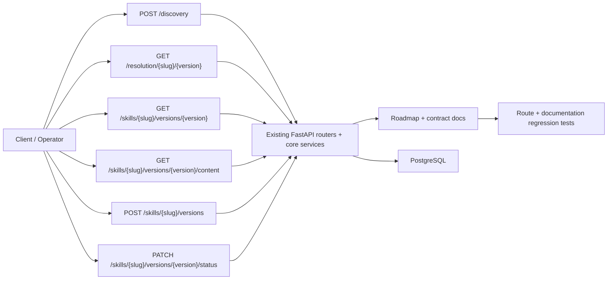
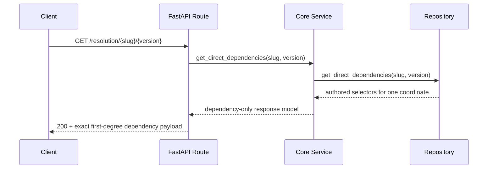

# Milestone 09 Changelog - Public API Simplification and Contract Freeze

This changelog documents implementation of [.agents/plans/09-public-api-simplification-and-contract-freeze.md](../../.agents/plans/09-public-api-simplification-and-contract-freeze.md).

The milestone did not add or remove runtime routes. It froze the already-implemented public contract in the primary docs, aligned milestone history with that decision, and added regression tests so later plans cannot drift back toward removed public read families.

## Scope Delivered

- The primary contract docs now state the freeze rule explicitly: public resolution remains first-class, exact `GET` metadata/content fetch is the baseline, and later plans extend semantics inside the existing route set instead of adding compatibility aliases or sibling read families: [docs/project/api-contract.md](../project/api-contract.md), [.agents/plans/roadmap.md](../../.agents/plans/roadmap.md), [docs/project/scope.md](../project/scope.md), [docs/prd.md](../prd.md).
- Historical milestone plans now carry superseding notes so pre-freeze list/search and batch-fetch text is not mistaken for the current public contract: [.agents/plans/04-repository-api-contract-v1.md](../../.agents/plans/04-repository-api-contract-v1.md), [.agents/plans/07-mvp-read-api-hard-cut.md](../../.agents/plans/07-mvp-read-api-hard-cut.md), [.agents/plans/09-public-api-simplification-and-contract-freeze.md](../../.agents/plans/09-public-api-simplification-and-contract-freeze.md).
- Historical changelog entries that still referenced removed route families now point readers back to the frozen contract instead of reading as live API guidance: [docs/changelog/05-metadata-search-ranking-changelog.md](05-metadata-search-ranking-changelog.md), [docs/changelog/07-mvp-read-api-hard-cut-changelog.md](07-mvp-read-api-hard-cut-changelog.md).
- Regression coverage now protects both the FastAPI surface and the contract docs from route-family drift, and the manual HTTP sanity fixture now exercises the frozen publish/discovery/resolution/exact-fetch/lifecycle flow: [tests/unit/test_registry_api_boundary.py](../../tests/unit/test_registry_api_boundary.py), [tests/unit/test_public_contract_docs.py](../../tests/unit/test_public_contract_docs.py), [tests/resources/test-main.http](../../tests/resources/test-main.http).

## Architecture Snapshot

Why this shape:
- Plan 09 freezes the public boundary around the already-implemented route families instead of adding migration aliases or compatibility facades: [app/main.py](../../app/main.py), [docs/project/api-contract.md](../project/api-contract.md), [tests/unit/test_registry_api_boundary.py](../../tests/unit/test_registry_api_boundary.py).
- The existing service split remains intact: discovery returns candidate slugs, resolution returns direct `depends_on`, and exact fetch keeps metadata and markdown separate while docs/tests prevent roadmap drift from re-expanding that surface: [app/interface/api/discovery.py](../../app/interface/api/discovery.py), [app/interface/api/resolution.py](../../app/interface/api/resolution.py), [app/interface/api/fetch.py](../../app/interface/api/fetch.py), [tests/unit/test_public_contract_docs.py](../../tests/unit/test_public_contract_docs.py).

## Runtime Flow

## Design Notes

- This milestone is a contract freeze, not a transport refactor. The implemented FastAPI route surface already matched the desired boundary, so the work focused on primary docs, milestone notes, and regression coverage rather than on runtime compatibility code: [app/main.py](../../app/main.py), [docs/project/api-contract.md](../project/api-contract.md).
- Historical delivery notes remain valuable, but they no longer stand alone as contract guidance. Superseding notes were added where older plans or changelogs described list/search or batch-fetch shapes that should not reappear in later milestones: [docs/changelog/05-metadata-search-ranking-changelog.md](05-metadata-search-ranking-changelog.md), [docs/changelog/07-mvp-read-api-hard-cut-changelog.md](07-mvp-read-api-hard-cut-changelog.md).
- No database schema changes ship in this milestone. The schema and service boundary from Plan 08 remain the runtime baseline; Plan 09 hardens the public contract language around that implementation: [docs/changelog/08-canonical-postgres-storage-finalization-changelog.md](08-canonical-postgres-storage-finalization-changelog.md), [docs/schema.md](../schema.md).

## Schema Reference

Source: [docs/project/api-contract.md](../project/api-contract.md), [.agents/plans/roadmap.md](../../.agents/plans/roadmap.md), [tests/unit/test_registry_api_boundary.py](../../tests/unit/test_registry_api_boundary.py).

### `public_route_surface`

| Field | Type | Nullable | Default / Constraint | Role |
| --- | --- | --- | --- | --- |
| `publish` | `POST /skills/{slug}/versions` | No | Frozen public route family | Creates one immutable `slug@version` and remains the only public publish entrypoint. |
| `discovery` | `POST /discovery` | No | Slug-only candidate response | Keeps discovery limited to candidate generation without reranking or solve semantics. |
| `resolution` | `GET /resolution/{slug}/{version}` | No | Exact coordinate read | Preserves public first-degree dependency inspection as a separate registry primitive. |
| `exact_metadata_fetch` | `GET /skills/{slug}/versions/{version}` | No | Exact immutable read | Returns the metadata envelope for one coordinate without introducing batch or identity/list variants. |
| `exact_content_fetch` | `GET /skills/{slug}/versions/{version}/content` | No | Exact immutable read | Returns raw markdown for one coordinate with immutable caching semantics. |
| `lifecycle_status` | `PATCH /skills/{slug}/versions/{version}/status` | No | Governing write route | Keeps lifecycle transitions inside the same frozen route family rather than in separate governance trees. |

## Verification Notes

- Route-boundary regressions now fail if legacy search, relationship-batch, list, or batch-fetch routes reappear in FastAPI or OpenAPI output: [tests/unit/test_registry_api_boundary.py](../../tests/unit/test_registry_api_boundary.py).
- Documentation regressions now fail if the roadmap, current contract docs, or later milestone plans reintroduce removed public read routes or stop stating the freeze rule explicitly: [tests/unit/test_public_contract_docs.py](../../tests/unit/test_public_contract_docs.py).
- Local manual validation uses the frozen route set end-to-end through publish, discovery, resolution, exact metadata fetch, exact content fetch, and lifecycle update requests: [tests/resources/test-main.http](../../tests/resources/test-main.http).
- Verification command used for this milestone:
  - `uv run pytest tests/unit/test_registry_api_boundary.py tests/unit/test_public_contract_docs.py`
