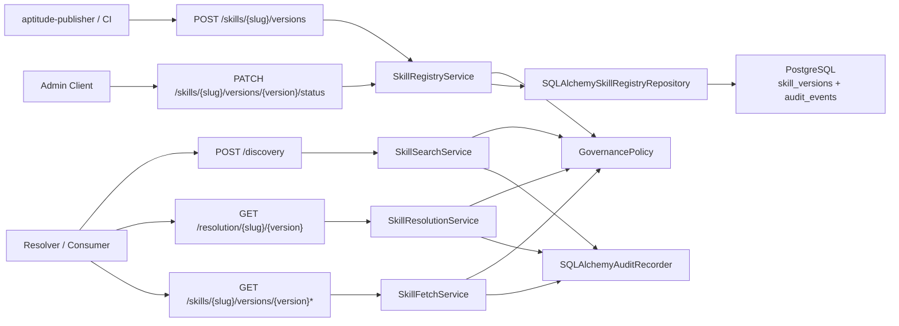

# Milestone 10 Changelog - Governance, Provenance, and Audit Completion

This changelog documents implementation of [.agents/plans/10-governance-provenance-and-audit-completion.md](../../.agents/plans/10-governance-provenance-and-audit-completion.md).

The milestone finishes the governance layer on top of the frozen publish/discovery/resolution/exact-fetch contract. Advisory provenance is aligned to the publisher/server/resolver boundary, exact-read auditing is complete, successful mutation audits commit in the same transaction as the authoritative PostgreSQL write, and the last stale `content.rendered_summary` artifact has been removed so canonical short-summary ownership lives only on `metadata.description`.

## Scope Delivered

- Publisher-collected provenance now supports optional `publisher_identity`, while the server remains authoritative for provenance normalization, validation, persistence, trust-tier enforcement, and derived trust context: [app/core/governance.py](../../app/core/governance.py), [app/core/skills/registry.py](../../app/core/skills/registry.py), [app/interface/dto/skills.py](../../app/interface/dto/skills.py), [app/interface/api/skill_api_support.py](../../app/interface/api/skill_api_support.py).
- Immutable version rows now store the full advisory provenance snapshot needed for exact metadata reads, including `publisher_identity` and `policy_profile_at_publish`: [alembic/versions/0001_initial_schema.py](../../alembic/versions/0001_initial_schema.py), [app/persistence/models/skill_version.py](../../app/persistence/models/skill_version.py), [app/persistence/skill_registry_repository.py](../../app/persistence/skill_registry_repository.py).
- Exact metadata fetch now returns enriched advisory provenance with server-derived `trust_context`, and its `content` summary now carries only checksum/size metadata while canonical short-summary text remains on `metadata.description`; discovery, resolution, and raw markdown content fetch remain provenance-independent: [app/core/skills/fetch.py](../../app/core/skills/fetch.py), [app/core/skills/resolution.py](../../app/core/skills/resolution.py), [docs/project/api-contract.md](../project/api-contract.md).
- Audit coverage now spans successful and denied publish, successful and denied lifecycle updates, discovery activity, exact resolution/metadata/content reads, and denied exact reads for hidden lifecycle states. Successful publish and lifecycle audits are committed transactionally with the mutation: [app/core/audit_events.py](../../app/core/audit_events.py), [app/audit/recorder.py](../../app/audit/recorder.py), [app/persistence/models/audit_event.py](../../app/persistence/models/audit_event.py).
- The stale `content.rendered_summary` compatibility path has been removed from publish requests, exact metadata responses, content persistence, examples, and manual clients; validation now rejects the legacy field explicitly: [app/core/ports.py](../../app/core/ports.py), [app/core/skills/models.py](../../app/core/skills/models.py), [app/persistence/models/skill_content.py](../../app/persistence/models/skill_content.py), [app/interface/dto/skills.py](../../app/interface/dto/skills.py), [app/interface/dto/examples.py](../../app/interface/dto/examples.py), [tests/unit/test_skill_manifest.py](../../tests/unit/test_skill_manifest.py), [tests/unit/test_skill_version_projections.py](../../tests/unit/test_skill_version_projections.py), [tests/integration/test_skill_registry_endpoints.py](../../tests/integration/test_skill_registry_endpoints.py).
- Docs and module READMEs now describe both the publisher/server/resolver provenance split and the canonical-summary boundary between metadata and content storage: [docs/project/api-contract.md](../project/api-contract.md), [docs/schema.md](../../docs/schema.md), [app/README.md](../../app/README.md), [app/core/README.md](../../app/core/README.md), [app/interface/README.md](../../app/interface/README.md), [app/persistence/README.md](../../app/persistence/README.md).

## Architecture Snapshot

## Architecture Review Outcome

- Architectural impact is low-risk and positive: removing `content.rendered_summary` eliminates duplicate summary ownership across metadata and content without widening the frozen public route families or changing provenance/audit responsibilities.
- Deduplicated `skill_contents` rows now remain content-addressed storage only, while author-owned short summary text is version-scoped metadata through `metadata.description`. That is the correct ownership boundary for discovery and exact metadata reads because it prevents drift between shared content blobs and per-version metadata.

## Design Notes

- Provenance stays advisory and publisher-supplied. The server does not invent a richer authenticated publisher principal in this milestone; that remains future auth-boundary work.
- `trust_context` is server-derived from immutable `trust_tier` plus the active policy profile captured at publish time. Clients cannot submit or override it.
- `metadata.description` is now the only canonical short-summary field. Removing `content.rendered_summary` prevents drift between deduplicated content storage and version-scoped metadata.
- Discovery, resolution, and raw content fetch still operate only on canonical PostgreSQL state and ignore provenance entirely.
- Mutation audit rows now share the same database transaction as the publish or lifecycle write so authoritative state and mutation audit cannot drift on partial commit.

## Verification Notes

- Unit coverage now includes provenance normalization/validation, audit-event builders, DTO example compatibility, fetch/resolution audit behavior, legacy `rendered_summary` rejection, projection cleanup, public-contract doc-path regression, and the stale duplicate-publish regression: [tests/unit/test_governance.py](../../tests/unit/test_governance.py), [tests/unit/test_audit_events.py](../../tests/unit/test_audit_events.py), [tests/unit/test_skill_registry_service.py](../../tests/unit/test_skill_registry_service.py), [tests/unit/test_skill_fetch_service.py](../../tests/unit/test_skill_fetch_service.py), [tests/unit/test_skill_resolution_service.py](../../tests/unit/test_skill_resolution_service.py), [tests/unit/test_api_contract_examples.py](../../tests/unit/test_api_contract_examples.py), [tests/unit/test_skill_manifest.py](../../tests/unit/test_skill_manifest.py), [tests/unit/test_skill_version_projections.py](../../tests/unit/test_skill_version_projections.py), [tests/unit/test_public_contract_docs.py](../../tests/unit/test_public_contract_docs.py).
- PostgreSQL integration coverage now asserts the enriched provenance response, explicit rejection of the legacy `rendered_summary` request field, and the audit event matrix: [tests/integration/test_skill_registry_endpoints.py](../../tests/integration/test_skill_registry_endpoints.py), [tests/integration/test_migrations.py](../../tests/integration/test_migrations.py).
- Verification commands run during this review:
  - `uv run ruff check app tests alembic` -> passed.
  - `uv run pytest tests/unit/test_governance.py tests/unit/test_audit_events.py tests/unit/test_skill_resolution_service.py tests/unit/test_api_contract_examples.py -q` -> `24 passed`.
  - `uv run pytest tests/unit/test_skill_manifest.py tests/unit/test_skill_version_projections.py tests/unit/test_public_contract_docs.py tests/unit/test_skill_registry_service.py tests/unit/test_skill_fetch_service.py tests/integration/test_skill_registry_endpoints.py tests/integration/test_migrations.py -q` -> `34 passed, 15 skipped`; PostgreSQL-backed integration tests were skipped because PostgreSQL was not reachable in the review environment.
