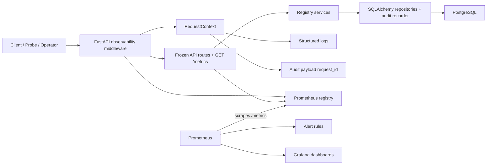
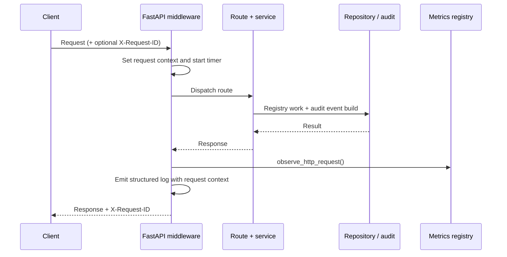

# Milestone 11 Changelog - Operability and Release Readiness

This changelog documents implementation of [.agents/plans/11-operability-and-release-readiness.md](../../.agents/plans/11-operability-and-release-readiness.md).

The milestone hardens the frozen registry surface with request-scoped observability, Prometheus-compatible metrics, optional local Prometheus/Grafana assets, containerized smoke paths, and incident runbooks. It does that without reopening the public registry-business route families finalized in Plans 09-10; the only new route is operational-only [`GET /metrics`](../project/api-contract.md).

## Scope Delivered

- Request correlation now starts in shared HTTP middleware, propagates through response headers, structured logs, and audit payloads, and is exercised by explicit operability tests: [app/main.py](../../app/main.py), [app/core/observability.py](../../app/core/observability.py), [app/core/logging.py](../../app/core/logging.py), [app/core/audit_events.py](../../app/core/audit_events.py), [tests/integration/test_operability.py](../../tests/integration/test_operability.py), [tests/unit/test_audit_events.py](../../tests/unit/test_audit_events.py), [tests/unit/test_logging.py](../../tests/unit/test_logging.py).
- The service now exposes bounded Prometheus-compatible HTTP, registry-surface, and readiness metrics, with readiness updates wired into `/readyz` and operational exposition wired into `/metrics`: [app/core/metrics.py](../../app/core/metrics.py), [app/interface/api/health.py](../../app/interface/api/health.py), [app/interface/api/operability.py](../../app/interface/api/operability.py), [app/main.py](../../app/main.py), [pyproject.toml](../../pyproject.toml), [tests/unit/test_observability.py](../../tests/unit/test_observability.py), [tests/integration/test_operability.py](../../tests/integration/test_operability.py).
- Prometheus scrape config, alert rules, Grafana provisioning, and a checked-in dashboard now exist as code, while remaining optional deployment-time assets rather than runtime requirements of the API itself: [ops/monitoring/prometheus/prometheus.yml](../../ops/monitoring/prometheus/prometheus.yml), [ops/monitoring/prometheus/alerts.yml](../../ops/monitoring/prometheus/alerts.yml), [ops/monitoring/grafana/provisioning/datasources/prometheus.yml](../../ops/monitoring/grafana/provisioning/datasources/prometheus.yml), [ops/monitoring/grafana/provisioning/dashboards/dashboards.yml](../../ops/monitoring/grafana/provisioning/dashboards/dashboards.yml), [ops/monitoring/grafana/dashboards/aptitude-server-operability.json](../../ops/monitoring/grafana/dashboards/aptitude-server-operability.json), [tests/unit/test_operability_assets.py](../../tests/unit/test_operability_assets.py).
- Local release-readiness paths now include explicit compose targets for database, one-shot migration, app, Prometheus, and Grafana startup plus container smoke commands documented for developers: [docker-compose.yml](../../docker-compose.yml), [Makefile](../../Makefile), [README.md](../../README.md), [docs/guides/setup-dev.md](../../docs/guides/setup-dev.md).
- CI now treats operability as part of the release gate by running lint, format, mypy, unit tests, integration tests, Prometheus config validation, compose validation, and Docker smoke flows on both `dev` and `master` pull requests: [.github/workflows/dev-ci.yml](../../.github/workflows/dev-ci.yml), [.github/workflows/main-ci.yml](../../.github/workflows/main-ci.yml), [docker-compose.yml](../../docker-compose.yml), [Makefile](../../Makefile).
- Contract docs and runbooks are now aligned to the frozen route set and the new observability vocabulary so operators troubleshoot the real API shape rather than deleted transition routes: [docs/project/api-contract.md](../project/api-contract.md), [docs/runbooks/README.md](../runbooks/README.md), [docs/runbooks/publish-failures.md](../runbooks/publish-failures.md), [docs/runbooks/discovery-latency-regression.md](../runbooks/discovery-latency-regression.md), [docs/runbooks/resolution-failures.md](../runbooks/resolution-failures.md), [docs/runbooks/fetch-failures.md](../runbooks/fetch-failures.md), [docs/runbooks/governance-denials.md](../runbooks/governance-denials.md), [docs/runbooks/metrics-scrape-failures.md](../runbooks/metrics-scrape-failures.md), [tests/unit/test_public_contract_docs.py](../../tests/unit/test_public_contract_docs.py), [tests/unit/test_registry_api_boundary.py](../../tests/unit/test_registry_api_boundary.py).

## Architecture Snapshot

Why this shape:
- Observability stays as shared middleware and a small core context object instead of being duplicated across route handlers, which keeps the frozen publish/discovery/resolution/fetch/lifecycle surfaces instrumented consistently: [app/main.py](../../app/main.py), [app/core/observability.py](../../app/core/observability.py).
- Prometheus and Grafana remain optional consumers of the in-process metrics contract, so the application can expose stable telemetry without taking a hard runtime dependency on either tool: [app/core/metrics.py](../../app/core/metrics.py), [app/interface/api/operability.py](../../app/interface/api/operability.py), [ops/monitoring/prometheus/prometheus.yml](../../ops/monitoring/prometheus/prometheus.yml), [ops/monitoring/grafana/dashboards/aptitude-server-operability.json](../../ops/monitoring/grafana/dashboards/aptitude-server-operability.json).

## Runtime Flow

## Design Notes

- `GET /metrics` is deliberately documented as an operational endpoint, not a new registry-business route family. That is the right boundary: scraping is necessary for operability, but it should not reopen product-contract churn around publish, discovery, resolution, or exact fetch: [docs/project/api-contract.md](../project/api-contract.md), [app/interface/api/operability.py](../../app/interface/api/operability.py).
- Metric labels are intentionally bounded to route templates, HTTP status classes, and named registry surfaces. That avoids the usual high-cardinality mistake of emitting raw slugs, versions, or request identifiers into Prometheus series: [app/core/metrics.py](../../app/core/metrics.py), [ops/monitoring/prometheus/alerts.yml](../../ops/monitoring/prometheus/alerts.yml).
- The branch chooses request correlation over a heavier tracing system. `X-Request-ID` is enough here because the service is still a single-process boundary with one primary datastore; logs, metrics, and audit rows can be stitched together without introducing tracing infrastructure theater: [app/main.py](../../app/main.py), [app/core/logging.py](../../app/core/logging.py), [app/core/audit_events.py](../../app/core/audit_events.py).
- Logging stays deterministic across app, uvicorn, SQLAlchemy, and psycopg, with `LOG_FORMAT=auto` selecting pretty local logs but JSON in containers and non-interactive environments. That keeps local development readable without sacrificing machine-readable production logs: [app/core/logging.py](../../app/core/logging.py), [app/core/settings.py](../../app/core/settings.py), [tests/unit/test_logging.py](../../tests/unit/test_logging.py).
- Compose-based release-readiness keeps migrations explicit through the one-shot `migrate` service instead of burying schema changes inside API startup. That is safer operationally and easier to reason about in CI and local smoke tests: [docker-compose.yml](../../docker-compose.yml), [Makefile](../../Makefile), [.github/workflows/dev-ci.yml](../../.github/workflows/dev-ci.yml), [.github/workflows/main-ci.yml](../../.github/workflows/main-ci.yml).
- No SQL tables or Alembic migrations were added in this milestone. The important contract change is operational vocabulary and support assets, not persistence shape; pretending otherwise would misstate what the branch actually delivers: [app/core/metrics.py](../../app/core/metrics.py), [docs/runbooks/README.md](../runbooks/README.md).

## Schema Reference

Source: [app/core/metrics.py](../../app/core/metrics.py), [app/core/observability.py](../../app/core/observability.py), [ops/monitoring/prometheus/alerts.yml](../../ops/monitoring/prometheus/alerts.yml).

### `Prometheus Metric Surface`

| Series | Type | Labels / Dimensions | Role |
| --- | --- | --- | --- |
| `aptitude_http_requests_total` | `Counter` | `method`, `route`, `status_class` | Counts bounded HTTP traffic by route template and coarse status family so alert math and traffic baselines stay stable across concrete slugs and versions. |
| `aptitude_http_request_duration_seconds` | `Histogram` | `method`, `route` | Records route-level latency with fixed buckets suitable for SLO-style p95 calculations without per-request cardinality blowups. |
| `aptitude_registry_operation_total` | `Counter` | `surface`, `outcome` | Tracks outcome rates for the business surfaces that matter operationally: publish, discovery, resolution, metadata, content, and lifecycle. |
| `aptitude_registry_operation_duration_seconds` | `Histogram` | `surface` | Measures latency at the named registry-surface layer so dashboards and alerts can speak in domain terms rather than only raw routes. |
| `aptitude_readiness_status` | `Gauge` | `dependency` | Publishes readiness of critical dependencies, currently the PostgreSQL database, so `/readyz` state is externally observable and alertable. |

### `Request Correlation Context`

| Field | Type | Propagation Point | Role |
| --- | --- | --- | --- |
| `request_id` | `str \| None` | Middleware, response headers, logs, audit payloads | Serves as the stitch key between client-visible responses, structured logs, and persisted audit rows. |
| `http_method` | `str \| None` | Middleware -> log context | Captures the normalized request verb for readable logs and bounded HTTP metric dimensions. |
| `http_route` | `str \| None` | Route template resolution | Stores the template path rather than the concrete URL so observability data stays aggregation-friendly. |
| `status_code` | `int \| None` | Response / exception handling | Carries final response outcome into logs and supports mapping to success, client-error, and server-error metrics. |
| `duration_ms` | `float \| None` | Middleware timer | Adds human-readable request latency to logs while the histogram stores the same timing in Prometheus-native seconds. |

## Verification Notes

- Unit coverage now verifies request-context helpers, logging format selection and enrichment, audit-event request ID stitching, metrics asset presence, contract-doc freeze rules, and route exposure for `/metrics`: [tests/unit/test_observability.py](../../tests/unit/test_observability.py), [tests/unit/test_logging.py](../../tests/unit/test_logging.py), [tests/unit/test_audit_events.py](../../tests/unit/test_audit_events.py), [tests/unit/test_operability_assets.py](../../tests/unit/test_operability_assets.py), [tests/unit/test_public_contract_docs.py](../../tests/unit/test_public_contract_docs.py), [tests/unit/test_registry_api_boundary.py](../../tests/unit/test_registry_api_boundary.py), [tests/unit/test_main.py](../../tests/unit/test_main.py), [tests/unit/test_settings.py](../../tests/unit/test_settings.py).
- Integration coverage exercises the unauthenticated `/metrics` endpoint, response `X-Request-ID` echoing on success and failure paths, and publish-flow correlation into persisted audit rows plus metrics output: [tests/integration/test_operability.py](../../tests/integration/test_operability.py).
- CI workflow definitions now encode the release gate directly: Ruff lint/format checks, mypy, unit tests, integration tests, Prometheus config validation with `promtool`, compose-profile validation, Docker image build, and container smoke hits against `/healthz`, `/readyz`, and `/metrics`: [.github/workflows/dev-ci.yml](../../.github/workflows/dev-ci.yml), [.github/workflows/main-ci.yml](../../.github/workflows/main-ci.yml).
