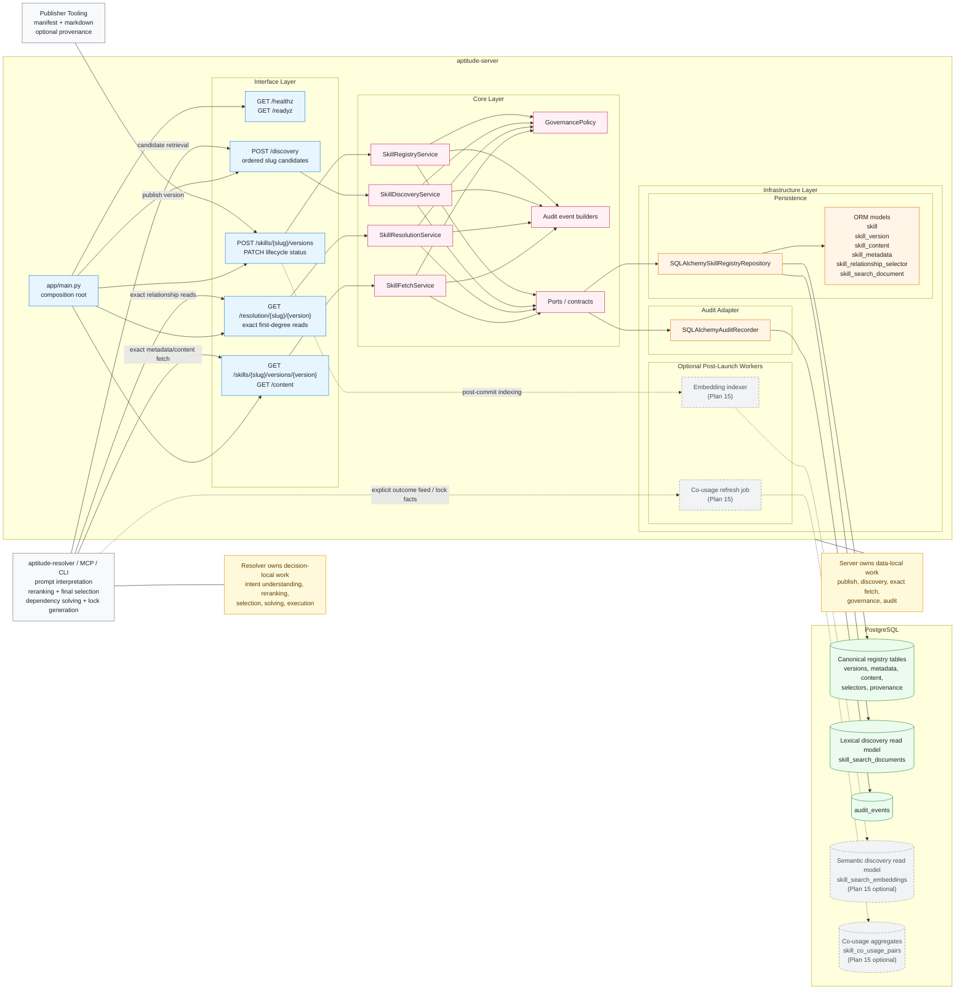
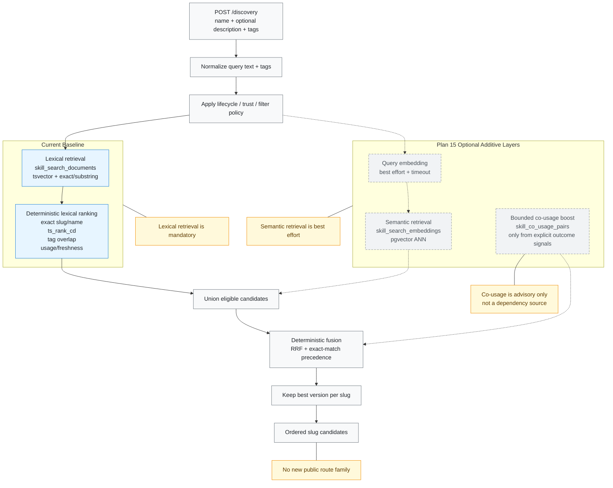

# Aptitude Server Architecture

This diagram set shows the current `aptitude-server` shape and the planned
post-launch discovery extension from Plan 15.

## 1. Server System View

## 2. Discovery Internals

