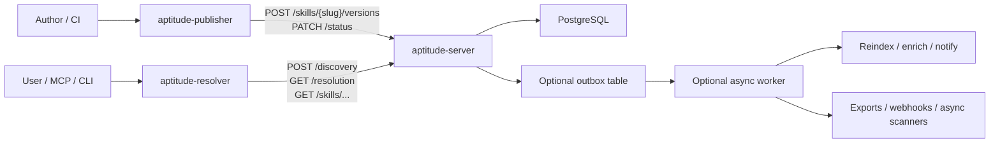
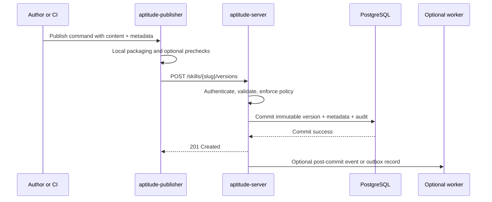
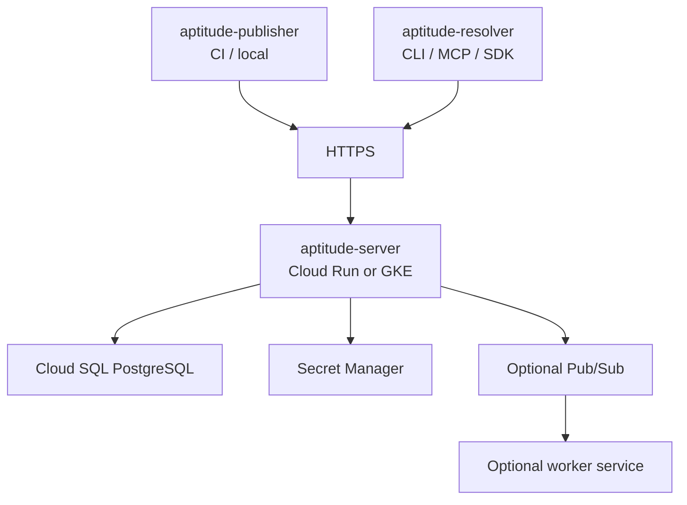

# Publisher, Server, Resolver Architecture Draft

This draft proposes a concrete target architecture for three Aptitude surfaces:

- `aptitude-publisher`: authoring and CI client for publish and lifecycle workflows
- `aptitude-server`: authoritative registry backend
- `aptitude-resolver`: consumer client for discovery, resolution, fetch, solving, and execution planning

The goal is team alignment on boundaries, repo shape, development structure, deployment structure, and the modular publish pipeline.

## 1. Executive Summary

- **Problem Statement**: Aptitude currently has a clear server/client split, but publish concerns, consumer concerns, and deployment evolution are not yet documented as separate first-class surfaces. Without an explicit architecture, the team risks mixing authoring workflows into the resolver, overloading the server contract, and introducing service splits too early.
- **Proposed Solution**: Standardize on three product surfaces: a dedicated publisher client, a single registry server, and a dedicated resolver client. Keep one authoritative backend and one PostgreSQL database, use synchronous HTTP for the core publish/read paths, and reserve asynchronous messaging for post-commit side effects only.
- **Success Criteria**:
  - Publisher and resolver ship independently without importing each other's domain logic.
  - `aptitude-server` remains the only authority for publish validation, immutability, governance, audit, and persisted skill state.
  - End-to-end publish of one `slug@version` completes synchronously in <= 2 seconds p95 under expected CI load.
  - Resolver consumption paths remain unchanged in principle: discovery, public resolution, exact metadata fetch, and exact content fetch.
  - Any asynchronous processing is non-authoritative and cannot create a published version that the server did not commit first.

## 2. User Experience & Functionality

- **User Personas**:
  - Skill author publishing from local development.
  - CI pipeline publishing immutable releases.
  - Platform operator managing lifecycle status, auditability, and trust policy.
  - Runtime consumer using resolver to discover, select, lock, and execute skills.

- **User Stories**:
  - As a skill author, I want a dedicated publishing client so I can package and submit a skill without depending on resolver runtime features.
  - As a CI pipeline, I want deterministic publish behavior with strong validation and clear errors so releases fail safely before bad metadata enters the registry.
  - As a runtime consumer, I want resolver to stay focused on discovery, solving, and execution planning so publish-time concerns do not leak into consumption flows.
  - As a platform operator, I want one authoritative server and one database so governance, audit, and operational ownership remain simple while the system is still early-stage.

- **Acceptance Criteria**:
  - `aptitude-publisher` owns packaging and request assembly for `POST /skills/{slug}/versions` and `PATCH /skills/{slug}/versions/{version}/status`.
  - `aptitude-resolver` owns `POST /discovery`, `GET /resolution/{slug}/{version}`, `GET /skills/{slug}/versions/{version}`, and `GET /skills/{slug}/versions/{version}/content`.
  - `aptitude-server` owns auth enforcement, validation, policy enforcement, immutability checks, persistence, indexing, and audit for both publish and read paths.
  - Prompt-injection and content safety checks that affect registry admission are enforced on the server, even if the publisher runs local prechecks.
  - Token footprint estimation, labeling, description quality, and dependency-shape validation are validated authoritatively on the server.
  - The publish path does not require a message broker to succeed.
  - If asynchronous workers are introduced later, they run only after the publish transaction commits and do not change canonical version identity.

- **Non-Goals**:
  - Splitting publish and read behavior into separate backend microservices now.
  - Introducing separate databases for publish and consume flows.
  - Making the broker part of the authoritative write path.
  - Moving dependency solving, prompt interpretation, or execution planning into the server.
  - Making the publisher a hidden wrapper around resolver internals.

## 3. AI System Requirements (If Applicable)

- **Tool Requirements**:
  - Not applicable as model-serving requirements. This architecture is about registry and client boundaries.
  - Publisher may optionally run local linting, schema checks, or content analysis tools before upload.
  - Resolver may optionally run prompt analysis, ranking, and execution plugins, but those stay client-side.

- **Evaluation Strategy**:
  - Boundary quality:
    - Publisher codebase has no dependency on resolver solving or execution modules.
    - Resolver codebase has no dependency on publisher packaging or release modules.
  - Publish correctness:
    - Invalid metadata, unsafe content, malformed dependencies, or governance violations are rejected by server integration tests.
  - Operational simplicity:
    - Local Docker deployment works with one server container and one PostgreSQL database.
  - Evolution safety:
    - Later async/event work proves that post-publish workers can fail or lag without corrupting canonical skill state.

## 4. Technical Specifications

- **Architecture Overview**:
  - `aptitude-publisher` is a thin authoring client.
  - `aptitude-server` is the only authoritative backend.
  - `aptitude-resolver` is the only runtime consumer/orchestration client.
  - PostgreSQL remains the single source of truth.
  - A broker is optional later for non-authoritative side effects.



- **Component Responsibilities**:

| Component | Primary Role | Must Own | Must Not Own |
| --- | --- | --- | --- |
| `aptitude-publisher` | Authoring and CI publish client | Packaging, request assembly, local prechecks, publisher UX, retry policy for publish calls | Canonical validation, persistence, auth policy decisions, runtime solving |
| `aptitude-server` | Authoritative registry backend | Auth, validation, immutability, governance, persistence, search indexing, audit, read APIs | Prompt interpretation, final selection, dependency solving, execution planning |
| `aptitude-resolver` | Consumer/runtime client | Discovery input construction, reranking, solving, lock generation, execution planning | Publish packaging, release lifecycle administration, canonical registry validation |
| Optional worker | Post-commit async processing | Reindex repair, notifications, export fanout, long-running enrichment | Canonical publish admission, source-of-truth writes, contract ownership |

- **Publish Pipeline Ownership**:

| Publish Concern | Publisher Client | Server | Resolver |
| --- | --- | --- | --- |
| Bearer token attachment | Yes | No | No |
| Auth token verification and scope enforcement | No | Yes | No |
| Payload assembly | Yes | No | No |
| Schema validation | Optional precheck | Yes authoritative | No |
| Dependency validation | Optional precheck | Yes authoritative | No |
| Immutable version conflict detection | No | Yes | No |
| Trust-tier / lifecycle policy | No | Yes | No |
| Prompt-injection / unsafe content admission checks | Optional advisory precheck | Yes authoritative | No |
| Token footprint validation | Optional estimate | Yes authoritative | No |
| Labels, tags, description constraints | Optional precheck | Yes authoritative | No |
| Provenance capture | Yes collect | Yes persist and validate | No |
| Audit event creation | No | Yes | Client-local only |
| Discovery / solve / execute | No | No | Yes |

- **Recommended Publish Flow**:



- **Why no broker on the critical path now**:
  - Publish must return a clear authoritative success or failure result.
  - Validation and persistence are part of the contract, not background work.
  - One backend and one DB keep governance and audit easy to reason about.
  - Broker-first architecture would add delivery, ordering, replay, and idempotency complexity before there is a demonstrated scale need.

- **When a broker becomes justified**:
  - publish triggers expensive downstream work such as:
    - advanced security scanning
    - notifications and webhooks
    - exports to analytics/search systems
    - derived evaluation pipelines
  - those tasks must be retryable and decoupled from request latency
  - failure of those tasks must not invalidate the committed version

- **Dev Structure Recommendation**:

Option recommended now:
- Keep separate repos for backend and runtime client.
- Add a third dedicated publisher repo or package.

Suggested shape:

```text
aptitude-server/
  app/
  docs/
  tests/

aptitude-resolver/
  src/resolver/
  tests/

aptitude-publisher/
  src/publisher/
  tests/
```

Alternative if repo count should stay smaller:
- Keep `aptitude-publisher` inside the client repo as a sibling package to resolver, but do not mix modules.

```text
aptitude-client/
  packages/
    resolver/
    publisher/
  tests/
```

Recommendation:
- Near term: keep current separate server repo and client repo.
- Add `publisher` under the client repo first if the team wants lower repo overhead.
- Split publisher into its own repo only when release cadence, team ownership, or SDK distribution needs diverge.

- **Deployment Structure Recommendation**:

### Phase 1: Current Docker deployment

```text
docker-compose / container runtime
  - aptitude-server
  - postgres
  - optional migration job
```

Clients are not long-running infrastructure:
- `aptitude-publisher` runs in CI or locally
- `aptitude-resolver` runs as CLI, MCP host integration, or SDK consumer

### Phase 2: GCP target deployment

Recommended baseline:
- `aptitude-server` on Cloud Run or GKE
- PostgreSQL on Cloud SQL for PostgreSQL
- object storage not required for canonical skill state yet
- Secret Manager for service tokens or bootstrap credentials
- optional Pub/Sub only for post-commit async work



- **Auth Recommendation**:
  - Keep server auth centralized.
  - Use scoped machine tokens:
    - `publish`
    - `read`
    - `admin`
  - Publisher typically uses `publish` and sometimes `admin`.
  - Resolver uses `read`.
  - Do not duplicate auth policy logic into clients beyond credential loading and friendly UX.

- **Validation and Security Recommendation**:
  - Server-side validation is authoritative for:
    - slug/version format
    - dependency shape
    - metadata field length and schema
    - label/tag constraints
    - description requirements
    - token footprint limits
    - lifecycle/trust policy
    - content safety and prompt-injection admission rules
  - Publisher may run the same checks locally for faster feedback, but those checks are advisory only.
  - Resolver should not revalidate publish-time authoring rules except where needed for safe runtime execution.

- **Security & Privacy**:
  - Publisher and resolver must use bearer tokens over HTTPS.
  - Canonical audit lives on server.
  - Prompt-injection and unsafe content checks should be treated as admission policy, not runtime user preference.
  - Provenance is captured at publish time and stored on server as advisory but auditable metadata.
  - Clients must never write directly to PostgreSQL.

## 5. Risks & Roadmap

- **Phased Rollout**:
  - **MVP**:
    - keep one server and one PostgreSQL DB
    - add a dedicated publisher package/client
    - keep resolver focused on consumption only
    - no broker in the critical path
  - **v1.1**:
    - share validation rules between publisher and server where safe
    - add optional outbox pattern for notifications or async enrichment
    - tighten publish-time safety checks for descriptions, labels, token footprint, and unsafe content
  - **v2.0**:
    - consider separate publisher repo if ownership/release cadence diverges
    - consider Pub/Sub or equivalent for non-authoritative background pipelines
    - revisit service extraction only if team topology or scale clearly demands it

- **Technical Risks**:
  - If publisher prechecks diverge from server validation, authors will see confusing pass-local/fail-server behavior.
  - If resolver and publisher stay in one package without clear module boundaries, publish and consume concerns will drift back together.
  - If a broker is introduced too early, the team will pay operational cost before there is sufficient throughput or latency benefit.
  - If async workers are allowed to mutate canonical skill state, the immutability contract becomes harder to reason about.
  - If publish-time safety checks are only client-side, malicious or malformed content can bypass them through direct API calls.

## Recommended Decision

Adopt this architecture now:

1. Keep one authoritative backend: `aptitude-server`.
2. Keep one PostgreSQL database.
3. Introduce a dedicated publisher surface separate from resolver.
4. Keep publisher and resolver as separate packages, even if they temporarily live in one client repo.
5. Keep the publish path synchronous over HTTP.
6. Add an outbox/worker later only for post-commit side effects.
7. Do not move to microservices until there is clear evidence from team ownership, scale, or deployment pressure.

## Implementation Sketch

Near-term concrete split:

```text
aptitude-server
  Owns:
    - publish API
    - discovery API
    - resolution API
    - exact fetch APIs
    - lifecycle API
    - auth/gov/audit/persistence

aptitude-client
  packages/resolver
    Owns:
      - discovery request construction
      - candidate reranking
      - dependency solving
      - lock generation
      - execution planning

  packages/publisher
    Owns:
      - source packaging
      - provenance capture
      - local validation UX
      - publish command
      - lifecycle command
```

This is the lowest-complexity architecture that keeps team boundaries clean while preserving the current server contract and leaving room for future growth.
