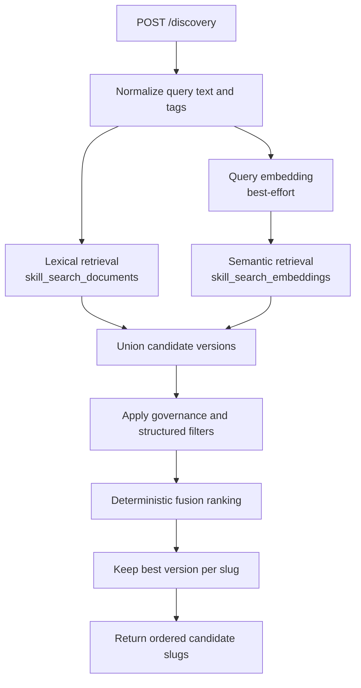
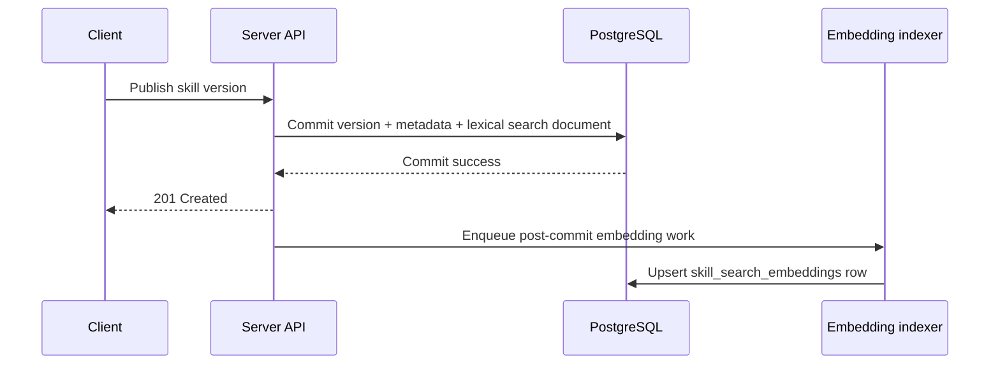

# Semantic Search Architecture Draft

> Status: draft/future-looking context only.
> This file is not the current source of truth for the live server contract.
> Use [docs/README.md](../README.md), [docs/project/api-contract.md](../project/api-contract.md),
> and [docs/project/scope.md](../project/scope.md) for the live baseline.

This draft proposes an additive semantic-search design for `aptitude-server`.

The intent is to improve discovery recall for paraphrases, synonym-heavy queries,
and sparse metadata without changing the core Aptitude boundary:

- the server still performs candidate generation over indexed registry data
- the resolver still owns reranking, final selection, dependency solving, and execution planning
- discovery remains advisory and contract-stable

## 1. Executive Summary

- **Problem**: the current discovery stack is lexical. It performs well for
  exact names, tags, and close wording, but it will miss semantically similar
  queries when the overlap is weak.
- **Proposal**: add embedding-backed retrieval as a second candidate-generation
  path and fuse it with the existing PostgreSQL full-text ranking pipeline.
- **Recommendation**: keep lexical search as the baseline, keep semantic search
  metadata-centric, and make embedding generation asynchronous for published
  versions so the immutable publish path stays fast and authoritative.
- **API Impact**: none for the public contract. `POST /discovery` still returns
  ordered candidate slugs only.

## 2. Current State

Today discovery is driven by the derived `skill_search_documents` read model:

- one row per immutable skill version
- lexical matching over `slug`, `name`, `description`, and `tags`
- deterministic ranking using exact slug/name boosts, `ts_rank_cd`, tag overlap,
  usage, freshness, and stable tie-breakers
- per-slug collapse before returning ordered candidates

This is the right baseline and should remain in place. The gap is recall, not
contract shape.

Current limitations:

- `"python static analysis"` may not match a skill described only as
  `"lint and quality checks"`
- semantically similar language with low lexical overlap ranks poorly or not at all
- substring and full-text search do not handle paraphrase-level matching

## 3. Goals

- Improve discovery recall for semantically related queries.
- Preserve the current registry/resolver boundary.
- Keep discovery body-light and deterministic in fallback behavior.
- Avoid making embedding generation part of the authoritative publish
  transaction.
- Make the feature degradable: lexical search must still work when embeddings
  are missing or temporarily unavailable.

## 4. Non-Goals

- Moving final selection or runtime reranking into `aptitude-server`
- Replacing lexical search entirely
- Embedding raw markdown bodies by default
- Introducing personalized ranking or user-specific retrieval
- Expanding the frozen public API with a parallel semantic-search route

## 5. Architectural Position

Semantic retrieval should be treated as **data-local candidate expansion**.

That means:

- it belongs on the server side because candidate retrieval is a registry concern
- it must stop before final selection because resolver-owned decision logic stays client-side
- it should feed the existing discovery contract rather than create a new public
  decision surface

The server continues to answer:

- "which published skills are plausibly relevant?"

The resolver continues to answer:

- "which candidate should I actually use for this task and environment?"

## 6. Proposed Retrieval Shape

Use a **hybrid retrieval pipeline**:

1. lexical retrieval from `skill_search_documents`
2. semantic retrieval from version embeddings
3. candidate union
4. deterministic fusion ranking
5. per-slug collapse
6. existing global ordering and limit

This keeps exact-match behavior strong while letting semantic retrieval recover
skills that lexical search would miss.



## 7. Indexing Strategy

### Recommendation

Keep the current lexical read model and add a second derived read model for
semantic retrieval.

Recommended new table:

- `skill_search_embeddings`

Why a separate table instead of adding a vector column to
`skill_search_documents`:

- embedding lifecycle is operationally different from lexical projection
- model versioning and reindex state belong to the embedding layer
- semantic indexing may lag safely behind publish
- multiple embedding models can coexist during migration or evaluation
- lexical search stays lean and independent

### Proposed Table Direction

`skill_search_embeddings`

- `skill_version_fk`
- `embedding_model`
- `embedding_dimensions`
- `source_checksum_digest`
- `embedding_vector`
- `index_status`
- `indexed_at`
- `created_at`
- `last_error`

Recommended constraints and indexes:

- primary key or unique key on `skill_version_fk + embedding_model`
- foreign key to `skill_versions.id` with `ON DELETE CASCADE`
- approximate nearest-neighbor index on `embedding_vector`
- B-tree index on `index_status`
- B-tree index on `indexed_at`

Implementation note:

- use PostgreSQL with `pgvector`
- choose the ANN index type based on supported extension/version and benchmarked
  behavior in the deployment target
- do not make the vector table a source of truth; it is rebuildable

## 8. What Gets Embedded

The semantic document should stay **metadata-centric**.

Recommended source text:

- `slug`
- `name`
- `description`
- `tags`

Do not embed full `raw_markdown` in the first version.

Reasons:

- current architecture intentionally keeps discovery off raw bodies
- indexing cost and prompt-injection surface area stay smaller
- summaries are usually enough for discovery-level semantics
- exact content fetch remains the only body-heavy read path

Suggested source construction:

```text
slug + "\n" + name + "\n" + description + "\n" + tags...
```

The source text should be normalized deterministically and hashed so reindex
eligibility is explicit.

## 9. Publish And Reindex Flow

Embedding generation should happen **after** the immutable publish transaction
commits.

Recommended flow:



This preserves:

- authoritative publish success without model-service dependency
- lexical search availability immediately after publish
- semantic search readiness when indexing completes

If embedding generation fails:

- keep the version discoverable lexically
- mark semantic row state as failed or missing
- retry asynchronously

## 10. Query-Time Flow

At discovery time:

1. normalize query text and tags as today
2. run lexical retrieval as today
3. if query text is empty, skip semantic retrieval
4. if semantic retrieval is enabled, generate one query embedding
5. fetch top semantic version candidates
6. union lexical and semantic candidates
7. apply deterministic fusion and existing tie-break rules

Important behavior:

- semantic retrieval is best-effort
- lexical retrieval is mandatory
- a query-embedding timeout or provider failure must degrade to lexical only

This keeps the system operationally safe.

## 11. Ranking And Fusion

Do not rank directly on raw cosine distance alone. Distances vary by model and
are awkward to compare with lexical scores.

Recommended approach:

- keep exact slug match first
- keep exact name match second
- fuse lexical and semantic candidate ranks using Reciprocal Rank Fusion (RRF)
- retain existing deterministic tie-breakers after fused rank

Proposed fused ordering:

1. `exact_slug_match`
2. `exact_name_match`
3. `rrf_score`
4. `tag_overlap_count`
5. `usage_count`
6. newer `published_at`
7. smaller `content_size_bytes`
8. lexical `slug`
9. higher internal version id

Why RRF:

- stable across different score scales
- robust when one retrieval path is missing
- simple to reason about in tests
- avoids overfitting to one embedding model's score distribution

## 12. Governance And Filtering

Governance filters must remain server-enforced.

The semantic path must respect the same filters as lexical search:

- lifecycle visibility
- trust tier
- freshness window
- max content size
- required tags

Architectural rule:

- never retrieve forbidden candidates and rely only on response-time pruning

Practical note:

- ANN indexes sometimes behave poorly under highly selective filters
- the implementation should over-fetch semantic candidates and then apply
  deterministic filtered ranking if needed
- but authorization and lifecycle boundaries must still be enforced in the SQL
  path, not only in Python post-processing

## 13. API And Contract Impact

Recommended public contract stance:

- no new route
- no required request-field changes
- no change to discovery being slug-only and advisory

Optional later extension:

- add internal-only explanation fields or metrics for debugging
- do not expose raw vector scores publicly in v1

## 14. Component Boundaries

Suggested ownership:

- `app/intelligence/`
  - embedding-source construction
  - hybrid fusion helpers
  - semantic-explanation helpers
- `app/core/`
  - orchestration rules for hybrid retrieval
  - fallback behavior and latency budgets
- `app/persistence/`
  - vector table model
  - ANN queries
  - filter-safe candidate retrieval
- background indexing worker or outbox consumer
  - post-commit embedding generation and retries

The current pure-helper direction of `app/intelligence/` still fits. Semantic
ranking logic should remain execution-agnostic and testable without DB access.

## 15. Rollout Plan

### Phase 0: Instrumentation

- measure discovery queries with poor lexical recall
- capture overlap between exact-match and fuzzy-match candidates
- define target latency and recall metrics

### Phase 1: Schema And Indexing

- add `pgvector` migration and `skill_search_embeddings`
- add source-text builder and checksumming
- add post-commit indexing worker

### Phase 2: Dark Launch

- build embeddings for existing published versions
- generate query embeddings in shadow mode
- log semantic candidate overlap without affecting responses

### Phase 3: Hybrid Retrieval

- enable lexical + semantic union for a controlled traffic slice
- compare recall, latency, and candidate-quality changes

### Phase 4: Hardening

- add rebuild tooling for model-version changes
- add index-health metrics and lag alerts
- freeze the first supported embedding model/version

## 16. Risks And Mitigations

### Risk: model drift changes ranking behavior

Mitigation:

- persist `embedding_model`
- treat embeddings as versioned derived data
- require explicit reindex on model change

### Risk: query embedding adds latency

Mitigation:

- strict timeout budget
- lexical-only fallback
- cache hot query embeddings if profiling justifies it

### Risk: publish path becomes dependent on external AI services

Mitigation:

- keep indexing post-commit and asynchronous
- never block immutable publish success on embedding availability

### Risk: semantic retrieval returns governance-ineligible candidates

Mitigation:

- enforce lifecycle/trust filters in the retrieval query
- cover with integration tests for forbidden-state leakage

### Risk: embedding metadata gets stale

Mitigation:

- version rows are immutable, so each published version has stable source text
- reindex triggers are explicit and rebuildable
- checksum mismatch marks rows for repair

## 17. Validation Plan

- unit tests for source-text normalization and checksuming
- unit tests for RRF fusion and deterministic tie-breaks
- integration tests for lexical fallback when embeddings are unavailable
- integration tests for governance-safe semantic filtering
- migration tests for backfilling embeddings on historical versions
- benchmark tests for discovery p95 latency and candidate recall

## 18. Recommendation

Proceed with semantic search only as a **hybrid, additive retrieval layer**.

The strongest architectural shape for Aptitude is:

- lexical search remains the always-on baseline
- embeddings live in a separate rebuildable read model
- indexing is asynchronous after publish commit
- fusion is deterministic and exact matches still win
- the public contract and resolver/server boundary remain unchanged

This yields better recall without turning discovery into an opaque, model-only
decision system.
