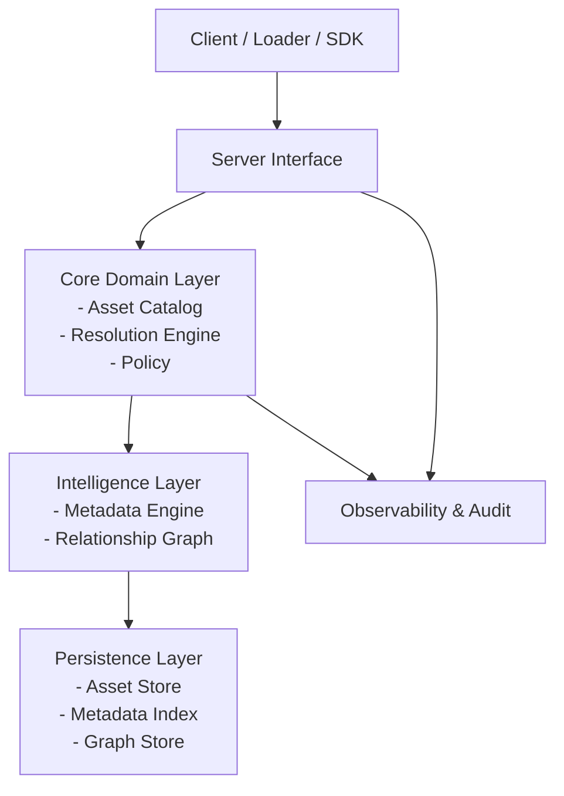

# Aptitude Server

Aptitude is a versioned, dependency-aware skill server for AI systems, designed to manage skills as atomic, immutable, and composable capability units rather than ad hoc prompt fragments. It provides deterministic versioning, explicit dependency modeling, structured metadata enrichment, and evaluation-based ranking, enabling secure skill supply chains, reproducible compositions, controlled evolution, and data-driven selection of the most relevant and reliable capabilities.

---

## Market Fit

### **Version & Dependency Management**

**Problem**

Skills tend to become monolithic and duplicated over time. Updates require manual propagation, personalization creates untracked forks, and overlapping capabilities introduce redundancy and inconsistency across agents.

**Solution**

Aptitude models skills as atomic, dependency-aware assets with version pinning, transitive resolution, fork lineage tracking, and explicit conflict handling. This enables modular skill design, controlled upgrades, safe specialization, and reproducible compositions across environments.

### **Skill Evaluation & Ranking**

**Problem**

When multiple skills provide similar functionality, selection becomes subjective and inconsistent. There is no standardized mechanism to compare efficiency, quality, maturity, or adoption.

**Solution**

Aptitude enriches each skill with structured metadata such as quality score, freshness, footprint, and usage frequency. This enables objective ranking, minimal bundle construction, redundancy elimination, and data-driven selection instead of manual preference.

### **Skill Supply Chain Security**

**Problem**

AI skills are reused, modified, and redistributed without clear provenance, integrity guarantees, or deterministic resolution. This creates exposure to prompt injection, undocumented behavioral drift, hidden transitive dependencies, and unverified third-party contributions.

**Solution**

Aptitude introduces software-grade governance through immutable versioning, explicit dependency graphs, provenance metadata, and deterministic resolution. Every skill has traceable origin, explicit transitive visibility, and reproducible builds — enabling secure, auditable, and controlled AI capability supply chains.

---

## **Design**

Aptitude is designed as a layered, graph-aware server that manages AI skills as immutable, versioned assets and resolves them into deterministic, reproducible bundles.

The system centralizes governance, resolution logic, and metadata-driven optimization within a single authoritative service. It is execution-agnostic and does not invoke models.

### Layering Rules (Implementation)

- Dependency direction is enforced as `interface -> core`, with persistence behind core-defined ports.
- Interface modules must not import persistence modules directly.
- Core modules must not import persistence modules directly.
- Persistence implements core ports and is wired in the composition root.
- `app/main.py` is the composition root where core and persistence are connected.

### **Client Layer**

External consumers such as loaders, SDKs, and administrative tooling interact with the server through a controlled interface. This layer is responsible only for requesting assets or resolved bundles.

It does not contain domain intelligence. All dependency traversal, conflict validation, ranking, and optimization remain inside the server.

Request Handling

- Requests specific skill versions or resolved bundles.
- May cache previously resolved bundles for efficiency.
- Presents resolution reports and provenance data to users.

Boundary

- Does not expand dependencies.
- Does not enforce policy rules.
- Does not apply ranking or optimization logic.

### **Server Interface Layer**

The Server Interface Layer defines the stable boundary of the system. It provides controlled access to assets, metadata, graphs, and resolution capabilities.

This layer abstracts internal storage and resolution mechanics behind a governed contract.

Access Control

- Enforces server-level governance and policy boundaries.
- Validates incoming requests before resolution.
- Ensures only published, valid versions are accessible.

Interface Stability

- Shields consumers from internal implementation changes.
- Maintains a consistent contract for loaders and tooling.
- Ensures deterministic behavior across environments.

### **Core Domain Layer**

The Core Domain Layer contains the authoritative logic of the server. It governs asset lifecycle and constructs deterministic bundles from requested skills.

This layer defines how assets are interpreted and assembled.

Asset Catalog

- Manages skill lifecycle and immutability.
- Ensures each version represents a fixed, reproducible state.
- Controls publishing, deprecation, and archival status.

Resolution Engine

- Expands direct and transitive dependencies.
- Validates conflicts and compatibility constraints.
- Eliminates redundant or overlapping assets.
- Applies metadata-driven prioritization.
- Produces a deterministic ResolvedBundle.

Policy

- Defines trust tiers and governance rules.
- Controls resolution constraints and selection strategy.
- Ensures reproducibility given version and server state.

### **Intelligence Layer**

The Intelligence Layer provides structured signals and explicit relationships used by the Core Domain Layer during resolution.

It supplies information but does not independently decide outcomes.

Relationship Graph

- Models typed relationships between skill versions.
- Encodes dependencies, conflicts, overlaps, and extensions.
- Enables safe traversal and impact analysis.

Metadata Engine

- Maintains derived signals used for ranking and filtering.
- Supports lifecycle management and deprecation workflows.
- Provides structured inputs for deterministic optimization.

### **Persistence Layer**

The Persistence Layer stores the immutable artifacts and indexed data required for efficient resolution.

It guarantees durability and integrity without embedding domain logic.

Asset Store

- Stores skill artifacts and versioned definitions.
- Preserves immutability once published.
- Acts as the source of truth for content.

Metadata Index

- Stores structured metadata for fast filtering and ranking.
- Enables efficient resolution queries.
- Supports search and governance operations.

Graph Store

- Persists typed relationships between skill versions.
- Enables efficient dependency traversal.
- Maintains consistency across server state.

### **Observability & Audit Layer**

The Observability and Audit Layer provides traceability across server operations.

It ensures resolution behavior is explainable and governed.

Audit Records

- Logs publishing, deprecation, and resolution events.
- Tracks provenance and lifecycle transitions.
- Supports compliance and forensic analysis.

Resolution Trace

- Records why specific assets were selected.
- Captures applied policies and ranking signals.
- Enables reproducible debugging of bundle construction.

---

## **End-to-End Flows**

### **Skill Publication Flow**

1. **Creation**
    - A new skill is authored as an atomic unit.
    - Dependencies and relationships are explicitly declared.
    - Required metadata fields are attached.
2. **Validation**
    - Schema and structure are validated.
    - Dependency references are verified.
    - Policy and trust constraints are enforced.
3. **Versioning**
    - A unique immutable version is assigned.
    - Artifact and metadata are persisted.
    - Relationship graph is updated.
4. **Indexing**
    - Metadata signals are indexed.
    - Relationship edges are stored.
    - Skill becomes discoverable and resolvable.

Once published, the version becomes immutable and reproducible.

### **Skill Consumption Flow**

1. **Request**
    - A client requests a specific skill version or a resolved bundle.
    - Policy constraints are applied.
2. **Resolution**
    - The server constructs a deterministic bundle.
    - Dependencies are expanded and validated.
    - Redundancies are eliminated.
3. **Delivery**
    - A ResolvedBundle is returned.
    - A ResolutionReport provides traceability.
    - The client may cache the result.

The server remains execution-agnostic. It delivers validated capability bundles, not runtime execution.

### **Skill Evaluation Flow**

1. **Trigger**
    - Evaluation is initiated after publication or during periodic review.
    - May be automated (benchmark execution) or curated (manual scoring).
    - Operates on a specific immutable skill version.
2. **Measurement**
    - Defined benchmarks or test suites are executed.
    - Performance, quality, footprint, or reliability metrics are collected.
    - Results are normalized into structured evaluation outputs.
3. **Scoring**
    - Evaluation outputs are translated into standardized metadata signals.
    - Quality score, efficiency indicators, or maturity levels may be derived.
    - Comparative signals may be calculated against similar skills.
4. **Metadata Update**
    - Evaluation results are stored as metadata attributes.
    - Metadata indexes are refreshed.
    - The skill artifact itself remains unchanged.

Evaluation enriches the Intelligence Layer without mutating the skill definition. Future resolution decisions may incorporate these updated signals while preserving determinism relative to server state.

---

## **Planning**

Goal: each step ends with a **complete, testable product** (a “vertical slice”), even if minimal. Steps are atomic and build cleanly toward the full server.

**Default implementation choice (recommended)**

- Language/runtime: **Python 3.12+**
- API: **FastAPI + Uvicorn**
- Database: **PostgreSQL** (default from MVP-0)
- Data layer: **SQLAlchemy 2.0 + Alembic**
- Validation/contracts: **Pydantic v2**
- Packaging: **Docker + Docker Compose**

### **Step 1 — Read-Only Skill Catalog (MVP-0)**

**Outcome (testable):** You can store skills and fetch skill@version reliably.

**Scope**

- Define the **Skill Artifact** format (file-based): skill.md + manifest.json (or frontmatter).
- Publish = add a new versioned folder (immutable by convention).
- Retrieve by id + version.

**Stack**

- Storage: local filesystem or object storage later (start with FS).
- Index DB: **PostgreSQL** (primary from MVP-0).
- Service: **FastAPI (Python)** with **Pydantic v2** schemas.
- API serving: **Uvicorn** (dev) and **Gunicorn + Uvicorn workers** (prod).
- Packaging: Docker + persistent volume.

**Architecture concepts**

- Immutable artifacts
- Server interface boundary
- Basic audit log (append-only file)

**Tests**

- Integration tests: publish 3 skills, fetch by version, verify immutability.

### **Step 2 — Dependency Graph + Deterministic Bundle (MVP-1)**

**Outcome (testable):** Client requests a root skill and gets a deterministic bundle (dependencies expanded).

**Scope**

- Add depends_on in manifest (explicit).
- Build transitive closure.
- Return ResolvedBundle = ordered list of skill versions.
- Return ResolutionReport (minimal): dependency tree + included list.

**Stack**

- Graph modeling in PostgreSQL: adjacency table edges(from, to, type).
- Data access: **SQLAlchemy 2.0** with explicit server queries.
- Migrations: **Alembic**.
- Keep everything in PostgreSQL for now.

**Architecture concepts**

- Resolver lives in server service (authoritative)
- Deterministic ordering rule (e.g., topo sort + stable tie-break by id)

**Tests**

- Golden tests: same input -> identical bundle ordering.
- Cycle detection test.

### **Step 3 — Metadata Index + Basic Search (MVP-2)**

**Outcome (testable):** Skills are discoverable and sortable by metadata signals.

**Scope**

- Introduce metadata fields: provenance, created_at, updated_at, footprint_estimate.
- Add server endpoints to query/filter skills (by tag, status, etc.).
- Derive footprint_estimate (simple heuristic) and store it.

**Stack**

- Use PostgreSQL: table skills, table metadata, plus native full-text indexes for search.
- Query layer: SQLAlchemy + explicit sort keys for deterministic ordering.
- Optional: add Meilisearch later, not now.

**Architecture concepts**

- “Metadata as decision surface”
- Derived vs source-of-truth separation

**Tests**

- Search returns expected results.
- Sorting stable and deterministic.

### **Step 4 — Conflicts + Overlaps (Governed Composition) (MVP-3)**

**Outcome (testable):** Server can reject invalid compositions and reduce redundancy.

**Scope**

- Add relationship types: conflicts_with, overlaps_with.
- Define simple policy: conflicts fail resolution; overlaps pick best by rule.
- Add Policy object (config file) controlling tie-breakers.

**Stack**

- Continue with PostgreSQL edges table: type in (depends, conflicts, overlaps, extends).
- Policy config: **Pydantic Settings** + env-driven overrides.

**Architecture concepts**

- Policy-driven resolution (explicit rules)
- Constraint validation as first-class behavior

**Tests**

- Conflict test: resolution fails with an explainable report.
- Overlap test: deterministic winner selection.

### **Step 5 — Evaluation Pipeline (Signals) (MVP-4)**

**Outcome (testable):** You can run evaluation and see resolution change due to updated metadata (in a controlled way).

**Scope**

- Add EvaluationRun entity and store results per skill@version.
- Compute quality_score from benchmark outputs.
- Update metadata index and expose it.
- Add server-state snapshot mechanism for reproducibility (minimal).

**Stack**

- PostgreSQL tables: evaluation_runs, evaluation_results.
- Runner (MVP): in-process scheduler with **APScheduler**.
- Scale option: **Celery + Redis** worker queue.

**Architecture concepts**

- Evaluation does not mutate artifacts
- Snapshot-based determinism (tie resolution to repo_state_id)

**Tests**

- After evaluation, ranking changes as expected.
- Resolving with pinned repo_state_id is stable.

### **Step 6 — Governance & Supply Chain Controls (MVP-5)**

**Outcome (testable):** Provenance and integrity checks are enforced.

**Scope**

- Trust tiers: official/community/experimental.
- Deprecation lifecycle: published → deprecated → archived.
- Integrity: checksums for artifacts; optional signing later.
- Access policies: allow/disallow untrusted skills by mode.

**Stack**

- Checksums stored in PostgreSQL metadata.
- Checksum implementation: Python **hashlib.sha256**.
- Signatures later: **sigstore-python** or simple public key signatures.

**Architecture concepts**

- Trust enforcement at server boundary
- Audit-first design

**Tests**

- “Enterprise mode” blocks untrusted skills.
- Deprecation affects discoverability and resolution policy.

---

## Tech Stack (Python / FastAPI)

### **Service Layer**

**FastAPI**

Primary API framework and server interface boundary.

**Pydantic v2**

Schema validation, serialization, and contract safety.

**Uvicorn (dev) / Gunicorn + Uvicorn workers (prod)**

ASGI serving for local development and production deployment.

**OpenAPI (spec file)**

Auto-generated API contract and documentation from FastAPI routes.

### **Persistence**

**PostgreSQL (primary from MVP-0)**

Relational storage for:

- Skill versions
- Metadata
- Relationship graph (edges)
- Evaluation results
- Server state snapshots

PostgreSQL is the default from the first milestone to keep behavior aligned with production-grade concurrency and indexing needs.

SQLite can be used only as an optional local fallback for isolated development tests.

**SQLAlchemy 2.0**

Database abstraction and query composition.

**Alembic**

Database schema migrations and versioned change tracking.

**Driver choice**

Use `psycopg` as the primary driver; `sqlite3` is optional for isolated local tests.

### **Artifact Storage**

**Filesystem (initial)**

Stores immutable skill artifacts (skills/<id>/<version>).

**S3 / GCS (future)**

Object storage for scalable artifact persistence.

**hashlib.sha256**

Checksum generation for integrity validation.

### **Graph Modeling**

**Adjacency table (relational model)**

Stores typed relationships:

- depends_on
- conflicts_with
- overlaps_with
- extends

No separate graph DB initially.

Consider Neo4j only if traversal complexity justifies it.

### **Search & Indexing**

**PostgreSQL Full-Text Search (MVP)**

Full-text search for skills and metadata.

**Meilisearch (future optional)**

If advanced search capabilities become necessary.

### **Evaluation Pipeline**

**APScheduler (MVP)**

Runs evaluation tasks inside service.

**jobs table (DB-backed queue)**

Tracks evaluation tasks deterministically.

Later option:

**Celery + Redis** if async scale required.

### **Observability**

**structlog or logging (stdlib)**

Structured logging.

**prometheus-fastapi-instrumentator (optional)**

Metrics collection.

**OpenTelemetry (optional)**

Tracing and distributed observability.

### **Configuration & Environment**

**Environment variables (.env for local only)**

Service configuration.

**pydantic-settings**

Maps environment variables to typed config structs.

### **Testing & Quality**

**pytest**

Unit and integration tests.

**httpx + pytest-asyncio**

API and async integration testing.

**ruff + mypy**

Linting, formatting, and static typing checks.

**black (optional if not using `ruff format`)**

Code formatting.

### **Dev & Deployment**

**Docker**

Containerized deployment.

**Docker Compose (local)**

Local multi-service setup.

**Makefile or justfile**

Common commands (run, test, lint, migrate).

### **Versioning & Determinism**

**repo_state_id (DB concept)**

Snapshot marker to guarantee reproducible resolution.

**ResolutionReport (domain model)**

Explainability and auditability of bundle construction.
