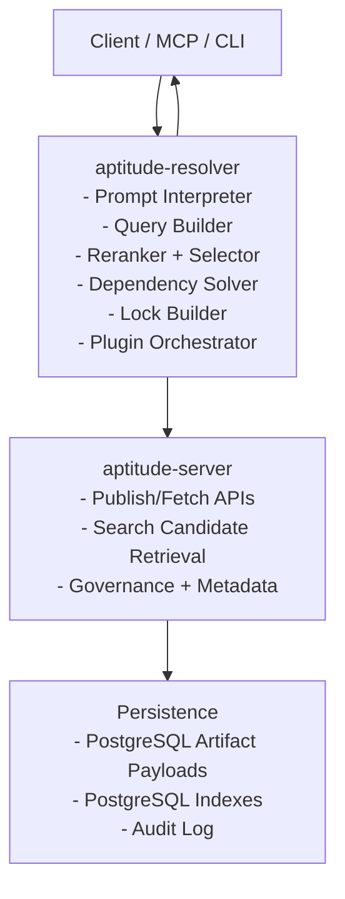

# Aptitude Overview

> Status: current product framing for `aptitude-server`.
> Use [docs/project/api-contract.md](project/api-contract.md) for the canonical
> HTTP contract and [docs/README.md](README.md) for the full docs map.

Aptitude is a versioned, dependency-aware skill ecosystem for AI systems.

- `aptitude-server` is a registry service for immutable artifacts and metadata.
- `aptitude-resolver` is the client-side runtime that performs agentic search, dependency solving, deterministic lock generation, and execution planning.

This mirrors PyPI/Maven/npm architecture: the registry stores immutable packages and searchable metadata, while the client interprets intent, chooses candidates, resolves dependencies, and executes the plan.

---

## Market Fit

### Version and Dependency Management

**Problem**

Skills become monolithic, duplicated, and hard to upgrade safely across environments.

**Solution**

Aptitude models skills as immutable `skill@version` units with explicit direct dependency declarations, allowing resolver clients to compute deterministic lock closures.

### Skill Evaluation and Discovery

**Problem**

When multiple skills overlap, selection quality is inconsistent and often undocumented.

**Solution**

Aptitude enriches published versions with structured metadata (quality, freshness, footprint, usage), enabling fast server-side candidate retrieval and objective client-side reranking inputs.

### Skill Supply Chain Security

**Problem**

Teams need provenance, integrity, and lifecycle controls for third-party and internal skills.

**Solution**

Aptitude provides immutable artifacts, checksums, trust metadata, and auditable lifecycle events. Resolver enforces lock replay and integrity verification at runtime.

---

## Design

Aptitude separates registry authority from resolution authority.

- Registry authority (`aptitude-server`): publish, exact fetch, discovery candidate retrieval, dependency metadata reads, and governance metadata.
- Resolution authority (`aptitude-resolver`): prompt interpretation, reranking, final selection, dependency solving, conflict handling, lock generation, execution planning.

Use this rule consistently:

- Server owns data-local work.
- Resolver owns decision-local work.

Data-local work includes indexed search over names, descriptions, tags, and structured metadata, plus exact immutable version retrieval.
Decision-local work includes prompt understanding, environment-aware reranking, final skill choice, dependency solving, and execution planning.

### Layering Rules (Implementation)

- Server layering remains `interface -> core -> ports -> persistence`.
- Resolver never imports server persistence internals.
- Integration between resolver and server is API/SDK contract only.
- `app/main.py` remains server composition root.

### Resolver Layer (Client-Side)

Resolver is responsible for runtime dependency behavior.

- Interprets user prompts and task context.
- Builds structured search queries for the registry.
- Reranks candidate results using local policy, workspace context, and installed state.
- Reads manifests/metadata from server APIs for chosen candidates.
- Expands dependency closure locally.
- Applies deterministic tie-break and policy hooks.
- Produces lock snapshot with selected versions and checksums.
- Builds execution plan and emits trace output.

### Server Interface and Domain

Server is responsible for registry correctness and governance.

- Validates and publishes immutable artifacts.
- Serves version metadata and artifact payloads.
- Exposes indexed discovery over descriptions, tags, and structured metadata.
- Returns ordered candidate slugs only.
- Exposes lifecycle state (published/deprecated/archived).
- Enforces publish/read governance and auditability.

### Persistence

Persistence ensures durability and integrity.

- PostgreSQL split tables for immutable skill payloads and version metadata.
- PostgreSQL indexes for discovery, lifecycle, and read models.
- Audit records for publish/deprecate/archive/read operations.

### Observability and Audit

- Server logs publish/read lifecycle events.
- Resolver logs solving decisions, lock composition, and plugin outcomes.
- Both sides emit trace IDs for cross-service diagnostics.

---

## End-to-End Flows

### Skill Publication Flow

1. **Creation**
   - A skill is authored with manifest + artifact.
   - Publisher tooling may collect advisory provenance such as repository, commit, path, and publisher identity.
   - Direct dependencies are declared explicitly.
2. **Validation**
   - Schema, immutability, and governance checks run on server.
3. **Versioning**
   - Immutable `skill@version` is persisted with checksum plus advisory provenance validated by the server.
4. **Indexing**
   - Metadata/read models are refreshed for discovery APIs.

### Skill Consumption Flow

1. **Request**
   - Client submits prompt/tool request to resolver.
2. **Candidate Retrieval**
   - Resolver converts prompt intent into structured search input.
   - Server returns ordered candidate slugs from indexed metadata and description search.
3. **Selection**
   - Resolver reranks candidates using task, policy, and environment context.
4. **Metadata Fetch**
   - Resolver fetches required version metadata from server for selected candidates.
5. **Solve and Lock**
   - Resolver computes deterministic dependency closure and writes lock output.
6. **Artifact Fetch**
   - Resolver downloads exact locked versions and verifies checksums.
7. **Plan and Execute**
   - Resolver applies plugins/policies and returns execution plan + trace.

### Skill Evaluation Flow

1. **Trigger**
   - Evaluation runs after publish or on schedule.
2. **Measurement**
   - Benchmarks generate quality/reliability metrics.
3. **Metadata Update**
   - Signals are written to metadata indexes (artifact remains immutable).
4. **Consumption**
   - Resolver may use signals as deterministic scoring inputs under pinned policy/version.

---

## Planning

Goal: each step ends with a complete, testable vertical slice.

### Step 1 - Immutable Registry Core (MVP-0)

**Outcome**: publish and fetch `skill@version` reliably.

**Scope**

- Define artifact + manifest schema.
- Publish immutable versions.
- Fetch by `slug` + `version`.

**Tests**

- Publish/fetch integration tests.
- Immutability overwrite rejection tests.

### Step 2 - Dependency Metadata Contract (MVP-1)

**Outcome**: server reliably exposes direct dependency metadata; no server-side closure solving.

**Scope**

- Add/validate `depends_on` declarations.
- Expose metadata via stable versioned APIs.
- Add client integration fixtures for resolver consumers.

**Tests**

- Contract tests for manifest/metadata payloads.
- API contract parity tests for the canonical API surface.

### Step 3 - Client Resolver and Locking (MVP-2)

**Outcome**: resolver computes deterministic lock snapshots client-side.

**Scope**

- Implement dependency solving in resolver.
- Add deterministic tie-break rules.
- Output lock and trace payloads.

**Tests**

- Golden tests: same input/context -> identical lock hash.
- Cycle/conflict handling tests.

### Step 4 - Policy and Plugin Governance (MVP-3)

**Outcome**: runtime policy checks and scanners are pluggable and auditable.

**Scope**

- Pre/post-solve plugin hooks.
- Security scanner and overlap/conflict policy plugins.
- Structured plugin decision traces.

**Tests**

- Plugin failure isolation tests.
- Fail-open/fail-closed policy behavior tests.

### Step 5 - Discovery and Evaluation Signals (MVP-4)

**Outcome**: discovery quality improves through fast server-side candidate retrieval and client-side reranking without mutating artifacts.

**Scope**

- Evaluation runs + score storage.
- Discovery/filter/sort API improvements for metadata and description search.
- Resolver scoring inputs pinned by policy/resolver version.

**Tests**

- Discovery ranking benchmarks.
- Deterministic solver behavior under fixed metadata snapshots.

### Step 6 - Supply Chain Hardening (MVP-5)

**Outcome**: provenance, integrity, and trust controls are enforced end-to-end.

**Scope**

- Trust tiers and lifecycle controls.
- Checksum enforcement and optional signatures.
- Enterprise policy gates for untrusted content.

**Tests**

- Checksum/signature verification tests.
- Policy-blocking tests for restricted trust tiers.

---

## Tech Stack

### Server

- FastAPI + Pydantic v2 + Swagger UI.
- PostgreSQL + SQLAlchemy 2.0 + Alembic.
- PostgreSQL split-table artifact storage with digest-keyed deduplication.

### Resolver

- Python service/CLI with prompt interpretation, candidate reranking, and deterministic solving engine.
- Local cache for metadata/artifacts with bounded TTL.
- Plugin interface for policy/scanner extensions.

### Quality and Operations

- pytest, ruff, mypy.
- Structured logs and optional OpenTelemetry.
- Docker + Docker Compose.

### Determinism Model

Reproducibility is lock-based.

- `resolver_version` + lock schema version
- selected versions + checksums
- optional metadata snapshot identifier

The server guarantees immutable artifact retrieval and stable candidate retrieval under a pinned catalog state; resolver guarantees deterministic lock composition and final choice traceability.
