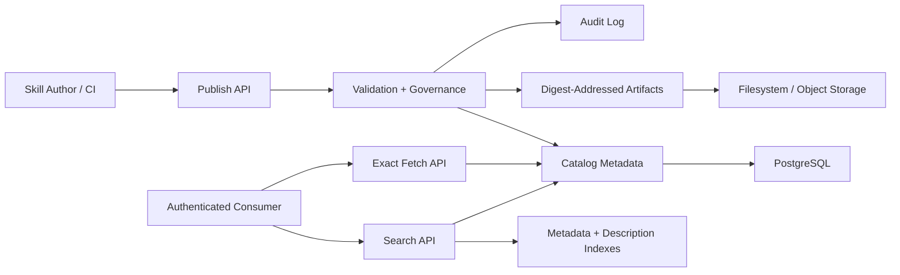

# Aptitude Server PRD

## 1. Executive Summary

- **Problem Statement**: Platform teams need a governed registry for publishing, discovering, and retrieving skills, but the server becomes harder to scale and cache when it also owns prompt interpretation, dependency solving, or runtime planning. The registry must stay focused on fast data-local operations over immutable artifacts and searchable metadata.
- **Proposed Solution**: Define `aptitude-server` as a package-registry-style service responsible only for publish, fetch, list, search, governance, and audit contracts. Keep PostgreSQL authoritative for registry metadata and digest mappings, keep immutable artifact payloads in filesystem or object storage, and treat Git only as optional authoring provenance rather than a runtime storage backend.
- **Success Criteria**:
  - 100% of artifact and metadata writes happen through server APIs.
  - Immutable overwrite attempts for existing `(skill_id, version)` are rejected 100% of the time.
  - Identical artifact content published under different versions is deduplicated by `sha256` digest mapping in PostgreSQL and reused from a single immutable blob object.
  - `GET /skills/search` p95 <= 250 ms for top-20 candidate retrieval on a 10,000-skill catalog with indexed filters.
  - `GET /skills/{id}/{version}` p95 <= 150 ms for metadata and manifest reads on the same catalog assumption.
  - Immutable read APIs return stable `ETag` headers and matching `If-None-Match` requests return `304 Not Modified`.
  - Exact fetches do not require access to a Git repository or working tree.
  - 100% of publish, deprecate, archive, and admin-policy actions emit auditable events.
- **In Scope**: Publish/download/list/search APIs, immutable versioning, metadata and discovery indexes, content-addressed artifact references, provenance and integrity controls, lifecycle governance, audit logging, and authorization on registry operations.
- **Out of Scope**: Prompt interpretation, personalized reranking, final candidate selection, dependency solving, lock generation, runtime execution planning, and direct database access by consumers.

## 2. User Experience & Functionality

- **User Personas**:
  - Skill author or CI pipeline publishing versioned artifacts.
  - Platform engineer operating registry availability and search quality.
  - Security or governance reviewer validating provenance, trust, and lifecycle policy.
  - Service operator monitoring publish, search, and fetch paths.

- **User Stories**:
  - As a skill author, I want to publish immutable `skill@version` artifacts so consumers can retrieve exact releases reliably.
  - As a platform engineer, I want fast indexed search over metadata and descriptions so consumers can discover candidate skills without crawling the full catalog.
  - As a security reviewer, I want provenance, integrity metadata, and lifecycle policy controls so risky artifacts can be governed at publish and read boundaries.
  - As a service operator, I want audit trails and operational telemetry so incidents are diagnosable and policy violations are traceable.

- **Acceptance Criteria**:
  - `POST /skills/publish` validates manifest schema, integrity fields, and lifecycle requirements before accepting a new version.
  - Publishing an existing `(skill_id, version)` returns a conflict and does not mutate stored metadata or artifacts.
  - Published versions persist direct dependency declarations exactly as authored; the server does not compute resolved dependency closures.
  - `GET /skills/search` supports full-text query plus structured filters over tags, language, trust tier, and lifecycle state.
  - Search results return stable ordering, deterministic tie-breaks, and explanation fields describing why a result matched.
  - `GET /skills/{id}` lists published versions and lifecycle state without exposing internal tables or derived storage details.
  - `GET /skills/{id}/{version}` returns immutable metadata, integrity fields, artifact reference data, and optional provenance metadata for the exact published version.
  - Published versions map immutably to a single `sha256` digest, and identical payloads reuse existing digest-backed blob storage.
  - Exact fetch and search behavior do not depend on a live Git checkout.
  - Deprecation and archive state are enforced consistently in discovery visibility and exact-read policy.

- **Non-Goals**:
  - Choosing the best skill for a user prompt.
  - Returning canonical solved bundles, dependency closures, or lock files.
  - Executing plugins, workflows, or runtime plans.
  - Running LLM inference in the request path.

## 3. AI System Requirements (If Applicable)

- **Tool Requirements**:
  - Not applicable for the server control plane. `aptitude-server` performs indexed retrieval and policy enforcement, not model inference or agent orchestration.
  - Required service primitives remain standard registry capabilities: publish, fetch, list, search, and governance endpoints.

- **Evaluation Strategy**:
  - No model-quality evaluation is required for MVP because the server does not interpret prompts or generate answers.
  - Discovery quality is evaluated as retrieval quality: filter correctness, deterministic ordering, explanation field correctness, and latency/SLO compliance.

## 4. Technical Specifications

- **Architecture Overview**:
  - `Publish API` -> `Validation + Governance` -> `Catalog Persistence + Blob Reference`
  - `Search API` -> `Metadata + Description Indexes` -> `Stable Candidate Response`
  - `Exact Fetch API` -> `Immutable Version Record` -> `Digest-Addressed Artifact Reference`
  - Aptitude Server is authoritative for published metadata, digest mappings, and lifecycle state. Artifact payloads live in immutable filesystem or object storage, and optional Git provenance is captured only as publish metadata. The server is not authoritative for runtime selection or dependency resolution outcomes.

- **Integration Points**:
  - Primary DB: PostgreSQL for skills, versions, manifests, digest mappings, lifecycle state, trust metadata, provenance metadata, and audit indexes.
  - Search/indexing: PostgreSQL full-text and structured indexes, with optional derived read models for query performance.
  - Artifact persistence: digest-addressed immutable blobs stored on the local filesystem for MVP; S3/GCS object storage and CDN support remain later-phase backends.
  - Git integration: optional publish-time provenance source (`repo_url`, `commit_sha`, `tree_path`); Git is not a required runtime storage backend.
  - Auth: scoped service tokens for `publish`, `read`, and `admin` permissions.
  - External integrations: CI publishers, admin tooling, and consumer-facing SDK or CLI layers through public HTTP APIs only.

- **Technology Stack (Current and Planned)**:

| Status | Technology | Used For |
| --- | --- | --- |
| Current (MVP baseline) | Python + FastAPI + OpenAPI | Registry API boundary for publish, fetch, list, discovery, and governance contracts. |
| Current (MVP baseline) | Pydantic v2 | Request and response validation for registry contracts. |
| Current (MVP baseline) | Uvicorn (dev), Gunicorn + Uvicorn workers (prod) | ASGI serving in development and production. |
| Current (MVP baseline) | PostgreSQL | Canonical storage for versions, metadata, lifecycle state, digest mappings, and audit records. |
| Current (MVP baseline) | SQLAlchemy 2.0 + Alembic + `psycopg` | Data access, schema migrations, and PostgreSQL driver stack. |
| Current (MVP baseline) | PostgreSQL full-text and metadata indexes | Low-latency search over descriptions, tags, and structured fields. |
| Current (MVP baseline) | Local filesystem artifact store | Immutable artifact payload persistence under digest-addressed or version-addressed paths outside PostgreSQL. |
| Current (MVP baseline) | Digest-addressed artifact mapping (`sha256`) | Immutable artifact identity, deduplication, and version-to-digest binding. |
| Current (MVP baseline) | HTTP conditional caching (`ETag`, `If-None-Match`) | Immutable read-path cache validation and bandwidth reduction. |
| Current (MVP baseline) | Structured logging (`logging`/`structlog`) | Auditable operational and lifecycle logs. |
| Planned (v1.1+) | S3/GCS object storage + CDN (digest-keyed) | Scalable artifact persistence and low-latency distribution. |
| Planned (v1.1+) | Prometheus instrumentation + OpenTelemetry (optional) | Metrics and tracing for SLO monitoring and diagnostics. |
| Planned (future optional) | Git provenance ingestion or mirroring | Capture authoring traceability without making Git part of the fetch/search critical path. |
| Planned (future optional) | Meilisearch | Advanced discovery capabilities beyond PostgreSQL-native indexing. |

- **Security & Privacy**:
  - Immutable `sha256` checksum per stored artifact and per published version binding.
  - Provenance metadata may be captured on publish, including source repository, commit identity, publisher identity, and trust tier.
  - Authorization and lifecycle policy gates on publication and privileged admin operations.
  - Audit retention for compliance, incident response, and forensic traceability.
  - Git metadata is stored as normalized provenance fields only; read paths do not require repository access.
  - No prompt content, workspace context, or execution traces are stored by default; the service stores registry metadata and operational telemetry only.

## 5. Risks & Roadmap

- **Phased Rollout**:
  - **MVP**: immutable artifact catalog, publish/fetch/list/search APIs, digest deduplication, filesystem-backed artifact storage, scoped auth, and minimal audit trail.
  - **v1.1**: richer discovery filters, deprecate/archive governance controls, object storage backend option, optional Git provenance capture, and stronger search explanation fields.
  - **v2.0**: signatures and attestations, multi-tenant governance policy packs, CDN-backed artifact delivery, and optional dedicated search engine support.

- **Technical Risks**:
  - Search index drift from canonical metadata can return stale or inconsistent candidate sets.
  - Blob-store references can drift from canonical DB mappings if publish and retention flows are not designed to be atomic and auditable.
  - Weak tie-break rules can make search ordering unstable and harder to debug or cache.
  - Incorrect lifecycle enforcement can leak deprecated or restricted artifacts through discovery or fetch paths.
  - Git provenance can become an accidental second source of truth if publish and fetch semantics start depending on repository state.
  - Poor `ETag` generation or cache-control policy can cause stale reads or unnecessary bandwidth consumption.

## 6. Boundary Contract & Exit Criteria

- **Server Boundary**:
  - Public API surface is limited to publish, fetch, list, search, and governance operations.
  - Search is candidate generation over indexed registry data; the server does not interpret prompts or choose final results.
  - Exact `(skill_id, version)` reads are immutable and content-addressed through PostgreSQL-backed digest mappings to blob storage.
  - Git provenance is advisory metadata only and is never a required runtime dependency for publish, search, or exact fetch behavior.
  - Derived search indexes are allowed for performance, but canonical truth remains the published version record and digest mapping.

- **Server Exit Criteria**:
  - Contract `v1` is documented with explicit backward-compatibility rules.
  - Integration and contract tests cover publish, list, search, fetch, deprecate, and archive flows.
  - Search and fetch SLOs are verified against the MVP catalog-scale assumption.
  - Digest mapping and deduplication invariants are enforced in schema, service logic, and tests.
  - Audit events, authorization gates, and lifecycle policy are enforced for all privileged and mutating operations.
  - Runbooks, dashboards, and alerts exist for publish, search, and fetch paths.

## Assumptions to Confirm

- MVP catalog scale is up to 10,000 skills with metadata and description search served from PostgreSQL indexes.
- MVP authentication is service-token based; end-user interactive auth flows are out of scope.
- Artifact storage remains on the local filesystem for MVP, with object storage deferred to a later phase.
- Git is an optional publish-time provenance source, not a runtime registry storage dependency.
