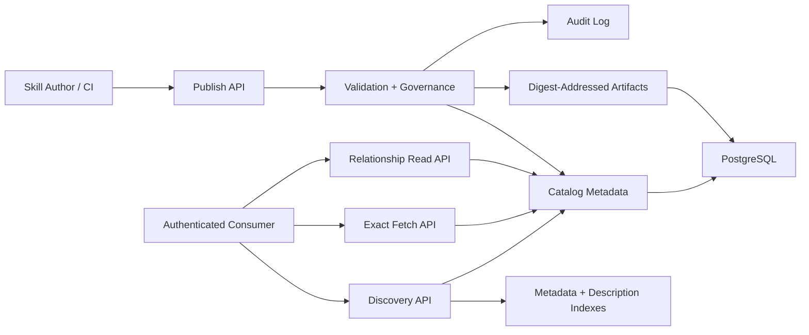

# Aptitude Server PRD

## 1. Executive Summary

- **Problem Statement**: Platform teams need a governed registry for publishing, discovering, and retrieving skills, but the server becomes harder to scale, cache, and reason about when it also owns prompt interpretation, dependency solving, or runtime planning. The registry must stay focused on fast data-local operations over immutable artifacts and searchable metadata.
- **Proposed Solution**: Define `aptitude-server` as a package-registry-style service responsible for publish, fetch, list, search, governance, and audit contracts. Keep PostgreSQL authoritative for registry metadata, digest mappings, and immutable artifact payloads, using split tables for metadata and content, and treat Git only as optional authoring provenance rather than a runtime storage backend.
- **Success Criteria**:
  - 100% of artifact and metadata writes happen through server APIs.
  - Immutable overwrite attempts for existing `(slug, version)` are rejected 100% of the time.
  - Identical artifact content published under different versions is deduplicated by `sha256` digest mapping in PostgreSQL and reused from a single immutable artifact row.
  - Target discovery API p95 <= 250 ms for top-20 candidate retrieval on a 10,000-skill catalog with indexed filters.
  - Target exact metadata fetch API p95 <= 150 ms on the same catalog assumption.
  - Immutable read APIs return stable `ETag` headers, and target conditional reads support `If-None-Match` with `304 Not Modified`.
  - Exact fetches do not require access to a Git repository or working tree.
  - 100% of publish, deprecate, archive, and admin-policy actions emit auditable events.
- **In Scope**: Publish/download/list/search APIs, immutable versioning, metadata and discovery indexes, content-addressed artifact references, provenance and integrity controls, lifecycle governance, audit logging, and authorization on registry operations.
- **Out of Scope**: Prompt interpretation, personalized reranking, final candidate selection, dependency solving, lock generation, runtime execution planning, and direct database access by consumers.

### Current Status vs Planned State (March 13, 2026)

- **Current Status**:
  - FastAPI service is implemented with PostgreSQL-backed publish, fetch, list, discovery, direct relationship, lifecycle, auth, and audit paths.
  - The current HTTP surface uses concrete routes such as `POST /skill-versions`, `POST /discovery`, and `GET /skills/{slug}/versions/{version}`.
  - Digest-backed `ETag` emission on exact content fetch is implemented.
  - Full conditional-read behavior with `If-None-Match` returning `304 Not Modified` is not yet documented as implemented behavior.
- **Planned State**:
  - Preserve the same product boundary while continuing to harden the v1 contract, observability, governance, and cache semantics.
  - Continue documenting the API in capability terms even where route naming may evolve before the public contract is finalized.

## 2. User Experience & Functionality

- **User Personas**:
  - Skill author or CI pipeline publishing versioned artifacts.
  - Platform engineer operating registry availability and search quality.
  - Security or governance reviewer validating provenance, trust, and lifecycle policy.
  - Service operator monitoring publish, search, and fetch paths.

- **User Stories**:
  - As a skill author, I want to publish immutable `skill@version` artifacts so consumers can retrieve exact releases reliably.
  - As a platform engineer, I want fast indexed search over metadata and descriptions so consumers can discover candidate skills without crawling the full catalog.
  - As a security reviewer, I want provenance, integrity metadata, and lifecycle policy controls so risky artifacts can be governed at publish and read boundaries.
  - As a service operator, I want audit trails and operational telemetry so incidents are diagnosable and policy violations are traceable.

- **Acceptance Criteria**:
  - The publish capability validates manifest schema, integrity fields, direct relationship selectors, trust-tier rules, and lifecycle requirements before accepting a new immutable version.
  - Publishing an existing `(slug, version)` returns a conflict and does not mutate stored metadata or artifacts.
  - Published versions persist direct dependency declarations exactly as authored; the server does not compute resolved dependency closures.
  - The discovery capability supports full-text query plus structured filters over tags, language, trust tier, lifecycle state, freshness, and content-size limits.
  - Search results return stable ordering, deterministic tie-breaks, and explanation fields describing why a result matched.
  - The exact fetch capability returns immutable metadata, integrity fields, artifact reference data, and optional provenance metadata for the requested published version.
  - Published versions map immutably to a single `sha256` digest, and identical payloads reuse existing digest-backed PostgreSQL artifact rows.
  - Exact fetch and search behavior do not depend on a live Git checkout.
  - Deprecation and archive state are enforced consistently in discovery visibility and exact-read policy.

- **Non-Goals**:
  - Choosing the best skill for a user prompt.
  - Returning canonical solved bundles, dependency closures, or lock files.
  - Executing plugins, workflows, or runtime plans.
  - Running LLM inference in the request path.

### Current Status vs Planned State (March 13, 2026)

- **Current Status**:
  - Publish is implemented at `POST /skill-versions`.
  - Discovery is implemented at `POST /discovery`.
  - Immutable metadata and content fetch are implemented as exact `GET` routes.
  - Direct dependency reads are implemented at `GET /resolution/{slug}/{version}`.
  - Bearer-token auth with `read`, `publish`, and `admin` scopes is enforced on business endpoints.
- **Planned State**:
  - The public contract may eventually normalize endpoint naming around publish/search capability labels, but the product requirement is the capability, not a specific path spelling.
  - Search explanation fields, observability, and governance controls are expected to grow richer without changing the server/client boundary.

## 3. AI System Requirements (If Applicable)

- **Tool Requirements**:
  - Not applicable for the server control plane. `aptitude-server` performs indexed retrieval and policy enforcement, not model inference or agent orchestration.
  - Required service primitives remain standard registry capabilities: publish, fetch, list, search, governance, and audit endpoints.

- **Evaluation Strategy**:
  - No model-quality evaluation is required for MVP because the server does not interpret prompts or generate answers.
  - Discovery quality is evaluated as retrieval quality: filter correctness, deterministic ordering, explanation field correctness, and latency/SLO compliance.
  - Contract quality is evaluated through integration and contract tests covering publish, fetch, discovery, relationship reads, lifecycle transitions, auth, and governance policy.

### Current Status vs Planned State (March 13, 2026)

- **Current Status**:
  - The implementation contains unit and integration coverage for registry flows and governance behavior.
  - The server intentionally does not contain model-inference dependencies in the request path.
- **Planned State**:
  - Add stronger contract-level coverage for finalized v1 semantics, especially around caching, lifecycle visibility, and public compatibility guarantees.

## 4. Technical Specifications

- **Architecture Overview**:
  - `Publish API` -> `Validation + Governance` -> `Metadata Rows + Digest-Addressed Artifact Rows`
  - `Discovery API` -> `Metadata + Description Indexes` -> `Stable Candidate Response`
  - `Exact Fetch API` -> `Immutable Version Record` -> `Digest-Addressed Artifact Row`
  - `Relationship Read API` -> `Exact Version Coordinates` -> `Direct Authored Selectors`
  - Aptitude Server is authoritative for published metadata, digest mappings, artifact payloads, lifecycle state, and audit events in PostgreSQL. Optional Git provenance is captured only as publish metadata. The server is not authoritative for runtime selection or dependency resolution outcomes.

- **Integration Points**:
  - Primary DB: PostgreSQL for skills, versions, metadata, artifact payloads, digest mappings, lifecycle state, trust metadata, provenance metadata, and audit indexes.
  - Search/indexing: PostgreSQL full-text and structured indexes, with optional derived read models for query performance.
  - Artifact persistence: digest-addressed immutable payloads stored in PostgreSQL split tables, with discovery and fetch optimized through separate query paths.
  - Git integration: optional publish-time provenance source (`repo_url`, `commit_sha`, `tree_path`); Git is not a required runtime storage backend.
  - Auth: scoped service tokens for `publish`, `read`, and `admin` permissions.
  - External integrations: CI publishers, admin tooling, and consumer-facing SDK or CLI layers through public HTTP APIs only.

- **Technology Stack (Current and Planned)**:

| Status | Technology | Used For |
| --- | --- | --- |
| Current (MVP baseline) | Python + FastAPI + Swagger UI | Registry API boundary for publish, fetch, list, discovery, relationship reads, and governance contracts. |
| Current (MVP baseline) | Pydantic v2 | Request and response validation for registry contracts. |
| Current (MVP baseline) | Uvicorn via FastAPI CLI in development | ASGI serving in local development. |
| Current (MVP baseline) | PostgreSQL | Canonical storage for versions, metadata, artifact payloads, lifecycle state, digest mappings, and audit records. |
| Current (MVP baseline) | SQLAlchemy 2.0 + Alembic + `psycopg` | Data access, schema migrations, and PostgreSQL driver stack. |
| Current (MVP baseline) | PostgreSQL full-text and metadata indexes | Low-latency search over descriptions, tags, and structured fields. |
| Current (MVP baseline) | PostgreSQL split artifact tables | Immutable artifact payload persistence with digest-addressed deduplication and separate discovery/fetch query paths. |
| Current (MVP baseline) | Digest-addressed artifact mapping (`sha256`) | Immutable artifact identity, deduplication, and version-to-digest binding. |
| Current (MVP baseline) | Bearer-token scope enforcement | `read`, `publish`, and `admin` authorization gates on public APIs. |
| Current (MVP baseline) | Digest-backed `ETag` + immutable cache headers | Exact content-read cache validation primitives. |
| Current (MVP baseline) | Structured application logging | Auditable operational and lifecycle logs. |
| Planned (v1.0 hardening) | Full conditional GET support | `If-None-Match` handling with `304 Not Modified` for immutable reads. |
| Planned (v1.1+) | Prometheus instrumentation + OpenTelemetry (optional) | Metrics and tracing for SLO monitoring and diagnostics. |
| Planned (future optional) | Git provenance ingestion or mirroring | Capture authoring traceability without making Git part of the fetch/search critical path. |
| Planned (future optional) | Meilisearch | Advanced discovery capabilities beyond PostgreSQL-native indexing. |

- **Security & Privacy**:
  - Immutable `sha256` checksum per stored artifact and per published version binding.
  - Provenance metadata may be captured on publish, including source repository, commit identity, publisher identity, and trust tier.
  - Authorization and lifecycle policy gates on publication and privileged admin operations.
  - Audit retention for compliance, incident response, and forensic traceability.
  - Git metadata is stored as normalized provenance fields only; read paths do not require repository access.
  - No prompt content, workspace context, or execution traces are stored by default; the service stores registry metadata and operational telemetry only.

### Current Status vs Planned State (March 13, 2026)

- **Current Status**:
  - The implementation matches the storage report recommendation: PostgreSQL only, with split metadata/content persistence and digest-addressed deduplication.
  - The current API surface includes health, readiness, publish, discovery, relationship reads, exact fetch, and lifecycle status update routes.
  - Exact content responses emit `ETag` and `Cache-Control: public, immutable`.
- **Planned State**:
  - Harden immutable-read cache semantics to full conditional GET behavior.
  - Add richer observability and, if needed later, optional dedicated search infrastructure without changing canonical storage ownership.

## 5. Risks & Roadmap

- **Phased Rollout**:
  - **MVP**: immutable artifact catalog, publish/fetch/list/search APIs, relationship reads, digest deduplication in PostgreSQL, scoped auth, and minimal audit trail.
  - **v1.0 hardening**: finalized public contract language, stronger conditional caching semantics, contract test expansion, and clearer backward-compatibility guarantees.
  - **v1.1**: richer discovery filters, deprecate/archive governance controls, optional Git provenance capture, stronger search explanation fields, and observability improvements.
  - **v2.0**: signatures and attestations, multi-tenant governance policy packs, and optional dedicated search engine support.

- **Technical Risks**:
  - Search index drift from canonical metadata can return stale or inconsistent candidate sets.
  - If artifact payloads grow materially beyond current assumptions, PostgreSQL storage, backup size, and replication traffic could become a bottleneck.
  - Weak tie-break rules can make search ordering unstable and harder to debug or cache.
  - Incorrect lifecycle enforcement can leak deprecated or restricted artifacts through discovery or fetch paths.
  - Git provenance can become an accidental second source of truth if publish and fetch semantics start depending on repository state.
  - Incomplete conditional caching behavior can cause unnecessary bandwidth usage even when immutable digests already exist.

### Current Status vs Planned State (March 13, 2026)

- **Current Status**:
  - Core registry capabilities are implemented and tested locally against PostgreSQL.
  - The largest remaining gaps are contract hardening, richer observability, and explicit public-v1 compatibility guarantees.
- **Planned State**:
  - Preserve the registry-first architecture while maturing the API, SLO instrumentation, and cache behavior into a stable production contract.

## 6. Boundary Contract & Exit Criteria

- **Server Boundary**:
  - Public API surface is limited to publish, discovery, exact immutable fetch, direct relationship reads, and governance operations.
  - Search is candidate generation over indexed registry data; the server does not interpret prompts or choose final results.
  - Exact `(slug, version)` reads are immutable and content-addressed through PostgreSQL-backed digest mappings to PostgreSQL artifact rows.
  - Git provenance is advisory metadata only and is never a required runtime dependency for publish, search, or exact fetch behavior.
  - Derived search indexes are allowed for performance, but canonical truth remains the published version record and digest mapping.

- **Server Exit Criteria**:
  - Contract `v1` is documented with explicit backward-compatibility rules and clear differentiation between current behavior and planned extensions.
  - Integration and contract tests cover publish, list, search, exact metadata fetch, exact content fetch, relationship reads, deprecate, and archive flows.
  - Search and fetch SLOs are verified against the MVP catalog-scale assumption.
  - Digest mapping and deduplication invariants are enforced in schema, service logic, and tests.
  - Audit events, authorization gates, and lifecycle policy are enforced for all privileged and mutating operations.
  - Runbooks, dashboards, and alerts exist for publish, search, and fetch paths before production rollout.

## Assumptions to Confirm

- MVP catalog scale is up to 10,000 skills with metadata and description search served from PostgreSQL indexes.
- MVP authentication is service-token based; end-user interactive auth flows are out of scope.
- Artifact payloads remain small enough that PostgreSQL-only split-table storage is operationally acceptable for MVP and near-term scale.
- Git is an optional publish-time provenance source, not a runtime registry storage dependency.
