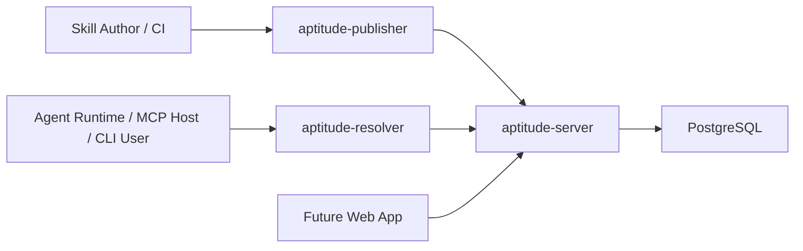
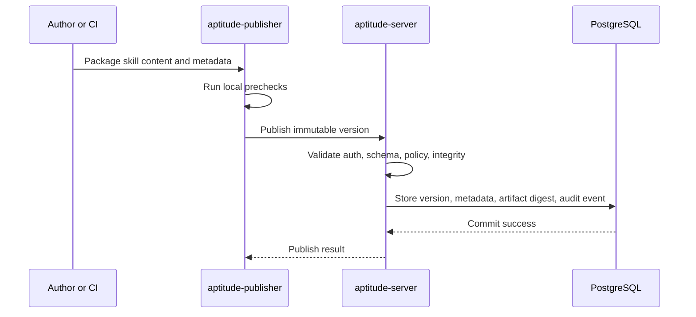
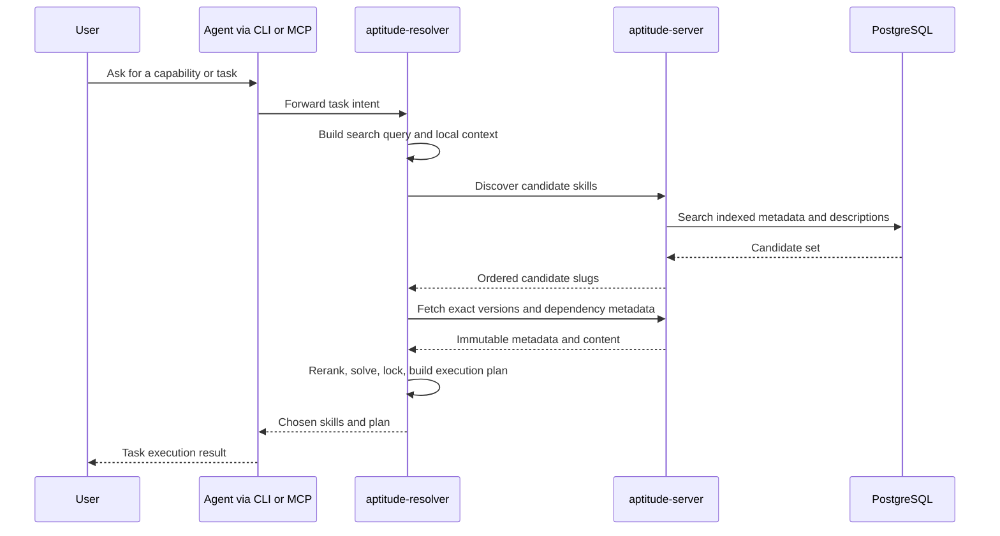

# Aptitude: High Level Design

**Team:** Aptitude

**Members:** Ela Shaul, Aviel Adika, Yonatan Csasnik

## 1. Executive Summary

- **Problem Statement**: Teams need a reliable way to publish, discover, resolve, and execute skills through agents without coupling authoring workflows, registry storage, and runtime decision-making into one hard-to-scale service. Today, Aptitude needs a project-level design that defines how publisher, registry, resolver, and agent-facing interfaces work together as one product.
- **Proposed Solution**: Build Aptitude as a three-surface product: `aptitude-publisher` for authoring and CI release flows, `aptitude-server` as the authoritative registry backend, and `aptitude-resolver` as the consumer-side discovery, solving, locking, and execution-planning client. The current user interface is CLI + MCP for seamless agent integration, with a future web application added as a convenience layer rather than as the core product dependency.
- **Success Criteria**:
  - Search relevance achieves an initial benchmark target of `Precision@5 >= 85%` across at least 50 representative skill-discovery tasks.
  - Discovery API latency stays at `p95 <= 250 ms` for top-candidate retrieval on a 10,000-skill catalog.
  - Exact metadata or content fetch latency stays at `p95 <= 150 ms` on the same catalog assumption.
  - End-to-end publish of a single immutable `slug@version` completes at `p95 <= 2 seconds` under expected CI load.
  - Agent integrations through CLI + MCP successfully complete discovery-to-resolution flows in `>= 95%` of the core integration test scenarios without custom per-agent server behavior.

## 2. User Experience & Functionality

### User Personas

- **Skill Author**: Publishes skills from local development or CI pipelines.
- **Agent Builder / Platform Engineer**: Integrates Aptitude into MCP hosts, SDKs, and agent runtimes.
- **Agent Runtime / End User**: Uses an agent that discovers and executes the right skills for a task.
- **Operator / Security Reviewer**: Maintains registry reliability, lifecycle controls, provenance, and auditability.

### User Stories

- As a skill author, I want to publish immutable skill versions so agents can consume exact and reproducible releases.
- As an agent builder, I want a stable CLI + MCP integration surface so I can plug Aptitude into agent runtimes with minimal custom glue code.
- As an agent runtime, I want fast candidate discovery and exact fetch APIs so I can select and lock skills without scanning the entire catalog.
- As an operator, I want governance, lifecycle controls, and audit events so risky or deprecated skills can be managed safely.
- As a future web user, I want a browser-based catalog and management experience so I can inspect skills and operations without relying only on terminal tools.

### Acceptance Criteria

- Publishing always goes through the publisher client and server APIs, never through direct database writes.
- The server remains the only authority for validation, immutability, governance, lifecycle, persistence, and audit.
- Discovery returns candidate slugs quickly and deterministically, without embedding final selection or dependency-solving logic.
- Resolver performs prompt interpretation, reranking, dependency solving, lock generation, and execution planning on the client side.
- CLI and MCP remain the primary MVP interaction surfaces for both human operators and agent integrations.
- The future web UI does not introduce a second source of truth or duplicate business logic already owned by the resolver or server.

### Non-Goals

- Building a server-side agent that chooses the final skill on behalf of every client.
- Moving dependency solving or execution planning into the registry backend.
- Making the web UI a launch dependency for the MVP.
- Splitting the backend into multiple authoritative microservices before scale requires it.

## 3. AI System Requirements

### Tool Requirements

- `aptitude-resolver` must expose agent-friendly interfaces through CLI and MCP.
- `aptitude-server` must expose stable HTTP APIs for publish, discovery, resolution, exact fetch, and lifecycle control.
- `aptitude-publisher` must support local and CI-driven release workflows.
- The project should remain model-agnostic: Aptitude integrates with agents, but does not require one specific LLM vendor to function.

### Evaluation Strategy

- Measure search quality using benchmark prompts mapped to expected candidate skills.
- Measure agent integration quality through end-to-end MCP and CLI scenarios covering discovery, exact fetch, solve, and execution-plan generation.
- Measure publish correctness through integration tests for immutability, validation, provenance, and lifecycle enforcement.
- Measure reliability through latency SLOs, failure-rate alerts, and regression suites across the three product surfaces.

## 4. Technical Specifications

### What Are the System's Main Components?

At the project level, Aptitude is composed of four primary product components and one future-facing interface:

- `aptitude-publisher`: authoring and CI publishing client.
- `aptitude-server`: authoritative registry backend and API surface.
- `aptitude-resolver`: consumer-side discovery, solving, locking, and execution-planning client.
- `PostgreSQL`: canonical storage for registry metadata, versions, artifacts, lifecycle state, and audit data.
- `Future Web App` (later phase): browser-based user experience for catalog browsing and operations, built on top of the same APIs and contracts.



### Component Breakdown

| Component | Primary Role | Owns | Does Not Own |
| --- | --- | --- | --- |
| `aptitude-publisher` | Publish client | Packaging, local prechecks, request assembly, CI and author UX | Canonical validation, persistence, runtime solving |
| `aptitude-server` | Registry backend | Auth, validation, immutability, governance, persistence, search, audit | Prompt interpretation, final selection, dependency solving, execution planning |
| `aptitude-resolver` | Runtime client | Discovery query construction, reranking, solve, lock, execution planning, MCP and CLI surfaces | Publish packaging, canonical registry policy |
| `PostgreSQL` | Canonical data store | Skill metadata, versions, content digests, lifecycle state, audit records | Client-side runtime decision logic |
| `Future Web App` | UX layer | Catalog browsing, skill inspection, operator workflows | Registry source of truth, solving logic |

### Data Model and Storage

The core project data model is registry-centric:

- Skills are identified by `slug`.
- Each published version is immutable and addressed as `(slug, version)`.
- Artifact content is stored through digest-addressed immutable records.
- Search uses metadata, description, tags, lifecycle state, and trust-oriented filters.
- Audit records capture publish, lifecycle, and privileged operational actions.
- Resolver-generated locks and execution plans are client-side outputs, not canonical server records.

### How Will the Main Users' Use Cases Look Alike?

The two dominant project flows are publishing and agent-driven consumption.

#### Publish Flow



#### Agent Discovery and Resolution Flow



### What Is the Front End Technology?

#### Current MVP Interface

- The current front end is not a browser UI.
- The primary user-facing surfaces are:
  - CLI for human operators and developers.
  - MCP for seamless agent integration.
- Because the MVP is CLI + MCP first, there is no dedicated browser backend or Node.js BFF required today.

#### Future Web UI Recommendation

- For a future browser experience, the recommended direction is `React + TypeScript`, preferably via `Next.js`.
- Rationale:
  - Strong support for authenticated product dashboards and catalog browsing.
  - Good fit for search-driven pages, skill detail pages, and admin/operator workflows.
  - Can add server-side rendering or route handlers without moving core Aptitude logic out of the resolver and server.
- Architectural rule:
  - The web app should remain a presentation layer over Aptitude APIs.
  - Business rules for publishing stay in `aptitude-publisher` and `aptitude-server`.
  - Discovery and planning intelligence stays in `aptitude-resolver`.

### Mocks for Main Pages

The MVP has no formal browser pages, so the current "screens" are CLI and MCP interactions. The following mocks describe recommended future web screens for a later phase.

#### Current CLI / MCP UX

```text
+--------------------------------------------------------------+
| aptitude resolve "Find a skill to review a FastAPI PR"       |
+--------------------------------------------------------------+
| Candidates:                                                  |
| 1. fastapi-review                                            |
| 2. architect-review                                          |
| 3. python-testing                                            |
|                                                              |
| Selected: fastapi-review@1.4.0                               |
| Dependencies locked: 2                                       |
| Execution plan ready                                         |
+--------------------------------------------------------------+
```

#### Future Page Mock: Catalog Search

```text
+-------------------------------------------------------------------+
| Aptitude Catalog                                                   |
+-------------------------------------------------------------------+
| Search: [ review API contracts for FastAPI services           ]    |
| Filters: [Tags] [Trust Tier] [Lifecycle] [Publisher]              |
+-------------------------------------------------------------------+
| fastapi-review              High match     Stable      View        |
| api-contract-checker        Medium match   Stable      View        |
| architect-review            Medium match   Beta        View        |
+-------------------------------------------------------------------+
```

#### Future Page Mock: Skill Detail

```text
+-------------------------------------------------------------------+
| fastapi-review                                                     |
| Version: 1.4.0      Status: Stable      Publisher: Aptitude Team   |
+-------------------------------------------------------------------+
| Description                                                        |
| Inputs / Outputs                                                   |
| Dependencies                                                       |
| Provenance                                                         |
| Audit / Lifecycle history                                          |
| [Use in Agent] [Copy CLI] [View Content]                           |
+-------------------------------------------------------------------+
```

#### Future Page Mock: Publish and Lifecycle Console

```text
+-------------------------------------------------------------------+
| Publish Skill                                                      |
+-------------------------------------------------------------------+
| Slug:        [____________________]                                |
| Version:     [____________________]                                |
| Content:     [ Upload / Paste ]                                    |
| Metadata:    [ Tags / Labels / Description ]                       |
| Provenance:  [ Repo URL / Commit SHA ]                             |
|                                                                   |
| [Validate] [Publish]                                               |
+-------------------------------------------------------------------+
```

#### Future Page Mock: Operations Dashboard

```text
+-------------------------------------------------------------------+
| Aptitude Operations                                                |
+-------------------------------------------------------------------+
| Search p95: 182 ms         Fetch p95: 93 ms                        |
| Publish p95: 1.4 s         Error Rate: 0.6%                        |
+-------------------------------------------------------------------+
| Recent Events                                                      |
| - Skill deprecated                                                 |
| - New version published                                            |
| - Policy rejection                                                 |
+-------------------------------------------------------------------+
```

### Integration Strategy

- Publisher integrates with the server over authenticated HTTP APIs.
- Resolver integrates with the server over authenticated HTTP APIs for discovery, fetch, and resolution reads.
- Agent platforms integrate with Aptitude through resolver CLI and MCP.
- The future web app will use the same core APIs rather than hidden internal endpoints.
- Optional asynchronous processing may be added later for non-authoritative side effects such as notifications, exports, or enrichment.

### Security and Privacy

- Server-side auth remains centralized with scoped machine tokens such as `read`, `publish`, and `admin`.
- Immutable artifacts are tied to digest-addressed content for integrity and cache stability.
- Governance and lifecycle controls are enforced at publish and read boundaries.
- Provenance metadata is captured for auditability, but Git is not a runtime source of truth.
- Clients must never read or write the registry database directly.

### Scalability and Performance

- Search stays near the indexed metadata on the server for low latency and better cacheability.
- Final selection and dependency solving stay on the resolver side to avoid turning server reads into expensive, context-heavy RPC calls.
- PostgreSQL is sufficient as the initial source of truth and search backend; dedicated search infrastructure remains optional later.
- Read APIs should scale horizontally without changing the public contract.

### Error Handling and Recovery

- Publish failures must be synchronous and explicit so authors know whether a version was accepted or rejected.
- Immutable version conflicts must never silently overwrite existing versions.
- Asynchronous workers, if added later, must only process post-commit side effects and must not alter canonical publish success.
- Audit logs and operational telemetry must make failed publishes, policy rejections, and degraded search performance diagnosable.

### Deployment Strategy

- **MVP**:
  - `aptitude-server` deployed as the only long-running backend service.
  - PostgreSQL as the canonical database.
  - `aptitude-publisher` used locally or in CI.
  - `aptitude-resolver` used via CLI, MCP host integration, or SDK surface.
- **Target cloud deployment**:
  - `aptitude-server` on Cloud Run or GKE.
  - PostgreSQL on Cloud SQL.
  - Optional Pub/Sub or worker tier only for post-commit side effects.

### Testing and Quality Assurance

- Contract tests for publish, discovery, exact fetch, lifecycle, and auth behavior.
- Search quality benchmark tests for relevance and ranking stability.
- End-to-end integration tests for CLI and MCP flows.
- Regression tests for resolver solving, lock generation, and execution-plan output.

### Maintenance and Support

- Keep public contracts stable and versioned.
- Expand observability before expanding service count.
- Preserve clear ownership boundaries between publisher, server, and resolver as the project grows.

### Performance Metrics and Monitoring

- Discovery latency and error rate.
- Exact fetch latency and cache hit behavior.
- Publish latency and validation failure rate.
- Search relevance benchmark score.
- MCP and CLI integration success rate.

### Regulatory and Compliance Considerations

- No special industry-specific compliance requirement is defined yet.
- Security, provenance, lifecycle governance, and auditability should be designed so future enterprise compliance work is possible without re-architecting the project.
- Data privacy scope is currently limited because Aptitude stores registry metadata and operational data, not end-user business data by default.

### Dependencies and External Services

- FastAPI application layer in `aptitude-server`.
- PostgreSQL for canonical storage and indexed retrieval.
- CLI and MCP host environments for end-user and agent integrations.
- Optional future services: dedicated search engine, async worker tier, web UI hosting stack.

## 5. Risks & Roadmap

### Phased Rollout

- **MVP**:
  - `aptitude-publisher`, `aptitude-server`, and `aptitude-resolver` working end to end.
  - CLI + MCP as the primary user-facing interfaces.
  - Search, exact fetch, immutable publishing, and resolver-side planning fully functional.
- **v1.1**:
  - Better observability and operational dashboards.
  - Governance and provenance hardening.
  - Broader integration support for agent frameworks.
- **v2.0**:
  - Future web UI for richer UX.
  - Optional dedicated search infrastructure.
  - Enterprise-grade policy packs and stronger ecosystem integrations.

### Technical Risks

- Search quality may be fast but still feel inaccurate if metadata quality and ranking heuristics lag behind user expectations.
- If too much runtime intelligence drifts back into the server, Aptitude may lose cacheability and scale benefits.
- If publisher and resolver logic become mixed, release workflows and runtime workflows will become harder to evolve independently.
- Future web UI work may accidentally duplicate logic already owned by the resolver or server unless boundaries stay explicit.
- PostgreSQL may eventually need search or storage offloading if catalog size and artifact volume grow significantly.

## 6. Open Assumptions to Confirm

- The product name remains `Aptitude` across publisher, server, resolver, and future web surfaces.
- CLI + MCP are sufficient for the MVP and early adopter phase.
- The future web UI is a later-phase enhancement, not a blocker for initial rollout.
- Initial search quality and latency targets above are acceptable as baseline KPIs for the project.
