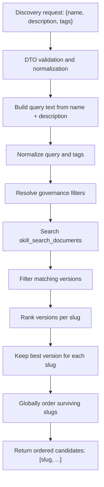

# Discovery Candidate Selection

## Purpose

This document explains how `POST /discovery` searches for candidate skills,
filters them, ranks them, and returns the final ordered slug list.

Important boundary:

- the server performs candidate generation and deterministic base ordering
- the server does not choose the final skill for the user
- the client is expected to rerank, prune, or make the final choice using task
  context and runtime information

## High-Level Flow



## Request Shape

Discovery accepts:

- `name`: required
- `description`: optional
- `tags`: optional

The request is normalized before search:

- `name` is trimmed and must not be blank
- `description` is trimmed and blank values become `null`
- `tags` are normalized, deduplicated, and ordered deterministically

The discovery service then builds one search string by concatenating:

- `name`
- `description`, if present

That combined text becomes the free-text query. Tags remain structured filters.

## Search Data Model

Discovery does not search raw markdown bodies.

Instead it queries the derived `skill_search_documents` table, which stores one
denormalized search row per immutable skill version. Each row contains:

- `slug`
- `normalized_slug`
- `version`
- `name`
- `normalized_name`
- `description`
- `tags`
- `normalized_tags`
- `lifecycle_status`
- `trust_tier`
- `published_at`
- `content_size_bytes`
- `usage_count`
- `search_vector`

This keeps discovery fast and body-free.

## What Goes Into `search_vector`

At publish time, the repository builds one normalized text source from:

- slug
- name
- description
- tags

That source is turned into a PostgreSQL full-text `tsvector` using the
`simple` text search configuration.

Conceptually, the stored searchable document is:

```text
normalize(slug) + " " + normalize(name) + " " + normalize(description) + " " + normalize(tags...)
```

## Query Normalization

Before hitting the database, the core search layer:

- lowercases text
- collapses repeated whitespace
- tokenizes the query into terms
- normalizes tags
- applies a hard limit of `20` results for discovery

By default, discovery only searches `published` versions. Trust-tier filtering
defaults to all tiers unless the caller explicitly narrows it.

## Matching Mechanisms

The SQL does not rely on one search strategy only. A version is eligible if it
passes governance and structured filters and matches at least one text path.

### 1. PostgreSQL Full-Text Match

This is the main lexical search path:

- the document side uses `to_tsvector('simple', ...)`
- the query side uses `plainto_tsquery('simple', :query_text)`
- the boolean match operator is `search_vector @@ tsquery`

`plainto_tsquery` turns plain user text into a Postgres full-text query. In
practice, it:

- normalizes the query text with the same text search configuration
- splits the query into lexemes
- joins the surviving terms with logical `AND`

Example:

```text
"Python lint files" -> python & lint & files
```

With the `simple` configuration, this search is lexical and conservative:

- it lowercases tokens
- it does not provide semantic matching
- it does not perform typo correction
- it is not embedding-based
- it generally does not apply language-aware stemming like `english` would

### 2. Exact Slug Match

If normalized query text exactly equals `normalized_slug`, the row receives an
`exact_slug_match` flag.

This is both a match path and the strongest ranking signal.

### 3. Exact Name Match

If normalized query text exactly equals `normalized_name`, the row receives an
`exact_name_match` flag.

### 4. Substring Match on Slug or Name

If full-text search does not cover a useful partial input, the query can still
match through a SQL `LIKE` pattern over:

- `normalized_slug`
- `normalized_name`

This broadens discovery for partial identifiers and partial names.

## Structured Filters

After text matching, discovery also applies deterministic structured filters.

### Tag Containment

If tags are supplied, all requested tags must be present in
`normalized_tags`.

This is a containment filter, not a soft preference:

- requested tags are required
- additional document tags are allowed

### Lifecycle Status

Discovery visibility is governance-aware.

Default behavior:

- anonymous discovery does not exist because the route requires `read`
- standard discovery returns `published` by default
- broader lifecycle search is only allowed when policy permits it

The default policy profile defines:

- default discovery statuses: `published`
- read-allowed requested statuses: `published`, `deprecated`
- admin-allowed requested statuses: `published`, `deprecated`, `archived`

### Trust Tier

Trust filtering is also enforced in SQL. If no explicit trust filter is
requested, all trust tiers are eligible.

### Shared Search Filters

The underlying search service also supports:

- freshness cutoff via `published_at`
- maximum content size via `content_size_bytes`

Discovery currently does not expose those knobs on its public request DTO, but
the shared ranking pipeline supports them.

## Ranking Algorithm

Once the candidate versions have been filtered, SQL ranks them in this order:

1. exact slug match first
2. exact name match second
3. higher full-text score via `ts_rank_cd`
4. higher tag overlap count
5. higher usage count
6. newer `published_at`
7. smaller `content_size_bytes`
8. lexical slug ordering for stable ties
9. higher internal version row id as the last tie-break

### `ts_rank_cd`

The full-text score uses PostgreSQL `ts_rank_cd`, which is the cover-density
ranking function.

Practically, that means PostgreSQL prefers documents where:

- more query terms match
- the matches are denser
- the matching terms occur closer together

This is still lexical ranking. It is not semantic relevance in the embedding
sense.

## Per-Slug Collapse

The search table stores one row per version, but discovery returns only slugs.

To avoid returning multiple versions of the same skill, SQL first ranks all
matching versions within each slug and keeps only the best version for that
slug.

It does this with:

- `ROW_NUMBER() OVER (PARTITION BY slug ORDER BY ...)`
- then `WHERE skill_rank = 1`

This step is critical. It means:

- ranking is version-aware internally
- the public response is slug-only
- each slug appears at most once

## Final Response Construction

After per-slug collapse, the surviving rows are globally sorted again with the
same ranking order and truncated to the discovery limit.

The API then returns:

```json
{
  "candidates": ["python.lint", "python.format"]
}
```

Only `slug` values cross the public discovery boundary.

## What the Server Is and Is Not Selecting

The phrase "candidate selection" can be misleading, so the boundary should be
explicit.

The server does select:

- which versions are eligible to be considered
- which version best represents each slug
- how candidate slugs are base-ranked for discovery

The server does not select:

- the final skill to use for the task
- the final version to install or execute
- dependency closures
- runtime-specific or user-specific winners

Those decisions belong to the client.

## Worked Example

Suppose the client sends:

```json
{
  "name": "Python Lint",
  "description": "Lint Python files consistently",
  "tags": ["python", "lint"]
}
```

The server will:

1. normalize the request
2. build query text:
   `python lint lint python files consistently`
3. search each version document built from slug, name, description, and tags
4. require both `python` and `lint` tags to be present
5. compute exact-match flags and a full-text rank
6. rank versions within each slug
7. keep the top version per slug
8. return ordered slug candidates

If one row has an exact slug match on `python.lint`, it outranks rows that only
match through text or tags.

## Code References

- Request DTO and normalization: `app/interface/dto/skills.py`
- Discovery route: `app/interface/api/discovery.py`
- Discovery service facade: `app/core/skills/discovery.py`
- Shared search normalization and explanation helpers:
  `app/intelligence/search_ranking.py`
- Governance filter resolution: `app/core/governance.py`
- Repository search adapter: `app/persistence/skill_registry_repository.py`
- Search SQL and search-document builders:
  `app/persistence/skill_registry_repository_support.py`
- Search read model: `app/persistence/models/skill_search_document.py`

## Summary

Discovery candidate selection in `aptitude-server` is:

- indexed
- lexical
- metadata-driven
- governance-aware
- deterministic
- version-aware internally
- slug-only externally

It combines PostgreSQL full-text search, exact matching, substring matching,
structured tag filtering, lifecycle and trust filtering, deterministic ranking,
and per-slug collapse. The result is an ordered candidate set for the client,
not a final server-side choice.
