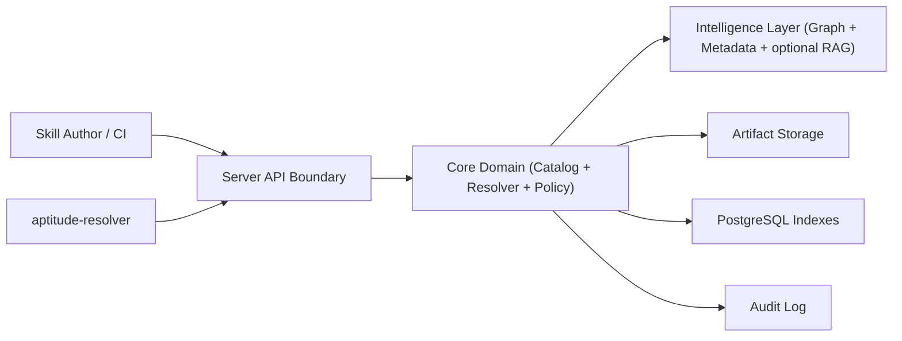

# Aptitude Server PRD

## 1. Executive Summary

- **Problem Statement**: Platform teams need a single authoritative service for skill artifact storage, dependency intelligence, and governed deterministic resolution that all runtime clients can consume.
- **Proposed Solution**: Define `aptitude-server` as the Artifactory-like backend for immutable skill artifacts, dependency/relationship intelligence, governed resolution, and upload/download APIs.
- **Success Criteria**:
  - 100% of skill artifact writes happen through server APIs (no direct client DB writes).
  - Deterministic resolution reproducibility >= 99.99% for identical `(root_skill, version, repo_state_id)` inputs across 1,000 runs.
  - `GET /resolve` p95 <= 250 ms for bundles up to 200 nodes and graph depth <= 5.
  - Publish pipeline (`validate -> store -> index`) success rate >= 99.5% per month.
  - 100% of publish/deprecate/archive/resolve actions emit auditable events.
- **In Scope**: Artifact publish/download APIs, immutable versioning, dependency + relationship graph intelligence, deterministic bundle resolution/reporting, and governance/audit controls.
- **Out of Scope**: Runtime prompt/tool execution, plugin orchestration, and MCP/CLI-facing user interaction surfaces.
- **Related PRD**: Runtime orchestration responsibilities are defined in [`resolver-prd.md`](./resolver-prd.md).

## 2. User Experience & Functionality

- **User Personas**:
  - Platform engineer operating enterprise skill governance.
  - Skill author publishing versioned capabilities.
  - Security/governance reviewer validating provenance and trust policy.

- **User Stories**:
  - As a skill author, I want to upload immutable `skill@version` artifacts so that consumers can reproduce behavior exactly.
  - As a platform engineer, I want deterministic dependency resolution so that different environments receive identical bundles.
  - As a security reviewer, I want provenance, checksums, and trust tiers so that untrusted skills can be blocked by policy.
  - As an AI platform owner, I want relationship intelligence (depends/conflicts/overlaps/extends) and optional RAG signals so that selection quality can improve without mutating artifacts.

- **Acceptance Criteria**:
  - Upload API rejects mutable overwrite attempts for existing `(skill_id, version)`.
  - Resolver query returns `ResolvedBundle` and `ResolutionReport` with explicit inclusion/exclusion reasons.
  - Relationship graph supports typed edges: `depends_on`, `conflicts_with`, `overlaps_with`, `extends`.
  - Metadata updates (including evaluation scores) do not modify immutable artifact content.
  - Download endpoint supports both single artifact retrieval and fully resolved bundle retrieval.
  - Optional RAG index can be enabled/disabled by config without changing artifact contracts.

- **Non-Goals**:
  - Executing prompts, tools, or plugin chains.
  - Exposing end-user chat/agent interfaces.
  - Running client-side security scanners as part of runtime orchestration.

## 3. AI System Requirements (If Applicable)

- **Tool Requirements**:
  - Artifact APIs: publish, fetch, list, deprecate/archive.
  - Resolution APIs: deterministic bundle construction and trace reports.
  - Intelligence APIs: graph query, metadata query, similarity lookup.
  - Optional RAG subsystem: embedding/index pipeline for retrieval hints (advisory signal only).

- **Evaluation Strategy**:
  - Determinism benchmark: same input must yield identical bundle hash under fixed `repo_state_id`.
  - Resolution correctness suite: dependency closure, cycle detection, conflict failure, overlap tie-break determinism.
  - Metadata quality checks: ranking correlation against curated benchmark set.
  - Optional RAG evaluation: Precision@10 >= 0.85 on server search benchmark before enabling in production.

## 4. Technical Specifications

- **Architecture Overview**:
  - `Server API Boundary` -> `Core Domain (Catalog + Resolver + Policy)` -> `Intelligence Layer (Graph + Metadata + optional RAG)` -> `Persistence (Artifacts + Postgres indexes + audit log)`.
  - Aptitude Server is authoritative and execution-agnostic; it returns capabilities, not runtime outcomes.

- **Integration Points**:
  - Primary DB: PostgreSQL for versions, metadata, relationships, evaluations, `repo_state_id`.
  - Artifact storage: local filesystem in MVP, object storage (S3/GCS) later.
  - Client integrations: resolver service, admin tools, CI pipelines.
  - Auth: token-based service-to-service authentication with scoped permissions (`publish`, `resolve`, `admin`).

- **Technology Stack (Current and Planned)**:

| Status | Technology | Used For |
| --- | --- | --- |
| Current (MVP baseline) | Python + FastAPI + OpenAPI | Server API boundary (`publish`, `fetch`, `resolve`, reporting) and contract generation. |
| Current (MVP baseline) | Pydantic v2 | Request/response schema validation and contract safety. |
| Current (MVP baseline) | Uvicorn (dev), Gunicorn + Uvicorn workers (prod) | ASGI serving in development and production. |
| Current (MVP baseline) | PostgreSQL | Versions, metadata, relationship graph edges, evaluation data, and `repo_state_id` state tracking. |
| Current (MVP baseline) | SQLAlchemy 2.0 + Alembic + `psycopg` | Data access, migrations, and PostgreSQL driver stack. |
| Current (MVP baseline) | Local filesystem + `sha256` checksums | Immutable artifact storage and integrity verification. |
| Current (MVP baseline) | Structured logging (`logging`/`structlog`) | Auditable operational and lifecycle logs. |
| Planned (v1.1+) | S3/GCS object storage | Scalable and durable artifact persistence beyond local disk. |
| Planned (v1.1+) | Prometheus instrumentation + OpenTelemetry (optional) | Metrics and tracing for SLO monitoring and diagnostics. |
| Planned (v2.0 optional) | RAG index subsystem (implementation TBD) | Advisory retrieval hints; isolated from deterministic resolution path. |
| Planned (v2.0 optional) | Async event bus (RabbitMQ candidate) | Decoupled publish/index/audit event propagation if services split. |
| Planned (future optional) | Meilisearch | Advanced search capabilities beyond PostgreSQL full-text search. |

- **Security & Privacy**:
  - Immutable checksum (`sha256`) per artifact and bundle manifest.
  - Provenance metadata required on publish (source, author, trust tier).
  - RBAC and policy gates on publication and retrieval.
  - Audit retention for compliance and forensic traceability.
  - Store no user prompt content by default; only server operational telemetry.

## 5. Risks & Roadmap

- **Phased Rollout**:
  - **MVP**: immutable artifact catalog, upload/download, dependency resolution, minimal audit.
  - **v1.1**: conflicts/overlaps policy engine, metadata ranking, expanded trust controls.
  - **v2.0**: optional RAG retrieval layer, advanced provenance/signing, multi-tenant governance policies.

- **Technical Risks**:
  - Graph growth may degrade traversal latency without careful indexing and caching.
  - Metadata/ranking signals can drift or be gamed without benchmark governance.
  - Artifact store and DB index inconsistency can break deterministic guarantees.
  - Optional RAG can introduce non-deterministic ranking if not isolated from deterministic resolution path.

## 6. Boundary Contract & Exit Criteria

- **Contract Boundary (Server -> Resolver)**:
  - Aptitude Server exposes versioned APIs only (`resolve`, `fetch`, `download`, reporting); consumers must not couple to server internals.
  - `ResolvedBundle`, `ResolutionReport`, error taxonomy, and `repo_state_id` are canonical contract objects.
  - Deterministic output is guaranteed for identical request + `repo_state_id` input.

- **Server Exit Criteria (Gate Before Resolver MVP)**:
  - Contract `v1` is frozen with documented backward-compatibility policy.
  - Provider/consumer contract tests pass in CI for server and resolver fixtures.
  - SLO and determinism targets are verified (`GET /resolve` p95 <= 250 ms, reproducibility >= 99.99%).
  - Governance controls are enforced: immutable artifact versions, audit events, and RBAC for `publish`, `resolve`, `admin`.
  - Operational readiness is complete: dashboards, alerts, and incident runbooks for publish/resolve paths.

## Assumptions to Confirm

- Initial target scale: up to 10,000 skills and up to 200 skills per resolved bundle.
- RAG remains optional and disabled in MVP production path.
