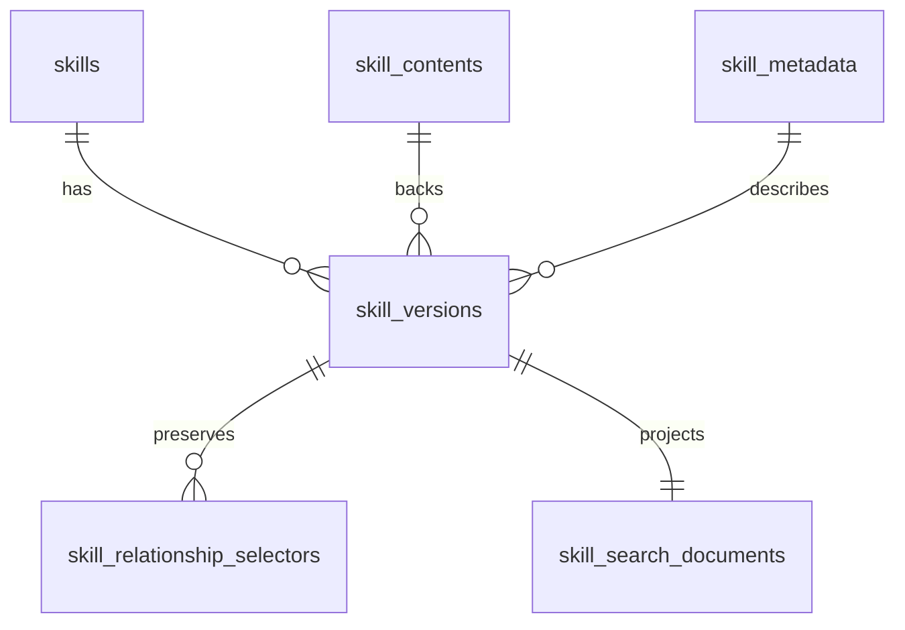

# Database Schema

## Purpose
This document is the canonical target schema for the registry data model.

It reflects the direction implied by the current plans:

- PostgreSQL is the only authoritative store
- versions are immutable
- discovery queries stay body-free
- markdown bodies are stored as `text`
- identity, versioning, body, query metadata, and graph edges are modeled separately

## Current Review
The live schema is a single canonical PostgreSQL baseline around content,
metadata, relationship selectors, and governance state.

- `skills` stores only the logical identity row
- `skill_versions` binds immutable content and metadata to a version-scoped lifecycle/trust policy state
- authored selectors live in `skill_relationship_selectors` and remain the exact dependency source of truth
- discovery uses `skill_search_documents` as a derived, governance-aware read model

## Design Principles
- Keep `skills` as the stable identity row.
- Keep `skill_versions` immutable after publish.
- Store authored markdown in `skill_contents.raw_markdown` as PostgreSQL `text`.
- Keep high-cardinality filters and ranking fields in typed columns.
- Use `jsonb` only for flexible structured metadata.
- Keep discovery/list/search APIs off the raw body table by default.
- Keep search read models derived and rebuildable.

## TOAST Guidance
Use PostgreSQL TOAST implicitly through normal `text` storage.

- `skill_contents.raw_markdown` should be `text`
- do not use large objects, blobs, or `jsonb` for markdown
- default Postgres storage behavior is sufficient to start
- only consider `SET STORAGE EXTERNAL` after profiling substring-heavy access patterns

The main optimization is not manual TOAST tuning. It is query-path separation so metadata-heavy reads never touch large text columns unless exact content is requested.

## Entity Overview

## Tables

### `skills`
Stable identity row.

| Column | Type | Constraints | Purpose |
| --- | --- | --- | --- |
| `id` | `bigint` | PK | Internal identity key |
| `slug` | `text` | `NOT NULL`, unique | Stable public skill identifier |
| `created_at` | `timestamptz` | `NOT NULL` | Row creation time |
| `updated_at` | `timestamptz` | `NOT NULL` | Last identity-state update |

Recommended constraints and indexes:

- unique index on `slug`

### `skill_versions`
Immutable version rows binding identity, content, and metadata together.

| Column | Type | Constraints | Purpose |
| --- | --- | --- | --- |
| `id` | `bigint` | PK | Internal immutable version key |
| `skill_fk` | `bigint` | `NOT NULL`, FK -> `skills.id` | Parent skill identity |
| `version` | `text` | `NOT NULL` | Semantic version string |
| `content_fk` | `bigint` | `NOT NULL`, FK -> `skill_contents.id` | Immutable body row |
| `metadata_fk` | `bigint` | `NOT NULL`, FK -> `skill_metadata.id` | Immutable metadata row |
| `checksum_digest` | `text` | `NOT NULL` | Version-level digest for integrity and caching |
| `lifecycle_status` | `text` | `NOT NULL` | `published`, `deprecated`, or `archived` |
| `lifecycle_changed_at` | `timestamptz` | `NOT NULL` | Most recent lifecycle transition time |
| `trust_tier` | `text` | `NOT NULL` | `untrusted`, `internal`, or `verified` |
| `provenance_repo_url` | `text` | nullable | Minimal source repository provenance |
| `provenance_commit_sha` | `text` | nullable | Commit associated with the published version |
| `provenance_tree_path` | `text` | nullable | Optional repository subpath for the skill |
| `created_at` | `timestamptz` | `NOT NULL` | Insert time |
| `published_at` | `timestamptz` | `NOT NULL` | Publish timestamp |

Recommended constraints and indexes:

- unique index on `(skill_fk, version)`
- index on `(skill_fk, published_at DESC, id DESC)`
- indexes on `content_fk` and `metadata_fk`
- check constraints on `lifecycle_status` and `trust_tier`

Immutability rule:

- lifecycle and trust are version-scoped governance state
- any body or metadata change creates a new `skill_versions` row
- default-version selection is derived from canonical version ordering when needed and is not stored on `skills`

### `skill_contents`
Authoritative markdown body storage.

| Column | Type | Constraints | Purpose |
| --- | --- | --- | --- |
| `id` | `bigint` | PK | Internal content key |
| `raw_markdown` | `text` | `NOT NULL` | Canonical skill markdown body |
| `rendered_summary` | `text` | nullable | Optional pre-rendered short summary |
| `storage_size_bytes` | `bigint` | `NOT NULL` | Observed body size for planning and diagnostics |
| `checksum_digest` | `text` | `NOT NULL`, unique | Content digest for deduplication and integrity |

Storage notes:

- `raw_markdown` is toastable `text`
- exact body fetches read this table directly
- list/search/rank queries should not join this table unless explicitly needed

### `skill_metadata`
Structured, queryable metadata for discovery and ranking.

| Column | Type | Constraints | Purpose |
| --- | --- | --- | --- |
| `id` | `bigint` | PK | Internal metadata key |
| `name` | `text` | `NOT NULL` | Display name |
| `description` | `text` | nullable | Searchable short description |
| `tags` | `text[]` | nullable or default empty | Primary categorical filters |
| `headers` | `jsonb` | nullable | Flexible header-like attributes |
| `inputs_schema` | `jsonb` | nullable | Structured input contract |
| `outputs_schema` | `jsonb` | nullable | Structured output contract |
| `token_estimate` | `integer` | nullable | Approximate token footprint |
| `maturity_score` | `numeric` | nullable | Quality/stability ranking input |
| `security_score` | `numeric` | nullable | Security/trust ranking input |

Recommended constraints and indexes:

- GIN index on `tags` when kept as `text[]`
- GIN index on `headers` only if containment queries are real
- B-tree indexes on `token_estimate`, `maturity_score`, and `security_score` if those fields are used in filters or deterministic ranking

Modeling rule:

- use typed columns first for fields frequently filtered or sorted
- keep `jsonb` for evolving structures, not as the main metadata dump

### `skill_relationship_selectors`
Authored relationship selectors preserved exactly as published.

| Column | Type | Constraints | Purpose |
| --- | --- | --- | --- |
| `id` | `bigint` | PK | Internal selector key |
| `source_skill_version_fk` | `bigint` | `NOT NULL`, FK -> `skill_versions.id` | Source immutable version |
| `edge_type` | `text` | `NOT NULL` | `depends_on`, `extends`, `conflicts_with`, `overlaps_with` |
| `ordinal` | `integer` | `NOT NULL` | Publish-order position within one edge family |
| `target_slug` | `text` | `NOT NULL` | Authored dependency target slug |
| `target_version` | `text` | nullable | Authored exact version selector |
| `version_constraint` | `text` | nullable | Authored version range selector |
| `optional` | `boolean` | nullable | Optional execution hint for `depends_on` |
| `markers` | `text[]` | `NOT NULL` | Authored environment/runtime markers |

Recommended constraints and indexes:

- index on `(source_skill_version_fk, edge_type, ordinal)`
- check constraint restricting `edge_type` to the supported set

### `skill_search_documents`
Derived read model for fast advisory search.

This table is derived from `skills`, `skill_versions`, `skill_metadata`, and
`skill_contents`.

| Column | Type | Purpose |
| --- | --- | --- |
| `skill_version_fk` | `bigint` | PK and FK to `skill_versions.id` |
| `slug` | `text` | Normalized identifier for direct matching |
| `normalized_slug` | `text` | Lowercased identifier for exact matching |
| `version` | `text` | Candidate version |
| `name` | `text` | Display name |
| `normalized_name` | `text` | Lowercased display name |
| `description` | `text` | Searchable summary |
| `tags` | `text[]` | Search filters |
| `normalized_tags` | `text[]` | Lowercased tags for containment filters |
| `lifecycle_status` | `text` | Discovery visibility filter |
| `trust_tier` | `text` | Trust filter |
| `published_at` | `timestamptz` | Freshness ranking input |
| `content_size_bytes` | `bigint` | Ranking/filtering input |
| `usage_count` | `bigint` | Ranking tie-break input |
| `search_vector` | `tsvector` | Full-text index target |

Recommended indexes:

- GIN on `search_vector`
- GIN on `tags`
- B-tree on `slug`
- B-tree on `published_at`
- B-tree on `lifecycle_status`
- B-tree on `trust_tier`

Rule:

- do not store `raw_markdown` in this table

## Query Path Separation
The schema is intentionally optimized around two read paths.

Discovery path:

- hit `skill_search_documents`
- rely on canonical `skills`, `skill_versions`, `skill_metadata`, and `skill_contents` only through the derived projection refresh path
- do not hit `skill_contents`

Exact fetch path:

- resolve `(slug, version)` through `skills` and `skill_versions`
- load `skill_contents.raw_markdown`
- return checksum metadata from `skill_versions.checksum_digest` and `skill_contents.checksum_digest`

## Migration Direction
The schema is rebaselined as one canonical Alembic migration:

1. `0001_initial_schema` creates the full normalized schema directly.
2. `skill_contents` and `skill_metadata` are canonical.
3. `skill_relationship_selectors` preserves authored selectors.
4. `skill_versions` carries version-scoped lifecycle, trust, and provenance.
5. `skill_search_documents` stores lifecycle/trust for governance-aware discovery.
6. Historical upgrade-from-legacy paths are intentionally unsupported.

## Non-Goals
- storing markdown in `jsonb`
- using Postgres large objects for `skill.md`
- joining the content table for every search/list request
- making derived search tables the source of truth
